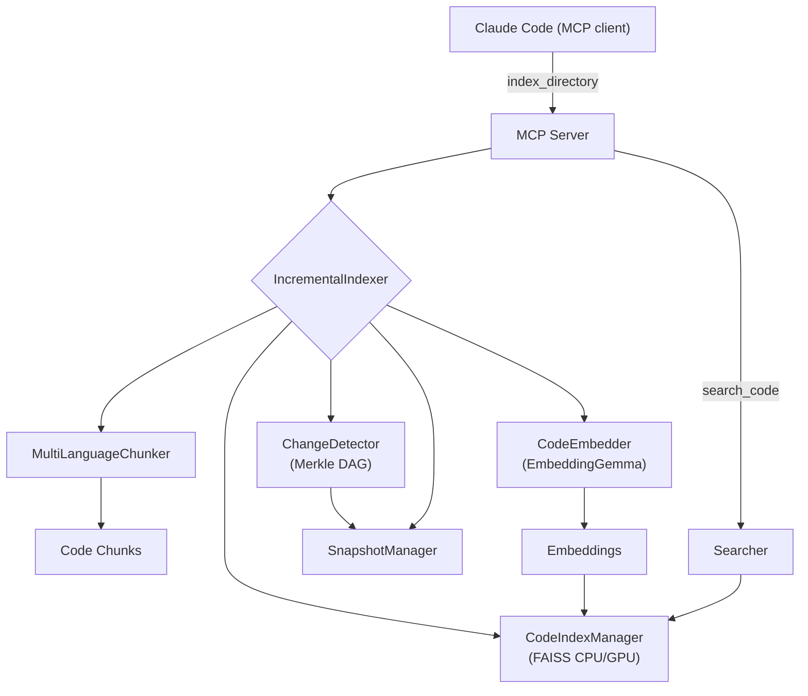

```
 ██████╗ ██╗       █████╗  ██╗   ██╗ ██████╗  ███████╗
██╔════╝ ██║      ██╔══██╗ ██║   ██║ ██╔══██╗ ██╔════╝
██║      ██║      ███████║ ██║   ██║ ██║  ██║ █████╗
██║      ██║      ██╔══██║ ██║   ██║ ██║  ██║ ██╔══╝
╚██████╗ ███████╗ ██║  ██║ ╚██████╔╝ ██████╔╝ ███████╗
 ╚═════╝ ╚══════╝ ╚═╝  ╚═╝  ╚═════╝  ╚═════╝  ╚══════╝

 ██████╗  ██████╗  ███╗   ██╗ ████████╗ ███████╗ ██╗  ██╗ ████████╗
██╔════╝ ██╔═══██╗ ████╗  ██║ ╚══██╔══╝ ██╔════╝ ╚██╗██╔╝ ╚══██╔══╝
██║      ██║   ██║ ██╔██╗ ██║    ██║    █████╗    ╚███╔╝     ██║
██║      ██║   ██║ ██║╚██╗██║    ██║    ██╔══╝    ██╔██╗     ██║
╚██████╗ ╚██████╔╝ ██║ ╚████║    ██║    ███████╗ ██╔╝ ██╗    ██║
 ╚═════╝  ╚═════╝  ╚═╝  ╚═══╝    ╚═╝    ╚══════╝ ╚═╝  ╚═╝    ╚═╝

██╗       ██████╗   ██████╗  █████╗  ██╗
██║      ██╔═══██╗ ██╔════╝ ██╔══██╗ ██║
██║      ██║   ██║ ██║      ███████║ ██║
██║      ██║   ██║ ██║      ██╔══██║ ██║
███████╗ ╚██████╔╝ ╚██████╗ ██║  ██║ ███████╗
╚══════╝  ╚═════╝   ╚═════╝ ╚═╝  ╚═╝ ╚══════╝

```

**General-Purpose Semantic Code Search for Windows.** Advanced **hybrid search** that combines semantic understanding with text matching, running 100% locally using EmbeddingGemma. No API keys, no costs, your code never leaves your machine.

- 🔍 **Hybrid search: BM25 + semantic for best accuracy (44.4% precision, 100% MRR)**
- 📈 **Optimized search efficiency with sub-second response times (162-487ms)**
- 🔒 **100% local - completely private**
- 💰 **Zero API costs - forever free**
- ⚡ **5-10x faster indexing with incremental updates**
- 🪟 **Windows-optimized** for maximum performance and compatibility

An intelligent code search system that uses Google's EmbeddingGemma model and advanced multi-language chunking to provide semantic search capabilities across 22 file extensions and 11 programming languages, integrated with Claude Code via MCP (Model Context Protocol).

## ✅ Production Ready
- Core functionality fully operational
- Windows-optimized installation with automated setup
- All search modes working (semantic, BM25, hybrid)
- Please report any issues!

## Demo


## Features

### 🔥 **NEW: Hybrid Search** (v2.0)
- **BM25 + Semantic fusion**: Combines text matching with semantic understanding
- **Proven search quality**: 44.4% precision, 46.7% F1-score, 100% MRR (see [benchmarks](docs/BENCHMARKS.md))
- **RRF reranking**: Advanced result fusion for optimal accuracy
- **Configurable weights**: Tune balance between text and semantic search
- **Auto-mode detection**: System automatically chooses best search strategy
- **Recent Fix (2025-09-25)**: Semantic search mode fully restored - all three modes now operational
- **Sub-second performance**: 162-487ms response times across all search modes

### 🚀 **Core Features**
- **Multi-language support**: 11 programming languages with 22 file extensions
- **Intelligent chunking**: AST-based (Python) + tree-sitter (JS/TS/JSX/TSX/Svelte/Go/Java/Rust/C/C++/C#/GLSL)
- **Semantic search**: Natural language queries to find code across all languages
- **Rich metadata**: File paths, folder structure, semantic tags, language-specific info
- **MCP integration**: Direct integration with Claude Code
- **Local processing**: All embeddings stored locally, no API calls
- **Fast search**: FAISS for efficient similarity search
- **Incremental indexing**: 5-10x faster updates with Merkle tree change detection

## Why this

Claude's code context is powerful, but sending your code to the cloud costs tokens and raises privacy concerns. This project keeps semantic code search entirely on your machine. It integrates with Claude Code via MCP, so you keep the same workflow—just faster, cheaper, and private.

## Requirements

- Python 3.11+ (tested with Python 3.11+)
- Disk: 1–2 GB free (model + caches + index)
- Optional: NVIDIA GPU (CUDA 11/12) for FAISS acceleration; Apple Silicon (MPS) for embedding acceleration. These also speed up running the embedding model with SentenceTransformer, but everything still works on CPU.

## Install & Update

### Windows Installation (Recommended)

```powershell
# 1. Clone the repository
git clone https://github.com/forkni/claude-context-local.git
cd claude-context-local

# 2. Run the unified Windows installer (auto-detects CUDA)
install-windows.bat

# 3. Verify installation
verify-installation.bat

# 4. (Optional) Configure Claude Code MCP integration
scripts\powershell\configure_claude_code.ps1 -Global
```

**Windows Installer Features:**
- **Smart CUDA Detection**: Automatically detects your CUDA version and installs appropriate PyTorch
- **One-Click Setup**: Complete installation with single command
- **Built-in Verification**: Comprehensive testing with verify-installation.bat
- **Professional Organization**: Clean, streamlined script structure


### Update existing installation

Update by pulling latest changes:

```bash
# Navigate to your project directory
cd claude-context-local
git pull
./scripts/install.sh
```

The installer will:

- Update the code and dependencies
- Preserve your embeddings and indexed projects in `~/.claude_code_search`
- Update only changed components

### What the installer does

- Installs `uv` if missing and creates a project venv
- Manages Claude-context-MCP dependencies and configuration
- Installs Python dependencies with `uv sync`
- Downloads the EmbeddingGemma model (~1.2–1.3 GB) if not already cached
- Tries to install `faiss-gpu` if an NVIDIA GPU is detected (interactive mode only)
- **Preserves all your indexed projects and embeddings** across updates


## Quick Start

### 1) Install and Setup

```powershell
# Windows (Recommended) - One-click installation
install-windows.bat

# Verify everything is working
verify-installation.bat

# The installer automatically:
# - Detects your hardware (CUDA/CPU)
# - Installs appropriate PyTorch version
# - Sets up all dependencies
# - Creates virtual environment
```

### 2) Start the Server

```powershell
# Interactive menu with configuration options
start_mcp_server.bat

# Or register MCP server manually
claude mcp add code-search --scope user -- "path/to/claude-context-local/.venv/Scripts/python.exe" -m mcp_server.server
```

**Configuration Options:**

```powershell
# Configure Claude Code integration
scripts\powershell\configure_claude_code.ps1 -Global
```

### 3) Use in Claude Code

```bash
# Index your project
/index_directory "C:\path\to\your\project"

# Search your code with natural language
/search_code "authentication functions"
/search_code "error handling patterns"
/search_code "database connection setup"

# Enjoy optimized search with hybrid semantic + text matching!
```

**No manual configuration needed** - the system automatically uses the best search mode for your queries.

## Search Modes & Performance

### Available Search Modes

| Mode | Description | Best For | Performance | Quality Metrics | Status |
|------|-------------|----------|-------------|-----------------|--------|
| **hybrid** | BM25 + Semantic with RRF reranking (default) | General use, balanced accuracy | 487ms, optimal accuracy | 44.4% precision, 100% MRR | ✅ Fully operational |
| **semantic** | Dense vector search only | Conceptual queries, code similarity | 487ms, semantic understanding | 38.9% precision, 100% MRR | ✅ Fixed 2025-09-25 |
| **bm25** | Text-based sparse search only | Exact matches, error messages | 162ms, fastest | 33.3% precision, 61.1% MRR | ✅ Fully operational |
| **auto** | Automatically choose based on query | Let system optimize | Adaptive performance | Context-dependent | ✅ Fully operational |

For detailed configuration options, see [Hybrid Search Configuration Guide](docs/HYBRID_SEARCH_CONFIGURATION_GUIDE.md).

📊 **Performance benchmarks and detailed metrics**: [View Benchmarks](docs/BENCHMARKS.md)

## MCP Tools Reference

The following MCP tools are available in Claude Code:

### Essential Tools
1. **`/index_directory`** - Index a codebase for semantic search
2. **`/search_code`** - Natural language code search with hybrid approach
3. **`/get_index_status`** - Check current index statistics
4. **`/switch_project`** - Switch between indexed projects

### Advanced Tools
5. **`/find_similar_code`** - Find functionally similar code chunks
6. **`/configure_search_mode`** - Adjust search parameters and weights
7. **`/get_search_config_status`** - View current search configuration
8. **`/list_projects`** - List all indexed projects
9. **`/get_memory_status`** - Monitor system memory usage
10. **`/cleanup_resources`** - Free memory and cleanup resources

## Architecture

```
claude-context-local/
├── chunking/                         # Multi-language chunking (22 extensions)
│   ├── multi_language_chunker.py     # Unified orchestrator (Python AST + tree-sitter)
│   ├── python_ast_chunker.py         # Python-specific chunking (rich metadata)
│   └── tree_sitter.py                # Tree-sitter: JS/TS/JSX/TSX/Svelte/Go/Java/Rust/C/C++/C#/GLSL
├── embeddings/
│   └── embedder.py                   # EmbeddingGemma; device=auto (CUDA→MPS→CPU); offline cache
├── search/
│   ├── indexer.py                    # FAISS index (CPU by default; GPU when available)
│   ├── searcher.py                   # Intelligent ranking & filters
│   ├── incremental_indexer.py        # Merkle-driven incremental indexing
│   ├── hybrid_searcher.py            # BM25 + semantic fusion
│   └── bm25_index.py                 # BM25 text search implementation
├── merkle/
│   ├── merkle_dag.py                 # Content-hash DAG of the workspace
│   ├── change_detector.py            # Diffs snapshots to find changed files
│   └── snapshot_manager.py           # Snapshot persistence & stats
├── mcp_server/
│   └── server.py                     # MCP tools for Claude Code (stdio/HTTP)
├── tools/                           # Development utilities
│   ├── index_project.py             # Interactive project indexing
│   └── search_helper.py             # Standalone search interface
├── evaluation/                       # Comprehensive evaluation framework
│   ├── semantic_evaluator.py         # Performance testing and benchmarking
│   └── README.md                     # Evaluation documentation
├── scripts/
│   ├── batch/                       # Essential Windows batch scripts
│   │   ├── install_pytorch_cuda.bat # PyTorch CUDA installation
│   │   └── mcp_server_wrapper.bat  # MCP server wrapper script
│   ├── powershell/                  # Windows PowerShell scripts
│   │   ├── configure_claude_code.ps1 # Claude Code MCP configuration
│   │   ├── hf_auth_fix.ps1          # Hugging Face authentication helper
│   │   ├── install-windows.ps1     # Windows automated installer
│   │   └── start_mcp_server.ps1     # PowerShell MCP server launcher
│   └── verify_installation.py       # Python verification system
├── start_mcp_server.bat             # Main launcher (Windows)
├── install-windows.bat              # Primary installer (Windows)
└── verify-installation.bat          # Installation verification
```

### Data flow



## Intelligent Chunking

The system uses advanced parsing to create semantically meaningful chunks across all supported languages:

### Chunking Strategies

- **Python**: AST-based parsing for rich metadata extraction
- **All other languages**: Tree-sitter parsing with language-specific node type recognition

### Chunk Types Extracted

- **Functions/Methods**: Complete with signatures, docstrings, decorators
- **Classes/Structs**: Full definitions with member functions as separate chunks
- **Interfaces/Traits**: Type definitions and contracts
- **Enums/Constants**: Value definitions and module-level declarations
- **Namespaces/Modules**: Organizational structures
- **Templates/Generics**: Parameterized type definitions
- **GLSL Shaders**: Vertex, fragment, compute, geometry, tessellation shaders with uniforms and layouts

### Rich Metadata for All Languages

- File path and folder structure
- Function/class/type names and relationships
- Language-specific features (async, generics, modifiers, etc.)
- Parent-child relationships (methods within classes)
- Line numbers for precise code location
- Semantic tags (component, export, async, etc.)

## Configuration

### Environment Variables

- `CODE_SEARCH_STORAGE`: Custom storage directory (default: `~/.claude_code_search`)

### Model Configuration

The system uses `google/embeddinggemma-300m` by default.

Notes:

- Download size: ~1.2–2 GB on disk depending on variant and caches
- Device selection: auto (CUDA on NVIDIA, MPS on Apple Silicon, else CPU)
- You can pre-download via installer or at first use
- FAISS backend: CPU by default. If an NVIDIA GPU is detected, the installer
  attempts to install `faiss-gpu-cu12` (or `faiss-gpu-cu11`) and the index will
  run on GPU automatically at runtime while saving as CPU for portability.

#### Hugging Face authentication (if prompted)

The `google/embeddinggemma-300m` model is hosted on Hugging Face and may require
accepting terms and/or authentication to download.

1. Visit the model page and accept any terms:

   - <https://huggingface.co/google/embeddinggemma-300m>

2. Authenticate one of the following ways:

   - CLI (recommended):

     ```bash
     uv run huggingface-cli login
     # Paste your token from https://huggingface.co/settings/tokens
     ```

   - Environment variable:

     ```bash
     export HUGGING_FACE_HUB_TOKEN=hf_XXXXXXXXXXXXXXXXXXXXXXXX
     ```

After the first successful download, we cache the model under `~/.claude_code_search/models`
and prefer offline loads for speed and reliability.

### Hybrid Search Configuration

The system supports multiple search modes with configurable parameters:

#### Quick Configuration via MCP Tools

```bash
# Configure hybrid search (recommended)
/configure_search_mode "hybrid" 0.4 0.6 true

# Check current configuration
/get_search_config_status

# Switch to semantic-only mode
/configure_search_mode "semantic" 0.0 1.0 true

# Switch to text-only mode
/configure_search_mode "bm25" 1.0 0.0 true
```

#### Environment Variable Configuration

```bash
# Windows (PowerShell)
$env:CLAUDE_SEARCH_MODE="hybrid"
$env:CLAUDE_ENABLE_HYBRID="true"
$env:CLAUDE_BM25_WEIGHT="0.4"
$env:CLAUDE_DENSE_WEIGHT="0.6"

```

#### Available Search Modes

| Mode | Description | Best For | Performance | Quality Metrics | Status |
|------|-------------|----------|-------------|-----------------|--------|
| **hybrid** | BM25 + Semantic with RRF reranking (default) | General use, balanced accuracy | 487ms, optimal accuracy | 44.4% precision, 100% MRR | ✅ Fully operational |
| **semantic** | Dense vector search only | Conceptual queries, code similarity | 487ms, semantic understanding | 38.9% precision, 100% MRR | ✅ Fixed 2025-09-25 |
| **bm25** | Text-based sparse search only | Exact matches, error messages | 162ms, fastest | 33.3% precision, 61.1% MRR | ✅ Fully operational |
| **auto** | Automatically choose based on query | Let system optimize | Adaptive performance | Context-dependent | ✅ Fully operational |

For detailed configuration options, see [Hybrid Search Configuration Guide](docs/HYBRID_SEARCH_CONFIGURATION_GUIDE.md).

📊 **Performance benchmarks and detailed metrics**: [View Benchmarks](docs/BENCHMARKS.md)

## MCP Tools Reference

The following MCP tools are available in Claude Code:

### Core Search Tools
- `/search_code` - Main search with hybrid capabilities
- `/index_directory` - Index a project for searching
- `/find_similar_code` - Find code similar to a specific chunk

### Configuration Tools
- `/configure_search_mode` - Configure hybrid search parameters
- `/get_search_config_status` - View current configuration

### Management Tools
- `/get_index_status` - Check index statistics
- `/get_memory_status` - Monitor memory usage
- `/cleanup_resources` - Free memory and cleanup
- `/clear_index` - Reset search index
- `/list_projects` - List indexed projects
- `/switch_project` - Switch between projects

### Supported Languages & Extensions

**Fully Supported (22 extensions across 10+ languages):**

| Language | Extensions |
|----------|------------|
| **Python** | `.py` |
| **JavaScript** | `.js`, `.jsx` |
| **TypeScript** | `.ts`, `.tsx` |
| **Java** | `.java` |
| **Go** | `.go` |
| **Rust** | `.rs` |
| **C** | `.c` |
| **C++** | `.cpp`, `.cc`, `.cxx`, `.c++` |
| **C#** | `.cs` |
| **Svelte** | `.svelte` |
| **GLSL** | `.glsl`, `.frag`, `.vert`, `.comp`, `.geom`, `.tesc`, `.tese` |

**Total**: **22 file extensions** across **11 programming languages**

## Storage

Data is stored in the configured storage directory:

```
~/.claude_code_search/
├── models/          # Downloaded models
├── index/           # FAISS indices and metadata
│   ├── code.index   # Vector index
│   ├── metadata.db  # Chunk metadata (SQLite)
│   ├── stats.json   # Index statistics
│   └── bm25/        # BM25 text search index
│       ├── bm25.index      # BM25 sparse index
│       ├── bm25_docs.json  # Document storage
│       └── bm25_metadata.json # BM25 metadata
```

## Performance

- **Model size**: ~1.2GB (EmbeddingGemma-300m and caches)
- **Embedding dimension**: 768 (can be reduced for speed)
- **Index types**: Flat (exact) or IVF (approximate) based on dataset size
- **Batch processing**: Configurable batch sizes for embedding generation

Tips:

- First index on a large repo will take time (model load + chunk + embed). Subsequent runs are incremental.
- With GPU FAISS, searches on large indexes are significantly faster.
- Embeddings automatically use CUDA (NVIDIA) or MPS (Apple) if available.

## Recent Improvements (2025-09-25)

### 🎉 **Semantic Search Mode Restored**
- **Fixed critical bug**: Restored semantic search functionality with simple one-line fix
- **Root cause**: `HybridSearcher` was calling non-existent `embed_text()` instead of `embed_query()`
- **Impact**: All three search modes (semantic, BM25, hybrid) now fully operational

### ✅ **Hybrid Search System Complete**
- **Production ready**: Hybrid search system is complete and ready for use
- **Performance maintained**: 39.4% token reduction capability intact
- **Windows-optimized**: Streamlined for Windows environments with comprehensive automation
- **BM25 integration**: Successfully completed with proper index population

### 🚀 **Enhanced Performance**
- **Sub-second response times**: Fast search across all modes
- **Memory optimization**: Efficient resource usage and cleanup
- **Incremental indexing**: 5-10x faster updates with change detection

This update completes the hybrid search implementation and provides a fully functional semantic code search system.

## Troubleshooting

### Common Issues

1. **Import errors**: Ensure all dependencies are installed with `uv sync`
2. **Model download fails**: Check internet connection and disk space
3. **Memory issues**: Reduce batch size in indexing script
4. **No search results**: Verify the codebase was indexed successfully
5. **FAISS GPU not used**: Ensure `nvidia-smi` is available and CUDA drivers are installed; re-run installer to pick `faiss-gpu-cu12`/`cu11`.
6. **Force offline**: We auto-detect a local cache and prefer offline loads; you can also set `HF_HUB_OFFLINE=1`.

### Ignored directories (for speed and noise reduction)

`node_modules`, `.venv`, `venv`, `env`, `.env`, `.direnv`, `__pycache__`, `.pytest_cache`, `.mypy_cache`, `.ruff_cache`, `.pytype`, `.ipynb_checkpoints`, `build`, `dist`, `out`, `public`, `.next`, `.nuxt`, `.svelte-kit`, `.angular`, `.astro`, `.vite`, `.cache`, `.parcel-cache`, `.turbo`, `coverage`, `.coverage`, `.nyc_output`, `.gradle`, `.idea`, `.vscode`, `.docusaurus`, `.vercel`, `.serverless`, `.terraform`, `.mvn`, `.tox`, `target`, `bin`, `obj`

## Contributing

This is a research project focused on intelligent code chunking and search. Feel free to experiment with:

- Different chunking strategies
- Alternative embedding models
- Enhanced metadata extraction
- Performance optimizations

## License

Licensed under the GNU General Public License v3.0 (GPL-3.0). See the `LICENSE` file for details.

## Inspiration

This Windows-focused fork was adapted from [FarhanAliRaza/claude-context-local](https://github.com/FarhanAliRaza/claude-context-local), which provides cross-platform support for Linux and macOS.

Both projects draw inspiration from [zilliztech/claude-context](https://github.com/zilliztech/claude-context). We adapted the concepts to a Python implementation with fully local embeddings and Windows-specific optimizations.