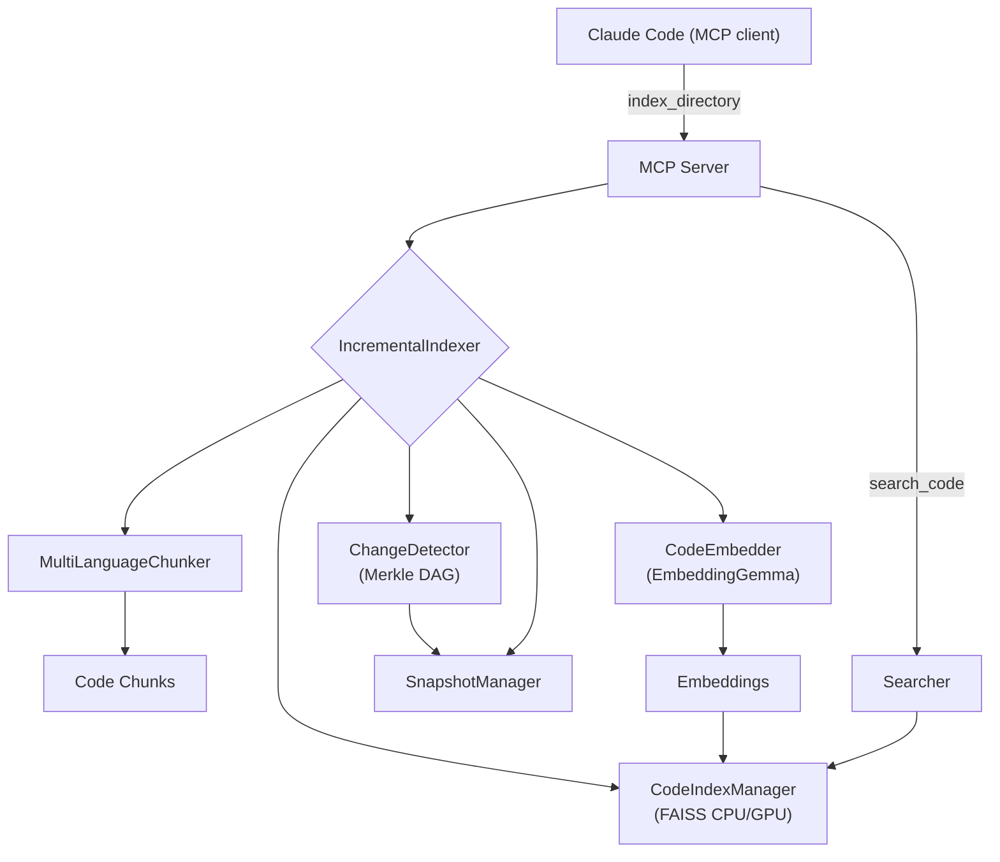

```
  ██████╗ ██╗       █████╗  ██╗   ██╗ ██████╗  ███████╗
 ██╔════╝ ██║      ██╔══██╗ ██║   ██║ ██╔══██╗ ██╔════╝
 ██║      ██║      ███████║ ██║   ██║ ██║  ██║ █████╗
 ██║      ██║      ██╔══██║ ██║   ██║ ██║  ██║ ██╔══╝
 ╚██████╗ ███████╗ ██║  ██║ ╚██████╔╝ ██████╔╝ ███████╗
  ╚═════╝ ╚══════╝ ╚═╝  ╚═╝  ╚═════╝  ╚═════╝  ╚══════╝

  ██████╗  ██████╗  ███╗   ██╗ ████████╗ ███████╗ ██╗  ██╗ ████████╗
 ██╔════╝ ██╔═══██╗ ████╗  ██║ ╚══██╔══╝ ██╔════╝ ╚██╗██╔╝ ╚══██╔══╝
 ██║      ██║   ██║ ██╔██╗ ██║    ██║    █████╗    ╚███╔╝     ██║
 ██║      ██║   ██║ ██║╚██╗██║    ██║    ██╔══╝    ██╔██╗     ██║
 ╚██████╗ ╚██████╔╝ ██║ ╚████║    ██║    ███████╗ ██╔╝ ██╗    ██║
  ╚═════╝  ╚═════╝  ╚═╝  ╚═══╝    ╚═╝    ╚══════╝ ╚═╝  ╚═╝    ╚═╝

 ██╗       ██████╗   ██████╗  █████╗  ██╗
 ██║      ██╔═══██╗ ██╔════╝ ██╔══██╗ ██║
 ██║      ██║   ██║ ██║      ███████║ ██║
 ██║      ██║   ██║ ██║      ██╔══██║ ██║
 ███████╗ ╚██████╔╝ ╚██████╗ ██║  ██║ ███████╗
 ╚══════╝  ╚═════╝   ╚═════╝ ╚═╝  ╚═╝ ╚══════╝

```

Claude Context without the cloud. Semantic code search that runs 100% locally using EmbeddingGemma. No API keys, no costs, your code never leaves your machine.

- 🔍 **Find code by meaning, not strings**
- 🔒 **100% local - completely private**
- 💰 **Zero API costs - forever free**
- ⚡ **Fewer tokens in Claude Code and fast local searches**

An intelligent code search system that uses Google's EmbeddingGemma model and advanced multi-language chunking to provide semantic search capabilities across 22 file extensions and 11 programming languages, integrated with Claude Code via MCP (Model Context Protocol).

## 🚧 Beta Release

- Core functionality working
- Installation tested on Windows/Mac/Linux
- Benchmarks coming soon
- Please report issues!

## Demo


## Features

- **Multi-language support**: 11 programming languages with 22 file extensions
- **Intelligent chunking**: AST-based (Python) + tree-sitter (JS/TS/JSX/TSX/Svelte/Go/Java/Rust/C/C++/C#/GLSL)
- **Semantic search**: Natural language queries to find code across all languages
- **Rich metadata**: File paths, folder structure, semantic tags, language-specific info
- **MCP integration**: Direct integration with Claude Code
- **Local processing**: All embeddings stored locally, no API calls
- **Fast search**: FAISS for efficient similarity search

## Why this

Claude’s code context is powerful, but sending your code to the cloud costs tokens and raises privacy concerns. This project keeps semantic code search entirely on your machine. It integrates with Claude Code via MCP, so you keep the same workflow—just faster, cheaper, and private.

## Requirements

- Python 3.11+ (tested with Python 3.11+)
- Disk: 1–2 GB free (model + caches + index)
- Optional: NVIDIA GPU (CUDA 11/12) for FAISS acceleration; Apple Silicon (MPS) for embedding acceleration. These also speed up running the embedding model with SentenceTransformer, but everything still works on CPU.

## Install & Update

### Windows Installation (Recommended)

```powershell
# 1. Clone the repository
git clone https://github.com/forkni/claude-context-local.git
cd claude-context-local

# 2. Run the automated Windows installer
.\scripts\powershell\install-windows.ps1

# 3. Install PyTorch with CUDA using UV (recommended)
.\scripts\batch\install_pytorch_cuda.bat

# 4. Configure Claude Code MCP integration (cross-directory compatible by default)
.\scripts\powershell\configure_claude_code.ps1 -Global
```

### Install (Unix/Linux)

```bash
# Clone repository and run installation
git clone https://github.com/forkni/claude-context-local.git
cd claude-context-local
./scripts/install.sh
```

### Update existing installation

Update by pulling latest changes:

```bash
# Navigate to your project directory
cd claude-context-local
git pull
./scripts/install.sh
```

The installer will:

- Update the code and dependencies
- Preserve your embeddings and indexed projects in `~/.claude_code_search`
- Update only changed components

### What the installer does

- Installs `uv` if missing and creates a project venv
- Manages Claude-context-MCP dependencies and configuration
- Installs Python dependencies with `uv sync`
- Downloads the EmbeddingGemma model (~1.2–1.3 GB) if not already cached
- Tries to install `faiss-gpu` if an NVIDIA GPU is detected (interactive mode only)
- **Preserves all your indexed projects and embeddings** across updates


## Quick Start

### 1) Register the MCP server (stdio)

```bash
# Use your actual project path
claude mcp add code-search --scope user -- "path/to/claude-context-local/.venv/Scripts/python.exe" -m mcp_server.server
```

**Windows Configuration Options:**

```powershell
# Default: Wrapper script (cross-directory compatible)
.\scripts\powershell\configure_claude_code.ps1 -Global

# Explicit wrapper method
.\scripts\powershell\configure_claude_code.ps1 -UseWrapper -Global

# Direct Python method (requires working directory)
.\scripts\powershell\configure_claude_code.ps1 -DirectPython -Global
```

Then open Claude Code; the server will run in stdio mode inside the appropriate environment.

### 2) Index your codebase

Open Claude Code and say: index this codebase. No manual commands needed.

### 3) Use in Claude Code

Interact via chat inside Claude Code; no function calls or commands are required.

## Architecture

```
claude-context-local/
├── chunking/                         # Multi-language chunking (22 extensions)
│   ├── multi_language_chunker.py     # Unified orchestrator (Python AST + tree-sitter)
│   ├── python_ast_chunker.py         # Python-specific chunking (rich metadata)
│   └── tree_sitter.py                # Tree-sitter: JS/TS/JSX/TSX/Svelte/Go/Java/Rust/C/C++/C#/GLSL
├── embeddings/
│   └── embedder.py                   # EmbeddingGemma; device=auto (CUDA→MPS→CPU); offline cache
├── search/
│   ├── indexer.py                    # FAISS index (CPU by default; GPU when available)
│   ├── searcher.py                   # Intelligent ranking & filters
│   └── incremental_indexer.py        # Merkle-driven incremental indexing
├── merkle/
│   ├── merkle_dag.py                 # Content-hash DAG of the workspace
│   ├── change_detector.py            # Diffs snapshots to find changed files
│   └── snapshot_manager.py           # Snapshot persistence & stats
├── mcp_server/
│   └── server.py                     # MCP tools for Claude Code (stdio/HTTP)
└── scripts/
    ├── batch/                        # Windows batch scripts
    │   ├── install_pytorch_cuda.bat  # PyTorch CUDA installation
    │   ├── mcp_server_wrapper.bat   # MCP server wrapper script
    │   ├── start_mcp_debug.bat      # Debug mode launcher
    │   └── start_mcp_simple.bat     # Simple MCP server launcher
    ├── powershell/                  # Windows PowerShell scripts
    │   ├── configure_claude_code.ps1 # Claude Code MCP configuration
    │   ├── hf_auth_fix.ps1          # Hugging Face authentication helper
    │   ├── install-windows.ps1     # Windows automated installer
    │   └── start_mcp_server.ps1     # PowerShell MCP server launcher
    └── install.sh                   # Unix/Linux installer
```

### Data flow



## Intelligent Chunking

The system uses advanced parsing to create semantically meaningful chunks across all supported languages:

### Chunking Strategies

- **Python**: AST-based parsing for rich metadata extraction
- **All other languages**: Tree-sitter parsing with language-specific node type recognition

### Chunk Types Extracted

- **Functions/Methods**: Complete with signatures, docstrings, decorators
- **Classes/Structs**: Full definitions with member functions as separate chunks
- **Interfaces/Traits**: Type definitions and contracts
- **Enums/Constants**: Value definitions and module-level declarations
- **Namespaces/Modules**: Organizational structures
- **Templates/Generics**: Parameterized type definitions
- **GLSL Shaders**: Vertex, fragment, compute, geometry, tessellation shaders with uniforms and layouts

### Rich Metadata for All Languages

- File path and folder structure
- Function/class/type names and relationships
- Language-specific features (async, generics, modifiers, etc.)
- Parent-child relationships (methods within classes)
- Line numbers for precise code location
- Semantic tags (component, export, async, etc.)

## Configuration

### Environment Variables

- `CODE_SEARCH_STORAGE`: Custom storage directory (default: `~/.claude_code_search`)

### Model Configuration

The system uses `google/embeddinggemma-300m` by default.

Notes:

- Download size: ~1.2–2 GB on disk depending on variant and caches
- Device selection: auto (CUDA on NVIDIA, MPS on Apple Silicon, else CPU)
- You can pre-download via installer or at first use
- FAISS backend: CPU by default. If an NVIDIA GPU is detected, the installer
  attempts to install `faiss-gpu-cu12` (or `faiss-gpu-cu11`) and the index will
  run on GPU automatically at runtime while saving as CPU for portability.

#### Hugging Face authentication (if prompted)

The `google/embeddinggemma-300m` model is hosted on Hugging Face and may require
accepting terms and/or authentication to download.

1. Visit the model page and accept any terms:

   - <https://huggingface.co/google/embeddinggemma-300m>

2. Authenticate one of the following ways:

   - CLI (recommended):

     ```bash
     uv run huggingface-cli login
     # Paste your token from https://huggingface.co/settings/tokens
     ```

   - Environment variable:

     ```bash
     export HUGGING_FACE_HUB_TOKEN=hf_XXXXXXXXXXXXXXXXXXXXXXXX
     ```

After the first successful download, we cache the model under `~/.claude_code_search/models`
and prefer offline loads for speed and reliability.

### Supported Languages & Extensions

**Fully Supported (22 extensions across 10+ languages):**

| Language | Extensions |
|----------|------------|
| **Python** | `.py` |
| **JavaScript** | `.js`, `.jsx` |
| **TypeScript** | `.ts`, `.tsx` |
| **Java** | `.java` |
| **Go** | `.go` |
| **Rust** | `.rs` |
| **C** | `.c` |
| **C++** | `.cpp`, `.cc`, `.cxx`, `.c++` |
| **C#** | `.cs` |
| **Svelte** | `.svelte` |
| **GLSL** | `.glsl`, `.frag`, `.vert`, `.comp`, `.geom`, `.tesc`, `.tese` |

**Total**: **22 file extensions** across **11 programming languages**

## Storage

Data is stored in the configured storage directory:

```
~/.claude_code_search/
├── models/          # Downloaded models
├── index/           # FAISS indices and metadata
│   ├── code.index   # Vector index
│   ├── metadata.db  # Chunk metadata (SQLite)
│   └── stats.json   # Index statistics
```

## Performance

- **Model size**: ~1.2GB (EmbeddingGemma-300m and caches)
- **Embedding dimension**: 768 (can be reduced for speed)
- **Index types**: Flat (exact) or IVF (approximate) based on dataset size
- **Batch processing**: Configurable batch sizes for embedding generation

Tips:

- First index on a large repo will take time (model load + chunk + embed). Subsequent runs are incremental.
- With GPU FAISS, searches on large indexes are significantly faster.
- Embeddings automatically use CUDA (NVIDIA) or MPS (Apple) if available.

## Troubleshooting

### Common Issues

1. **Import errors**: Ensure all dependencies are installed with `uv sync`
2. **Model download fails**: Check internet connection and disk space
3. **Memory issues**: Reduce batch size in indexing script
4. **No search results**: Verify the codebase was indexed successfully
5. **FAISS GPU not used**: Ensure `nvidia-smi` is available and CUDA drivers are installed; re-run installer to pick `faiss-gpu-cu12`/`cu11`.
6. **Force offline**: We auto-detect a local cache and prefer offline loads; you can also set `HF_HUB_OFFLINE=1`.

### Ignored directories (for speed and noise reduction)

`node_modules`, `.venv`, `venv`, `env`, `.env`, `.direnv`, `__pycache__`, `.pytest_cache`, `.mypy_cache`, `.ruff_cache`, `.pytype`, `.ipynb_checkpoints`, `build`, `dist`, `out`, `public`, `.next`, `.nuxt`, `.svelte-kit`, `.angular`, `.astro`, `.vite`, `.cache`, `.parcel-cache`, `.turbo`, `coverage`, `.coverage`, `.nyc_output`, `.gradle`, `.idea`, `.vscode`, `.docusaurus`, `.vercel`, `.serverless`, `.terraform`, `.mvn`, `.tox`, `target`, `bin`, `obj`

## Contributing

This is a research project focused on intelligent code chunking and search. Feel free to experiment with:

- Different chunking strategies
- Alternative embedding models
- Enhanced metadata extraction
- Performance optimizations

## License

Licensed under the GNU General Public License v3.0 (GPL-3.0). See the `LICENSE` file for details.

## Inspiration

This project draws inspiration from [zilliztech/claude-context](https://github.com/zilliztech/claude-context). I adapted the concepts to a Python implementation with fully local embeddings.
