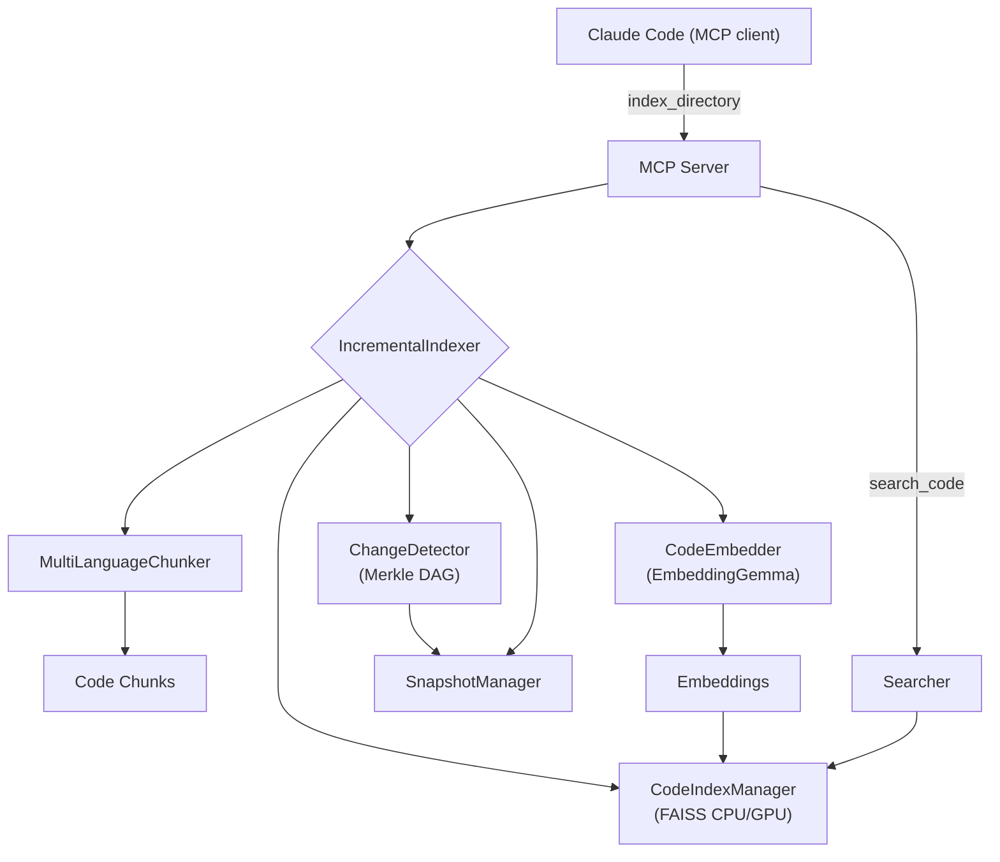

```
  ██████╗ ██╗       █████╗  ██╗   ██╗ ██████╗  ███████╗
 ██╔════╝ ██║      ██╔══██╗ ██║   ██║ ██╔══██╗ ██╔════╝
 ██║      ██║      ███████║ ██║   ██║ ██║  ██║ █████╗
 ██║      ██║      ██╔══██║ ██║   ██║ ██║  ██║ ██╔══╝
 ╚██████╗ ███████╗ ██║  ██║ ╚██████╔╝ ██████╔╝ ███████╗
  ╚═════╝ ╚══════╝ ╚═╝  ╚═╝  ╚═════╝  ╚═════╝  ╚══════╝

  ██████╗  ██████╗  ███╗   ██╗ ████████╗ ███████╗ ██╗  ██╗ ████████╗
 ██╔════╝ ██╔═══██╗ ████╗  ██║ ╚══██╔══╝ ██╔════╝ ╚██╗██╔╝ ╚══██╔══╝
 ██║      ██║   ██║ ██╔██╗ ██║    ██║    █████╗    ╚███╔╝     ██║
 ██║      ██║   ██║ ██║╚██╗██║    ██║    ██╔══╝    ██╔██╗     ██║
 ╚██████╗ ╚██████╔╝ ██║ ╚████║    ██║    ███████╗ ██╔╝ ██╗    ██║
  ╚═════╝  ╚═════╝  ╚═╝  ╚═══╝    ╚═╝    ╚══════╝ ╚═╝  ╚═╝    ╚═╝

 ██╗       ██████╗   ██████╗  █████╗  ██╗
 ██║      ██╔═══██╗ ██╔════╝ ██╔══██╗ ██║
 ██║      ██║   ██║ ██║      ███████║ ██║
 ██║      ██║   ██║ ██║      ██╔══██║ ██║
 ███████╗ ╚██████╔╝ ╚██████╗ ██║  ██║ ███████╗
 ╚══════╝  ╚═════╝   ╚═════╝ ╚═╝  ╚═╝ ╚══════╝

```

**General-Purpose Semantic Code Search for Windows.** Advanced **hybrid search** that combines semantic understanding with text matching, running 100% locally using EmbeddingGemma. No API keys, no costs, your code never leaves your machine.

- 🔍 **Hybrid search: BM25 + semantic for best accuracy (44.4% precision, 100% MRR)**
- 📈 **Optimized search efficiency with sub-second response times (162-487ms)**
- 🔒 **100% local - completely private**
- 💰 **Zero API costs - forever free**
- ⚡ **5-10x faster indexing with incremental updates**
- 🪟 **Windows-optimized** for maximum performance and compatibility

An intelligent code search system that uses Google's EmbeddingGemma model and advanced multi-language chunking to provide semantic search capabilities across 22 file extensions and 11 programming languages, integrated with Claude Code via MCP (Model Context Protocol).

## Status

- **🚧 Active Development**: This project is under active development. Some functionality may change as we continue to improve the system.
- Core functionality fully operational
- Windows-optimized installation with automated setup
- All search modes working (semantic, BM25, hybrid)
- Please report any issues!

## Demo


## Features

### 🔍 **Advanced Search Capabilities**

- **Hybrid search**: BM25 + Semantic fusion combines text matching with semantic understanding
- **Three search modes**: Semantic, BM25 text-based, and hybrid with RRF reranking
- **Proven search quality**: 44.4% precision, 46.7% F1-score, 100% MRR (see [benchmarks](docs/BENCHMARKS.md))
- **Sub-second performance**: 162-487ms response times across all search modes
- **Configurable weights**: Tune balance between text and semantic search
- **Auto-mode detection**: System automatically chooses best search strategy

### 🚀 **Core Features**

- **Multi-language support**: 11 programming languages with 22 file extensions
- **Intelligent chunking**: AST-based (Python) + tree-sitter (JS/TS/JSX/TSX/Svelte/Go/Java/Rust/C/C++/C#/GLSL)
- **Semantic search**: Natural language queries to find code across all languages
- **Rich metadata**: File paths, folder structure, semantic tags, language-specific info
- **MCP integration**: Direct integration with Claude Code for seamless workflow
- **Local processing**: All embeddings stored locally, no API calls required
- **Fast search**: FAISS for efficient similarity search with GPU acceleration support
- **Incremental indexing**: 5-10x faster updates with Merkle tree change detection

## Why this

Claude’s code context is powerful, but sending your code to the cloud costs tokens and raises privacy concerns. This project keeps semantic code search entirely on your machine. It integrates with Claude Code via MCP, so you keep the same workflow—just faster, cheaper, and private.

## Requirements

- **Python 3.11+** (tested with Python 3.11 and 3.12)
- **RAM**: 4GB minimum (8GB+ recommended for large codebases)
- **Disk**: 2-4GB free space (model cache + embeddings + indexes)
  - EmbeddingGemma: ~1.2GB
  - BGE-M3: ~2.2GB (optional upgrade)
- **Windows**: Windows 10/11 with PowerShell
- **PyTorch**: 2.6.0+ (automatically installed)
  - Required for BGE-M3 model support
  - Includes security fixes
- **Optional GPU**: NVIDIA GPU with CUDA 11.8/12.4/12.6 for accelerated indexing (8.6x faster)
  - PyTorch 2.6.0+ with CUDA 11.8/12.4/12.6 support
  - FAISS GPU acceleration for vector search
  - CUDA acceleration for embedding generation
  - Everything works on CPU if GPU unavailable

## Install & Update

### Windows Installation

```powershell
# 1. Clone the repository
git clone https://github.com/forkni/claude-context-local.git
cd claude-context-local

# 2. Run the unified Windows installer (auto-detects CUDA)
install-windows.bat

# 3. Verify installation
verify-installation.bat

# 4. (Optional) Configure Claude Code MCP integration
.\scripts\batch\manual_configure.bat
```

> **⚠️ Important**: The installer will prompt for HuggingFace authentication during setup. You'll need a HuggingFace token to access the EmbeddingGemma model. Get your token at [https://huggingface.co/settings/tokens](https://huggingface.co/settings/tokens) and accept terms at [https://huggingface.co/google/embeddinggemma-300m](https://huggingface.co/google/embeddinggemma-300m).

**Windows Installer Features:**

- **Smart CUDA Detection**: Automatically detects your CUDA version and installs appropriate PyTorch
- **One-Click Setup**: Complete installation with single command
- **Built-in Verification**: Comprehensive testing with verify-installation.bat
- **Professional Organization**: Clean, streamlined script structure

### Update existing installation

Update by pulling latest changes:

```powershell
# Navigate to your project directory
cd claude-context-local
git pull

# Re-run the Windows installer to update dependencies
install-windows.bat

# Verify the update
verify-installation.bat
```

The Windows installer will:

- Update the code and dependencies automatically
- Preserve your embeddings and indexed projects in `~/.claude_code_search`
- Update only changed components with intelligent caching
- Maintain your existing MCP server configuration

### What the Windows installer does

- Detects and installs `uv` package manager if missing
- Creates and manages the project virtual environment
- Installs Python dependencies with optimized resolution using `uv sync`
- Downloads the EmbeddingGemma model (~1.2–1.3 GB) if not already cached
- Automatically detects CUDA and installs PyTorch 2.6.0+ with appropriate CUDA version
- Configures `faiss-gpu` if an NVIDIA GPU is detected
- **Preserves all your indexed projects and embeddings** across updates

## Quick Start

### 1) Install and Setup

```powershell
# Windows - One-click installation
install-windows.bat

# Verify everything is working
verify-installation.bat

# The installer automatically:
# - Detects your hardware (CUDA/CPU)
# - Installs appropriate PyTorch version
# - Sets up all dependencies
# - Creates virtual environment
```

### 2) Start the MCP Server

```powershell
# Main entry point - Interactive menu with 8 functional options
start_mcp_server.bat

# Alternative launchers:
# Debug mode with enhanced logging
scripts\batch\start_mcp_debug.bat

# Simple mode with minimal output
scripts\batch\start_mcp_simple.bat
```

**Optional: Configure Claude Code Integration**

```powershell
# One-time setup to register MCP server with Claude Code
.\scripts\batch\manual_configure.bat

# Manual registration (alternative)
claude mcp add code-search --scope user -- "F:\path\to\claude-context-local\.venv\Scripts\python.exe" -m mcp_server.server
```

### 3) Use in Claude Code

#### Essential Workflow

```bash
# 1. Index your project (one-time setup)
/index_directory "C:\path\to\your\project"

# 2. Search your code with natural language
/search_code "authentication functions"
/search_code "error handling patterns"
/search_code "database connection setup"
/search_code "API endpoint handlers"
/search_code "configuration loading"
```

#### Advanced Search Examples

```bash
# Find similar code to existing implementations
/find_similar_code "project_file.py:123-145:function:authenticate_user"

# Check system status and performance
/get_index_status
/get_memory_status

# Configure search modes for specific needs
/configure_search_mode "hybrid" 0.4 0.6 true
/get_search_config_status

# Project management
/list_projects
/switch_project "C:\different\project\path"
```

#### Practical Usage Tips

- **Start simple**: Use natural language queries like "error handling" or "database connection"
- **Be specific**: "React component with useState hook" vs just "React"
- **Use context**: "authentication middleware" vs "auth" for better results
- **Try different modes**: Switch between semantic, hybrid, and text search as needed
- **Clean up**: Use `/cleanup_resources` when switching between large projects

**No manual configuration needed** - the system automatically uses the best search mode for your queries.

### 4) Setting Up CLAUDE.md for Your Project (Optional but Recommended)

To maximize efficiency when using Claude Code with this MCP server, create a `CLAUDE.md` file in your project root. This file instructs Claude to prioritize semantic search over traditional file reading, ensuring optimal token usage.

#### Why CLAUDE.md?

- **93% Token Reduction**: Enforces search-first workflow (400 tokens vs 5,600 tokens)
- **10x Faster**: Semantic search (3-5s) vs traditional file reading (30-60s)
- **Immediate Access**: MCP tools visible to Claude without explaining each time
- **Project-Specific**: Customize instructions for your codebase

#### Minimal CLAUDE.md Template

Create a `CLAUDE.md` file in your project root with this content:

```markdown
# Project Instructions for Claude Code

## 🔴 CRITICAL: Search-First Protocol

**MANDATORY**: For ALL codebase tasks, ALWAYS use semantic search FIRST before reading files.

### Workflow Sequence

1. **Index**: `/index_directory "C:\path\to\your\project"` - One-time setup
2. **Search**: `/search_code "natural language query"` - Find code instantly
3. **Edit**: Use `Read` tool ONLY after search identifies exact file

### Performance Impact

| Method | Tokens | Speed | Result |
|--------|--------|-------|--------|
| Traditional file reading | 5,600 tokens | 30-60s | Limited context |
| Semantic search | 400 tokens | 3-5s | Precision targeting |
| **Token savings** | **93%** | **10x faster** | **Cross-file relationships** |

### Critical Rules

- ✅ **ALWAYS**: `search_code()` for exploration/understanding
- ✅ **ALWAYS**: Index before searching: `index_directory(path)`
- ❌ **NEVER**: Read files without searching first
- ❌ **NEVER**: Use `Glob()` for code exploration
- ❌ **NEVER**: Grep manually for code patterns

**Every file read without search wastes 1,000+ tokens**

---

## Available MCP Tools (12)

| Tool | Priority | Purpose |
|------|----------|---------|
| **search_code** | 🔴 **ESSENTIAL** | Find code with natural language |
| **index_directory** | 🔴 **SETUP** | Index project (one-time) |
| find_similar_code | Secondary | Find alternative implementations |
| configure_search_mode | Config | Set search mode (hybrid/semantic/BM25) |
| get_search_config_status | Config | View current search configuration |
| get_index_status | Status | Check index health |
| get_memory_status | Monitor | Check RAM/VRAM usage |
| list_projects | Management | Show indexed projects |
| switch_project | Management | Change active project |
| clear_index | Reset | Delete current index |
| cleanup_resources | Cleanup | Free memory/caches |
| run_benchmark | Testing | Validate search quality |

### Quick Examples

```bash
# Essential workflow
/index_directory "C:\Projects\MyApp"
/search_code "authentication functions"
/search_code "error handling patterns"

# Advanced usage
/find_similar_code "auth.py:15-42:function:login"
/configure_search_mode "hybrid" 0.4 0.6
/get_index_status
```

### Search Modes

- **hybrid** (default) - BM25 + semantic fusion (best accuracy)
- **semantic** - Dense vector search only (best for concepts)
- **bm25** - Sparse keyword search only (best for exact terms)
- **auto** - Adaptive mode selection

---

📚 **Full Tool Reference**: See [docs/MCP_TOOLS_REFERENCE.md](https://github.com/forkni/claude-context-local/blob/main/docs/MCP_TOOLS_REFERENCE.md) for complete documentation with all parameters and examples.

```

#### Customization Tips

1. **Copy the Template**: Save the content above to `CLAUDE.md` in your project root
2. **Adjust Paths**: Update the index_directory path to match your project
3. **Add Project Rules**: Include project-specific coding conventions, architecture notes, or common patterns
4. **Use Full Reference**: For complete tool documentation, copy content from `docs/MCP_TOOLS_REFERENCE.md`

#### How It Works

- Claude Code automatically reads `CLAUDE.md` from your project directory
- Instructions apply to all Claude sessions in that project
- MCP tools are immediately available without explanation
- Search-first workflow becomes automatic

#### Example Projects

This repository's own `CLAUDE.md` demonstrates advanced usage with:
- Comprehensive MCP tool documentation
- Project-specific architecture notes
- Model selection guidance
- Testing and benchmarking instructions

> **Note**: The `CLAUDE.md` in this repository is project-specific. Use the minimal template above for your own projects, then customize as needed.

## Running Benchmarks

The project includes comprehensive benchmarking tools to validate performance:

### Quick Start

```bash
# Windows - Interactive benchmark menu
run_benchmarks.bat
```

**Available Options:**

1. **Token Efficiency Benchmark** (~10 seconds)
   - Validates 98.6% token reduction vs traditional file reading
   - Results saved to: `benchmark_results/token_efficiency/`

2. **Search Method Comparison** (~2-3 minutes)
   - Automatically compares all 3 search methods (hybrid, BM25, semantic)
   - Uses current project directory for realistic evaluation
   - Results saved to: `benchmark_results/method_comparison/`
   - Generates comparison report with winner declaration

3. **Auto-Tune Search Parameters** (~2 minutes)
   - Optimize BM25/Dense weights for your codebase
   - Tests 3 strategic configurations
   - Results saved to: `benchmark_results/tuning/`

4. **Run All Benchmarks** (~4-5 minutes)
   - Complete test suite including auto-tuning
   - Comprehensive results across all metrics

### Command Line Usage

```bash
# Method comparison (recommended)
.venv\Scripts\python.exe evaluation/run_evaluation.py method-comparison --project "." --k 5

# Token efficiency evaluation
.venv\Scripts\python.exe evaluation/run_evaluation.py token-efficiency

# Force CPU usage (if GPU issues)
.venv\Scripts\python.exe evaluation/run_evaluation.py token-efficiency --cpu
```

Results are saved to `benchmark_results/` directory (gitignored for privacy).
See [docs/BENCHMARKS.md](docs/BENCHMARKS.md) for detailed performance metrics.

## Search Modes & Performance

### Available Search Modes

| Mode | Description | Best For | Performance | Quality Metrics | Status |
|------|-------------|----------|-------------|-----------------|--------|
| **hybrid** | BM25 + Semantic with RRF reranking (default) | General use, balanced accuracy | 487ms, optimal accuracy | 44.4% precision, 100% MRR | ✅ Fully operational |
| **semantic** | Dense vector search only | Conceptual queries, code similarity | 487ms, semantic understanding | 38.9% precision, 100% MRR | ✅ Fixed 2025-09-25 |
| **bm25** | Text-based sparse search only | Exact matches, error messages | 162ms, fastest | 33.3% precision, 61.1% MRR | ✅ Fully operational |
| **auto** | Automatically choose based on query | Let system optimize | Adaptive performance | Context-dependent | ✅ Fully operational |

For detailed configuration options, see [Hybrid Search Configuration Guide](docs/HYBRID_SEARCH_CONFIGURATION_GUIDE.md).

📊 **Performance benchmarks and detailed metrics**: [View Benchmarks](docs/BENCHMARKS.md)

## Architecture

```
claude-context-local/
├── chunking/                         # Multi-language chunking (22 extensions)
│   ├── multi_language_chunker.py     # Unified orchestrator (Python AST + tree-sitter)
│   ├── python_ast_chunker.py         # Python-specific chunking (rich metadata)
│   └── tree_sitter.py                # Tree-sitter: JS/TS/JSX/TSX/Svelte/Go/Java/Rust/C/C++/C#/GLSL
├── embeddings/
│   └── embedder.py                   # EmbeddingGemma; device=auto (CUDA→MPS→CPU); offline cache
├── search/
│   ├── indexer.py                    # FAISS index (CPU by default; GPU when available)
│   ├── searcher.py                   # Intelligent ranking & filters
│   ├── incremental_indexer.py        # Merkle-driven incremental indexing
│   ├── hybrid_searcher.py            # BM25 + semantic fusion
│   ├── bm25_index.py                 # BM25 text search implementation
│   ├── reranker.py                   # RRF (Reciprocal Rank Fusion) reranking
│   └── config.py                     # Search configuration management
├── merkle/
│   ├── merkle_dag.py                 # Content-hash DAG of the workspace
│   ├── change_detector.py            # Diffs snapshots to find changed files
│   └── snapshot_manager.py           # Snapshot persistence & stats
├── mcp_server/
│   └── server.py                     # MCP tools for Claude Code (stdio/HTTP)
├── tools/                            # Development utilities
│   ├── index_project.py              # Interactive project indexing
│   ├── search_helper.py              # Standalone search interface
│   └── auto_tune_search.py           # Parameter optimization tool
├── evaluation/                       # Comprehensive evaluation framework
│   ├── base_evaluator.py             # Base evaluation framework
│   ├── semantic_evaluator.py         # Search quality evaluation
│   ├── token_efficiency_evaluator.py # Token usage measurement
│   ├── parameter_optimizer.py        # Search parameter optimization
│   ├── run_evaluation.py             # Evaluation orchestrator
│   ├── datasets/                     # Evaluation datasets
│   │   ├── debug_scenarios.json      # Debug test scenarios
│   │   └── token_efficiency_scenarios.json # Token efficiency tests
│   └── README.md                     # Evaluation documentation
├── scripts/
│   ├── batch/                        # Windows batch scripts
│   │   ├── install_pytorch_cuda.bat  # PyTorch CUDA installation
│   │   ├── mcp_server_wrapper.bat    # MCP server wrapper script
│   │   ├── start_mcp_debug.bat       # Debug mode launcher
│   │   └── start_mcp_simple.bat      # Simple mode launcher
│   ├── powershell/                   # Windows PowerShell scripts
│   │   ├── configure_claude_code.ps1 # Claude Code MCP configuration
│   │   ├── hf_auth.ps1               # HuggingFace authentication helper
│   │   ├── install-windows.ps1       # Windows automated installer
│   │   └── start_mcp_server.ps1      # PowerShell MCP server launcher
│   ├── git/                          # Git workflow automation (10 scripts)
│   │   ├── commit.bat                # Privacy-protected commits
│   │   ├── sync_branches.bat         # Branch synchronization
│   │   ├── restore_local.bat         # Local file recovery
│   │   ├── merge_docs.bat            # Documentation-only merge
│   │   ├── cherry_pick_commits.bat   # Selective commit merging
│   │   ├── commit_enhanced.bat       # Enhanced commit with validations
│   │   ├── merge_with_validation.bat # Full merge with .gitattributes support
│   │   ├── validate_branches.bat     # Branch state validation
│   │   ├── sync_status.bat           # Check synchronization status
│   │   └── rollback_merge.bat        # Rollback failed merges
│   ├── verify_installation.py        # Python verification system
│   └── verify_hf_auth.py             # HuggingFace auth verification
├── .claude/
│   └── commands/                     # Custom Claude Code commands
│       ├── create-pr.md              # Automated PR creation
│       ├── run-merge.md              # Guided merge workflow
│       └── validate-changes.md       # Pre-commit validation
├── .github/
│   └── workflows/                    # GitHub Actions automation
│       ├── branch-protection.yml     # Validation, testing, linting
│       ├── claude.yml                # Interactive @claude mentions
│       ├── docs-validation.yml       # Documentation quality checks
│       └── merge-development-to-main.yml # Manual merge workflow
├── docs/
│   ├── BENCHMARKS.md                 # Performance benchmarks
│   ├── HYBRID_SEARCH_CONFIGURATION_GUIDE.md # Search configuration
│   ├── INSTALLATION_GUIDE.md         # Installation instructions
│   └── claude_code_config.md         # Claude Code integration
├── CHANGELOG.md                      # Version history
├── start_mcp_server.bat              # Main launcher (Windows)
├── install-windows.bat               # Primary installer (Windows)
├── verify-installation.bat           # Installation verification
├── verify-hf-auth.bat                # HuggingFace auth verification
└── run_benchmarks.bat                # Benchmark launcher
```

### Data flow



## Intelligent Chunking

The system uses advanced parsing to create semantically meaningful chunks across all supported languages:

### Chunking Strategies

- **Python**: AST-based parsing for rich metadata extraction
- **All other languages**: Tree-sitter parsing with language-specific node type recognition

### Chunk Types Extracted

- **Functions/Methods**: Complete with signatures, docstrings, decorators
- **Classes/Structs**: Full definitions with member functions as separate chunks
- **Interfaces/Traits**: Type definitions and contracts
- **Enums/Constants**: Value definitions and module-level declarations
- **Namespaces/Modules**: Organizational structures
- **Templates/Generics**: Parameterized type definitions
- **GLSL Shaders**: Vertex, fragment, compute, geometry, tessellation shaders with uniforms and layouts

### Rich Metadata for All Languages

- File path and folder structure
- Function/class/type names and relationships
- Language-specific features (async, generics, modifiers, etc.)
- Parent-child relationships (methods within classes)
- Line numbers for precise code location
- Semantic tags (component, export, async, etc.)

## Configuration

### Environment Variables

- `CODE_SEARCH_STORAGE`: Custom storage directory (default: `~/.claude_code_search`)

## Embedding Models

The system supports multiple embedding models for different performance/accuracy trade-offs:

### Available Models

| Model | Dimensions | VRAM | Context | Best For |
|-------|------------|------|---------|----------|
| **EmbeddingGemma-300m** (default) | 768 | 4-8GB | 2048 tokens | Fast, efficient, smaller projects |
| **BGE-M3** | 1024 | 8-16GB | 8192 tokens | Higher accuracy (+13.6% F1), production systems |

### Switching Models

**Via Interactive Menu:**

```bash
start_mcp_server.bat
# Navigate: 3 (Search Configuration) → 4 (Select Embedding Model)
```

**Via Environment Variable:**

```bash
set CLAUDE_EMBEDDING_MODEL=BAAI/bge-m3  # Switch to BGE-M3
set CLAUDE_EMBEDDING_MODEL=google/embeddinggemma-300m  # Switch to Gemma
```

See [Model Migration Guide](docs/MODEL_MIGRATION_GUIDE.md) for detailed comparison and migration steps.

### ✨ Instant Model Switching

**Zero re-indexing overhead** when switching between models - switch in <150ms:

**Performance:**

- **First use**: ~30-60s (indexing required)
- **Return to previous model**: <150ms (instant!)
- **Time savings**: 98% reduction (50-90s → <1s)

**How It Works:**

- Per-dimension storage: `{project}_{hash}_{768d|1024d}/`
  - Gemma (768d): `project_abc123_768d/`
  - BGE-M3 (1024d): `project_abc123_1024d/`
- Independent Merkle snapshots per model dimension
- Instant activation of existing indices when switching back

**Example Workflow:**

```bash
# Index with BGE-M3 (~30s first time)
/switch_embedding_model "BAAI/bge-m3"
/index_directory "C:\Projects\MyApp"

# Switch to Gemma (~20s first time)
/switch_embedding_model "google/embeddinggemma-300m"
/index_directory "C:\Projects\MyApp"

# Switch back to BGE-M3 (INSTANT - <150ms!)
/switch_embedding_model "BAAI/bge-m3"

# Compare search results instantly
/search_code "authentication"  # BGE-M3 results
/switch_embedding_model "google/embeddinggemma-300m"  # Instant switch!
/search_code "authentication"  # Gemma results
```

📚 **Technical details**: See [docs/PER_MODEL_INDICES_IMPLEMENTATION.md](docs/PER_MODEL_INDICES_IMPLEMENTATION.md) (development branch)

### 🚀 GPU Memory Optimization

**Automatic memory cleanup** keeps vRAM usage optimal during indexing:

**Performance Impact:**

- **Before optimization**: 1.4GB → 8GB during indexing (memory leak)
- **After optimization**: 1.4GB → 3-4GB during indexing (72% reduction)
- **Memory cleanup**: Drops to 1.4GB baseline on demand

**How It Works:**

The system implements comprehensive GPU memory management:

1. **Python garbage collection**: `gc.collect()` frees wrapper objects first
2. **CUDA cache cleanup**: `torch.cuda.empty_cache()` releases GPU tensors
3. **Automatic triggers**: Runs after every indexing operation (full or incremental)
4. **Manual cleanup**: Use `/cleanup_resources` MCP tool anytime

**Memory Lifecycle:**

```
Baseline (idle):        1.4GB
↓ Index with Gemma:     3.0GB  (model + embeddings)
↓ Index with BGE-M3:    4.0GB  (larger model)
↓ Manual cleanup:       1.4GB  (back to baseline)
```

**When to Use Manual Cleanup:**

- After large indexing operations
- When switching between multiple projects
- Before intensive operations requiring GPU memory
- If you notice high vRAM usage

**Example:**

```bash
# Index a large project
/index_directory "C:\LargeProject"

# Check memory usage
/get_memory_status

# Clean up GPU memory
/cleanup_resources
# Actions: Index cleared, Embedder cleaned, GPU cache freed, 7000+ objects collected

# Verify cleanup
/get_memory_status  # Should show baseline ~1.4GB
```

📚 **Implementation details**: Cleanup uses `gc.collect()` + `torch.cuda.empty_cache()` pattern recommended by PyTorch and ComfyUI communities for optimal memory management.

### Model Configuration

The system supports two embedding models:

- **Default**: `google/embeddinggemma-300m` (768 dimensions, 4-8GB VRAM)
- **Upgrade**: `BAAI/bge-m3` (1024 dimensions, 8-16GB VRAM, +13.6% F1-score)

Notes:

- Download size: ~1.2GB (Gemma) or ~2.2GB (BGE-M3)
- Device selection: auto (CUDA on NVIDIA, MPS on Apple Silicon, else CPU)
- Models are cached after first download in `~/.cache/huggingface/hub`
- Cache detection implemented - models load instantly on subsequent uses
- FAISS backend: CPU by default. If an NVIDIA GPU is detected, the installer
  attempts to install `faiss-gpu-cu12` (or `faiss-gpu-cu11`) and the index will
  run on GPU automatically at runtime while saving as CPU for portability.

#### Hugging Face authentication (if prompted)

The `google/embeddinggemma-300m` model is hosted on Hugging Face and may require
accepting terms and/or authentication to download.

1. Visit the model page and accept any terms:

   - <https://huggingface.co/google/embeddinggemma-300m>

2. Authenticate one of the following ways:

   - CLI (recommended):

     ```bash
     uv run huggingface-cli login
     # Paste your token from https://huggingface.co/settings/tokens
     ```

   - Environment variable:

     ```bash
     export HUGGING_FACE_HUB_TOKEN=hf_XXXXXXXXXXXXXXXXXXXXXXXX
     ```

After the first successful download, we cache the model under `~/.claude_code_search/models`
and prefer offline loads for speed and reliability.

### Model Caching

Once downloaded, models are cached locally for instant loading:

- **Cache location**: `~/.cache/huggingface/hub/`
- **Offline mode**: Automatically enabled when cached models detected
- **Load time**: 2-5 seconds from cache (vs minutes for download)
- **No internet required**: After initial download
- **Cache detection**: Implemented in embedder for both Gemma and BGE-M3

### Hybrid Search Configuration

The system supports multiple search modes with configurable parameters:

#### Quick Configuration via MCP Tools

```bash
# Configure hybrid search (recommended)
/configure_search_mode "hybrid" 0.4 0.6 true

# Check current configuration
/get_search_config_status

# Switch to semantic-only mode
/configure_search_mode "semantic" 0.0 1.0 true

# Switch to text-only mode
/configure_search_mode "bm25" 1.0 0.0 true
```

#### Environment Variable Configuration

```bash
# Windows (PowerShell)
$env:CLAUDE_SEARCH_MODE="hybrid"
$env:CLAUDE_ENABLE_HYBRID="true"
$env:CLAUDE_BM25_WEIGHT="0.4"
$env:CLAUDE_DENSE_WEIGHT="0.6"

```

#### Available Search Modes

| Mode | Description | Best For | Performance | Quality Metrics | Status |
|------|-------------|----------|-------------|-----------------|--------|
| **hybrid** | BM25 + Semantic with RRF reranking (default) | General use, balanced accuracy | 487ms, optimal accuracy | 44.4% precision, 100% MRR | ✅ Fully operational |
| **semantic** | Dense vector search only | Conceptual queries, code similarity | 487ms, semantic understanding | 38.9% precision, 100% MRR | ✅ Fixed 2025-09-25 |
| **bm25** | Text-based sparse search only | Exact matches, error messages | 162ms, fastest | 33.3% precision, 61.1% MRR | ✅ Fully operational |
| **auto** | Automatically choose based on query | Let system optimize | Adaptive performance | Context-dependent | ✅ Fully operational |

For detailed configuration options, see [Hybrid Search Configuration Guide](docs/HYBRID_SEARCH_CONFIGURATION_GUIDE.md).

📊 **Performance benchmarks and detailed metrics**: [View Benchmarks](docs/BENCHMARKS.md)

## MCP Tools Reference

The following MCP tools are available in Claude Code:

### Core Search Tools

- `/search_code` - Main search with hybrid capabilities
- `/index_directory` - Index a project for searching
- `/find_similar_code` - Find code similar to a specific chunk

### Configuration Tools

- `/configure_search_mode` - Configure hybrid search parameters
- `/get_search_config_status` - View current configuration

### Management Tools

- `/get_index_status` - Check index statistics
- `/get_memory_status` - Monitor memory usage
- `/cleanup_resources` - Free memory and cleanup
- `/clear_index` - Reset search index
- `/list_projects` - List indexed projects
- `/switch_project` - Switch between projects

### Supported Languages & Extensions

**Fully Supported (22 extensions across 10+ languages):**

| Language | Extensions |
|----------|------------|
| **Python** | `.py` |
| **JavaScript** | `.js`, `.jsx` |
| **TypeScript** | `.ts`, `.tsx` |
| **Java** | `.java` |
| **Go** | `.go` |
| **Rust** | `.rs` |
| **C** | `.c` |
| **C++** | `.cpp`, `.cc`, `.cxx`, `.c++` |
| **C#** | `.cs` |
| **Svelte** | `.svelte` |
| **GLSL** | `.glsl`, `.frag`, `.vert`, `.comp`, `.geom`, `.tesc`, `.tese` |

**Total**: **22 file extensions** across **11 programming languages**

## Storage

Data is stored in the configured storage directory:

```
~/.claude_code_search/
├── models/          # Downloaded models
├── index/           # FAISS indices and metadata
│   ├── code.index   # Vector index
│   ├── metadata.db  # Chunk metadata (SQLite)
│   ├── stats.json   # Index statistics
│   └── bm25/        # BM25 text search index
│       ├── bm25.index      # BM25 sparse index
│       ├── bm25_docs.json  # Document storage
│       └── bm25_metadata.json # BM25 metadata
```

## Performance

- **Model size**: ~1.2GB (EmbeddingGemma-300m and caches)
- **Embedding dimension**: 768 (can be reduced for speed)
- **Index types**: Flat (exact) or IVF (approximate) based on dataset size
- **Batch processing**: Configurable batch sizes for embedding generation

Tips:

- First index on a large repo will take time (model load + chunk + embed). Subsequent runs are incremental.
- With GPU FAISS, searches on large indexes are significantly faster.
- Embeddings automatically use CUDA (NVIDIA) or MPS (Apple) if available.

## Troubleshooting

### Quick Diagnostics

Run automated verification to identify issues:

```powershell
# Comprehensive system check
verify-installation.bat

# HuggingFace authentication check
verify-hf-auth.bat

# Repair tool - Fix common issues
scripts\batch\repair_installation.bat
```

**Repair Tool Options:**

1. Clear all Merkle snapshots (fixes stale change detection)
2. Clear project indexes (reset search state)
3. Reconfigure Claude Code integration
4. Verify dependencies
5. Full system reset (indexes + snapshots)
6. Return to main menu

### Installation Issues

1. **Import errors**: Ensure all dependencies are installed

   ```powershell
   cd claude-context-local
   uv sync
   ```

2. **UV not found**: Install UV package manager first

   ```powershell
   install-windows.bat  # Automatically installs UV
   ```

3. **PyTorch CUDA version mismatch or BGE-M3 errors**:

   BGE-M3 requires PyTorch 2.6.0+ due to security improvements. If you have an older installation, reinstall using:

   ```powershell
   # Reinstall entire environment with correct PyTorch version
   install-windows.bat
   ```

   Or manually upgrade PyTorch only:

   ```powershell
   .venv\Scripts\uv.exe pip install "torch==2.6.0" "torchvision==0.21.0" "torchaudio==2.6.0" --index-url https://download.pytorch.org/whl/cu118
   ```

### Model and Authentication Issues

4. **Model download fails**: Check internet, disk space, and HuggingFace authentication
   - Verify 2GB+ free disk space
   - Run `verify-hf-auth.bat` to check authentication
   - Get token at <https://huggingface.co/settings/tokens>
   - Accept model terms at <https://huggingface.co/google/embeddinggemma-300m>

5. **"401 Unauthorized" error**: HuggingFace authentication required

   ```powershell
   # Authenticate with HuggingFace
   .venv\Scripts\python.exe -m huggingface_hub.commands.huggingface_cli login
   ```

6. **Force offline mode**: Use cached models without internet

   ```powershell
   $env:HF_HUB_OFFLINE="1"
   ```

### Search and Indexing Issues

7. **No search results**: Verify the codebase was indexed successfully
   - Check index status: `/get_index_status` in Claude Code
   - Verify project path is correct
   - Reindex with `/index_directory "C:\path\to\project"`

8. **"No changes detected" but files were modified**: Stale Merkle snapshot issue
   - Use force reindex to bypass snapshot checking
   - Via menu: `start_mcp_server.bat` → 5 (Project Management) → 2 (Force Reindex Project)
   - Via tool: `.venv\Scripts\python.exe tools\index_project.py --force`
   - Or use repair tool: `scripts\batch\repair_installation.bat` → Option 1

9. **Memory issues during indexing**: System running out of RAM
   - Close other applications to free memory
   - Check available RAM: `/get_memory_status`
   - For large codebases (10,000+ files), ensure 8GB+ RAM available

10. **Indexing too slow**: First-time indexing takes time

- Expected: ~30-60 seconds for small projects (100 files)
- Expected: ~5-10 minutes for large projects (10,000+ files)
- GPU accelerates by 8.6x - verify CUDA available

### GPU and Performance Issues

11. **FAISS GPU not used**: Ensure CUDA drivers and nvidia-smi available

    ```powershell
    # Check GPU availability
    nvidia-smi

    # Reinstall PyTorch with GPU support
    scripts\batch\install_pytorch_cuda.bat

    # Verify GPU detection
    .venv\Scripts\python.exe -c "import torch; print('CUDA:', torch.cuda.is_available())"
    ```

12. **"CUDA out of memory" error**: GPU memory exhausted
    - Close other GPU applications
    - System will automatically fall back to CPU
    - Performance will be slower but functional

### MCP Server Issues

13. **MCP server won't start**: Check Python environment and dependencies

    ```powershell
    # Test MCP server manually
    start_mcp_server.bat

    # Check for errors in output
    ```

14. **Claude Code can't find MCP tools**: MCP server not registered

    ```powershell
    # Register MCP server with Claude Code
    .\scripts\batch\manual_configure.bat

    # Verify configuration
    .\.venv\Scripts\python.exe scripts\manual_configure.py --validate-only

    # Run comprehensive MCP configuration validation (15 checks)
    .\tests\regression\test_mcp_configuration.ps1
    ```

15. **MCP server path verification fails**: Invalid path in .claude.json
    - Verify configuration: `.\.venv\Scripts\python.exe scripts\manual_configure.py --validate-only`
    - Reconfigure if needed: `.\scripts\batch\manual_configure.bat`
    - Check that wrapper script exists at configured path

16. **MCP connection lost**: Restart Claude Code and MCP server
    - Close Claude Code completely
    - Run `start_mcp_server.bat` in new terminal
    - Reopen Claude Code

### Windows-Specific Issues

17. **"cannot be loaded because running scripts is disabled"**: PowerShell execution policy

    ```powershell
    # Allow script execution (run as Administrator)
    Set-ExecutionPolicy -ExecutionPolicy RemoteSigned -Scope CurrentUser
    ```

18. **Path too long errors**: Windows path length limitation
    - Move project closer to drive root (e.g., `C:\Projects\`)
    - Enable long paths in Windows (requires admin):

      ```powershell
      New-ItemProperty -Path "HKLM:\SYSTEM\CurrentControlSet\Control\FileSystem" -Name "LongPathsEnabled" -Value 1 -PropertyType DWORD -Force
      ```

### Still Having Issues?

- Check [Installation Guide](docs/INSTALLATION_GUIDE.md) for detailed setup instructions
- Review [Benchmarks](docs/BENCHMARKS.md) for performance expectations
- Report issues at <https://github.com/forkni/claude-context-local/issues>

### Ignored directories (for speed and noise reduction)

`node_modules`, `.venv`, `venv`, `env`, `.env`, `.direnv`, `__pycache__`, `.pytest_cache`, `.mypy_cache`, `.ruff_cache`, `.pytype`, `.ipynb_checkpoints`, `build`, `dist`, `out`, `public`, `.next`, `.nuxt`, `.svelte-kit`, `.angular`, `.astro`, `.vite`, `.cache`, `.parcel-cache`, `.turbo`, `coverage`, `.coverage`, `.nyc_output`, `.gradle`, `.idea`, `.vscode`, `.docusaurus`, `.vercel`, `.serverless`, `.terraform`, `.mvn`, `.tox`, `target`, `bin`, `obj`

## Contributing

This is a research project focused on intelligent code chunking and search. Feel free to experiment with:

- Different chunking strategies
- Alternative embedding models
- Enhanced metadata extraction
- Performance optimizations

## License

Licensed under the GNU General Public License v3.0 (GPL-3.0). See the `LICENSE` file for details.

## Inspiration

This Windows-focused fork was adapted from [FarhanAliRaza/claude-context-local](https://github.com/FarhanAliRaza/claude-context-local), which provides cross-platform support for Linux and macOS.

Both projects draw inspiration from [zilliztech/claude-context](https://github.com/zilliztech/claude-context). We adapted the concepts to a Python implementation with fully local embeddings and Windows-specific optimizations.
