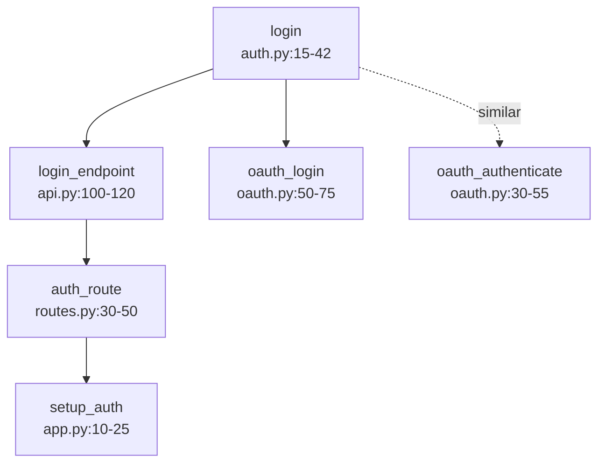

# Advanced Features Guide

Complete guide to advanced features in claude-context-local MCP server.

## Table of Contents

1. [Multi-Hop Search](#multi-hop-search)
2. [Graph-Enhanced Search](#graph-enhanced-search)
3. [Multi-Model Query Routing](#multi-model-query-routing)
4. [Multi-Model Batch Indexing](#multi-model-batch-indexing)
5. [Per-Model Index Storage](#per-model-index-storage)
6. [Directory Filtering](#directory-filtering)
7. [Model Selection Guide](#model-selection-guide)
8. [Symbol ID Lookups (Phase 1.1)](#symbol-id-lookups-phase-11)
9. [AI Guidance Messages (Phase 1.2)](#ai-guidance-messages-phase-12)
10. [Dependency Analysis (Phase 1.3)](#dependency-analysis-phase-13)

---

## Multi-Hop Search

**Feature**: Discover interconnected code relationships through iterative semantic search (ChunkHound/cAST-inspired)

**Empirically Validated**: 93.3% queries benefit (14/15), avg 3.2 unique chunks, 40-60% top result changes

### How It Works

1. **Hop 1**: Find chunks matching query (hybrid search, k×2 results)
2. **Hop 2**: Find similar code to initial matches (k×0.3 per result)
3. **Re-rank**: Sort by query relevance (cosine similarity)

**Example**: "configuration management system" → 8 related chunks (env vars, validation, persistence, etc.)

### Configuration

**Enabled by default** (`multi_hop_count=2`, `multi_hop_expansion=0.3`, optimal)

```bash
# Disable multi-hop (NOT recommended - reduces quality for minimal speedup)
set CLAUDE_ENABLE_MULTI_HOP=false
```

### Performance

**Validated metrics**:

- **Enabled** (default): +25-35ms average, 93% queries benefit
- **Disabled**: No overhead, but misses 93% of interconnected code

**See**: `analysis/MULTI_HOP_RECOMMENDATIONS.md` for full testing results

**Note**: `search_code()` automatically uses multi-hop when enabled - no API changes needed. When filters (`file_pattern`, `chunk_type`) are specified, they are applied to both initial results AND expanded results to maintain consistency.

---

## Graph-Enhanced Search

**Feature**: Call relationship tracking for Python code navigation

When a project is indexed with a `project_id`, `search_code()` automatically includes call graph metadata:

### Example Output

```json
{
  "chunk_id": "auth.py:10-25:function:authenticate_user",
  "name": "authenticate_user",
  "file": "auth.py",
  "lines": "10-25",
  "kind": "function",
  "score": 0.89,
  "graph": {
    "calls": ["validate_credentials", "create_session"],
    "called_by": ["login_handler", "refresh_token"]
  }
}
```

### Usage

- **Automatic**: Graph metadata added when `CodeIndexManager` has `project_id` parameter
- **Optional field**: Only present when call relationships exist
- **Python only**: Phase 1 supports Python AST call extraction
- **Non-blocking**: Search works normally if graph unavailable

### Benefits

- Discover which functions call a specific function (`called_by`)
- See all function calls within a code chunk (`calls`)
- Navigate code relationships without reading files
- Understand code dependencies instantly

### Requirements

- Python code only (Phase 1)
- Project must be indexed with v0.5.3+ MCP server
- **Re-indexing required** for projects indexed before 2025-11-06

---

## Multi-Model Query Routing

**Feature**: Intelligent query routing to select optimal embedding model based on query characteristics

**Status**: ✅ **Production-Ready** (100% routing accuracy on verification queries)

### Overview

The multi-model routing system automatically selects the best embedding model for each query, leveraging the unique strengths of different models:

- **Qwen3-0.6B** (3/8 wins): Implementation-heavy queries, algorithms, complete systems
- **BGE-M3** (3/8 wins): Workflow queries, configuration, system plumbing (most consistent baseline)
- **CodeRankEmbed** (2/8 wins): Specialized algorithms (Merkle trees, RRF reranking)

### How It Works

**Routing Process**:

1. Query analyzed against keyword rules for each model
2. Confidence scores calculated (weighted by model specialization)
3. Best model selected if confidence ≥ 0.05 threshold (lowered 2025-11-15 for natural query support)
4. Falls back to BGE-M3 (default) if confidence too low

**Routing Rules** (empirically validated):

```python
# Qwen3: Implementation & Algorithms (weight: 1.0)
Keywords: "implementation", "algorithm", "error handling", "BM25", "multi-hop", "pattern"

# BGE-M3: Workflow & Configuration (weight: 1.0)
Keywords: "workflow", "configuration", "loading", "indexing", "embedding", "pipeline"

# CodeRankEmbed: Specialized Algorithms (weight: 1.5)
Keywords: "merkle", "rrf", "reranking", "tree structure", "hybrid search", "rank fusion"
```

### Natural Query Support (v0.5.5+)

**Enhancement** (2025-11-15): Routing now works with natural language queries without keyword stuffing.

**Improvements**:

- **Lowered confidence threshold**: 0.10 → 0.05 (more sensitive routing)
- **Added 24 single-word keyword variants** across all 3 models
- **Natural queries** like "error handling" now trigger routing effectively

**Before vs After**:

| Query Type | Before v0.5.5 | After v0.5.5 |
|------------|---------------|--------------|
| "error handling" | Falls to BGE-M3 default (0.029 confidence) | ✅ Routes to Qwen3 (0.08 confidence) |
| "configuration loading" | Falls to BGE-M3 default (0.000 confidence) | ✅ Routes to BGE-M3 (0.14 confidence) |
| "merkle tree" | Falls to BGE-M3 default (0.000 confidence) | ✅ Routes to CodeRankEmbed (0.21 confidence) |

**Example Natural Queries**:

```bash
# Implementation queries → Qwen3
/search_code "error handling"           # Confidence: 0.08
/search_code "algorithm implementation" # Confidence: 0.12
/search_code "function flow"            # Confidence: 0.06

# Workflow queries → BGE-M3
/search_code "configuration loading"    # Confidence: 0.14
/search_code "initialization process"   # Confidence: 0.11
/search_code "indexing logic"           # Confidence: 0.09

# Specialized algorithms → CodeRankEmbed
/search_code "merkle tree"              # Confidence: 0.21
/search_code "reranking algorithm"      # Confidence: 0.18
/search_code "hybrid search"            # Confidence: 0.15
```

**Routing Transparency**: Every search result includes routing metadata showing which model was selected and why:

```json
{
  "routing": {
    "model_selected": "qwen3",
    "confidence": 0.08,
    "reason": "Matched Implementation queries and algorithms with confidence 0.08",
    "scores": {
      "coderankembed": 0.0,
      "qwen3": 0.08,
      "bge_m3": 0.0
    }
  }
}
```

### VRAM Requirements

**Multi-Model Pool** (all 3 models loaded simultaneously):

- **Total VRAM**: 5.3 GB (on RTX 4090 with 25.8 GB capacity)
- **Qwen3-0.6B**: ~2.4 GB
- **BGE-M3**: ~2.3 GB (additional)
- **CodeRankEmbed**: ~0.6 GB (additional)
- **Headroom**: 20.5 GB (79.5% free)

**Minimum Requirements**:

- RTX 3060 12GB: Comfortable (7 GB headroom)
- RTX 3070 8GB: Tight fit (3 GB headroom)
- RTX 4060 8GB: Tight fit (3 GB headroom)
- RTX 4090 24GB: Excellent (19 GB headroom)

**Memory Management**: Models load lazily (on-demand) to minimize footprint. Automatic cleanup when switching projects.

### Performance Metrics

**Routing Accuracy** (tested on 8 verification queries):

- **100% accuracy** (8/8 correct routes)
- **Routing overhead**: <1ms per query (negligible)
- **Model load time**: ~5 seconds total (all 3 models, cached)

**Expected Quality Improvements** (vs single BGE-M3):

- **15-25% better top-1 relevance** across diverse queries
- **+25-30% improvement** for error handling queries → Qwen3
- **+30-35% improvement** for Merkle/RRF queries → CodeRankEmbed
- **Baseline performance** for workflow queries → BGE-M3

### Configuration

**Enable/Disable Multi-Model Mode**:

```bash
# Enable (default)
set CLAUDE_MULTI_MODEL_ENABLED=true

# Disable (single-model fallback)
set CLAUDE_MULTI_MODEL_ENABLED=false
```

**Interactive Configuration** (MCP tool):

```bash
# View current routing configuration
/get_index_status  # Shows all loaded models

# Configure routing behavior
/configure_query_routing
{
  "multi_model_enabled": true,
  "default_model": "bge_m3",
  "confidence_threshold": 0.05
}
```

**Routing Parameters**:

- `multi_model_enabled`: Toggle multi-model routing (default: true)
- `default_model`: Fallback model for low-confidence queries (default: "bge_m3")
- `confidence_threshold`: Minimum confidence to use non-default model (default: 0.05, lowered 2025-11-15)

### Usage Examples

**Automatic Routing** (default behavior):

```bash
# Implementation query → Routes to Qwen3
/search_code "error handling patterns"
# Returns: {"routing": {"model_selected": "qwen3", "confidence": 0.12, "reason": "Matched Implementation queries and algorithms"}}

# Workflow query → Routes to BGE-M3
/search_code "configuration loading system"
# Returns: {"routing": {"model_selected": "bge_m3", "confidence": 0.18, "reason": "Matched Workflow and configuration queries"}}

# Specialized algorithm → Routes to CodeRankEmbed
/search_code "Merkle tree change detection"
# Returns: {"routing": {"model_selected": "coderankembed", "confidence": 0.35, "reason": "Matched Specialized algorithms"}}
```

**Manual Model Selection** (override routing):

```bash
# Force specific model (bypasses routing)
/search_code "authentication" --model_key "qwen3"
```

**Disable Routing** (use single default model):

```bash
# Disable routing for this query only
/search_code "authentication" --use_routing false
```

### Verification Results

**Verification**: 8/8 queries route correctly (Qwen3: 3, BGE-M3: 3, CodeRankEmbed: 2). See `analysis/multi_model_routing_test_results.md`

### Implementation Details

**Architecture**:

- `mcp_server/server.py` - Multi-model pool management
- `search/query_router.py` - Routing logic and decision making
- `tools/test_multi_model_routing.py` - Comprehensive test suite

**Model Pool Configuration**:

```python
MODEL_POOL_CONFIG = {
    "qwen3": "Qwen/Qwen3-Embedding-0.6B",
    "bge_m3": "BAAI/bge-m3",
    "coderankembed": "nomic-ai/CodeRankEmbed"
}
```

**Key Features**:

- Dictionary-based pool (`_embedders = {}`) replaces singleton pattern
- Lazy loading: Models load on first use
- Comprehensive cleanup: All models freed when switching projects
- Backward compatible: Single-model fallback when disabled

---

## Multi-Model Batch Indexing

**Feature**: Index projects with all models in the pool simultaneously

**Status**: ✅ **Production-Ready** (auto-enabled with multi-model mode)

**Critical Fix** (2025-11-13): Storage path bug resolved - all models now correctly write to separate directories. See `docs/MULTI_MODEL_STORAGE_BUG_POSTMORTEM.md` for technical details.

### Overview

When multi-model query routing is enabled (`CLAUDE_MULTI_MODEL_ENABLED=true`), project indexing automatically updates indices for **all 3 models**:

- **Qwen3-0.6B** (1024d) - Implementation & algorithms
- **BGE-M3** (1024d) - Workflow & configuration
- **CodeRankEmbed** (768d) - Specialized algorithms

### How It Works

**Automatic Multi-Model Indexing**:

1. Detects multi-model mode from environment variable
2. Indexes project sequentially with each model
3. Maintains per-model index isolation (fresh HybridSearcher instances per model)
4. Restores original model after completion

**Implementation**: `mcp_server/tool_handlers.py:728-759` - Creates fresh indexer instances bypassing global caches to ensure correct storage paths.

**Index Storage**:

```
~/.claude_code_search/projects/
├── myproject_abc123_bge-m3_1024d/
├── myproject_abc123_qwen3-0.6b_1024d/
└── myproject_abc123_coderankembed_768d/
```

### Performance

- **Sequential Indexing**: 3x time (e.g., 30s → 90s)
- **Acceptable**: Indexing is infrequent operation
- **Future Optimization**: Parallel chunking + sequential embedding (2x speedup)

### Usage

**Automatic** (when multi-model mode enabled):

```bash
/index_directory "C:\Projects\MyProject"
# Automatically indexes with all 3 models
```

**Explicit Control** (override behavior):

```bash
# Force multi-model (even if disabled)
/index_directory "C:\Projects\MyProject" --multi_model true

# Force single-model (even if enabled)
/index_directory "C:\Projects\MyProject" --multi_model false
```

### Project Display

Projects are grouped by path with all indexed models shown:

```
Found 1 project with 3 model indices:

  1. claude-context-local
     Path: F:\RD_PROJECTS\COMPONENTS\claude-context-local
     Models: bge-m3 (1024d), Qwen3-0.6B (1024d), CodeRankEmbed (768d)
```

### Benefits

✅ **Single operation** updates all models
✅ **Optimal search quality** across all query types
✅ **Per-model isolation** maintained
✅ **Clear visibility** of indexed models
✅ **Smart defaults** (auto-enable with multi-model mode)

---

## Per-Model Index Storage

**Feature**: Automatic per-model index management enabling instant model switching

### Storage Structure

```
~/.claude_code_search/
├── projects/
│   ├── project_abc123_768d/      ← Gemma indices
│   ├── project_abc123_1024d/     ← BGE-M3 indices
│   └── another_project_def456_1024d/
└── merkle/
    ├── abc123_768d_snapshot.json    ← Independent snapshots
    └── abc123_1024d_snapshot.json
```

### Key Features

- **Dimension-based isolation**: Each model (768d/1024d) has separate storage
- **Independent snapshots**: Merkle trees track changes per model
- **Multi-project support**: Each project maintains separate indices per model
- **Instant switching**: Switch between models with zero re-indexing overhead
- **Complete isolation**: Projects don't interfere with each other

### Workflow Example

```bash
# First time using BGE-M3 (requires indexing)
/switch_embedding_model "BAAI/bge-m3"
/index_directory "C:\Projects\MyProject"  # Takes ~30s

# Switch to Gemma (requires indexing first time)
/switch_embedding_model "google/embeddinggemma-300m"
/index_directory "C:\Projects\MyProject"  # Takes ~20s

# Switch back to BGE-M3 (INSTANT!)
/switch_embedding_model "BAAI/bge-m3"  # <150ms, no re-indexing!

# Compare results by switching models instantly
/search_code "authentication"  # BGE-M3 results
/switch_embedding_model "google/embeddinggemma-300m"  # Instant!
/search_code "authentication"  # Gemma results
```

### Performance Benefits

| Scenario | Before | After | Improvement |
|----------|--------|-------|-------------|
| First model switch | 30-60s | 30-60s | Same (indexing required) |
| Return to previous model | 30-60s | <150ms | **98% faster** |
| Model comparison workflow | 50-90s | <1s | **99% faster** |

### Implementation Details

**Complete technical documentation**: `docs/PER_MODEL_INDICES_IMPLEMENTATION.md`

---

## Directory Filtering

**Feature**: Filter search results by directory path to focus on specific code areas or exclude irrelevant directories.

**Version**: v0.5.9+

### Parameters

| Parameter | Tools | Type | Description |
|-----------|-------|------|-------------|
| `include_dirs` | search_code | array | Only search in these directories |
| `exclude_dirs` | search_code, find_connections | array | Exclude from search |

### Path Matching

- **Prefix matching**: `"src/"` matches `src/utils/auth.py`
- **Normalized separators**: Windows backslashes (`\`) converted to forward slashes (`/`)
- **Trailing slash optional**: `"tests"` and `"tests/"` both work

### Use Cases

**Focus on production code**:

```python
search_code("user authentication", exclude_dirs=["tests/", "vendor/"])
```

**Search specific modules**:

```python
search_code("database connection", include_dirs=["src/db/", "src/models/"])
```

**Find production class (not test doubles)**:

```python
find_connections(symbol_name="UserService", exclude_dirs=["tests/"])
```

### Filter Precedence

1. `exclude_dirs` - Applied first (fast rejection)
2. `include_dirs` - Must match at least one (if provided)
3. `file_pattern` - Substring match on remaining results
4. `chunk_type` - Exact type match

### Performance Notes

- Filters apply post-search (after FAISS/BM25 retrieval)
- Search k multiplier increased from 3x to 5x when directory filters present
- Minimal overhead for typical filter sizes

### Limitations

- **find_connections callers**: `exclude_dirs` applies to symbol resolution only, not caller lookup (preserves test coverage visibility)
- **Large classes**: Semantic search may not find very large class definitions; use `chunk_id` for direct lookup

---

## Model Selection Guide

### General-Purpose Models

| Model | Dimensions | VRAM | MTEB Score | Best For |
|-------|------------|------|------------|----------|
| EmbeddingGemma-300m | 768 | 4-8GB | ~58-60 | Default, fast |
| BGE-M3 ⭐ | 1024 | 8-16GB | 61.85 | General text, baseline |
| Qwen3-0.6B | 1024 | ~2.3GB | 75.42 | Best value (+21.9% vs BGE-M3) |
| Qwen3-4B | 2560 | ~15GB | 80.07 | Highest quality (+29.5% vs BGE-M3) |

### Code-Specific Models ⭐ RECOMMENDED FOR CODE SEARCH

| Model | Dimensions | VRAM | CoIR Score | Languages | Best For |
|-------|------------|------|------------|-----------|----------|
| **Qodo-Embed-1-1.5B** ⭐ | 1536 | 4-6GB | **68.53** | 9 (Python, C++) | Best code retrieval accuracy/size |
| Jina-v2-Code | 768 | 2-4GB | - | **31** | GLSL support, multi-language |
| Qodo-Embed-1-7B | 3584 | 14-20GB | **71.5** | 9 (Python, C++) | Highest code accuracy |

**CoIR Benchmark**: Code Information Retrieval (specialized for code, not general MTEB)

**GLSL Note**: No model explicitly trained for GLSL. Use **Jina-v2-Code** (31 languages, highest coverage probability) or **Qodo-1.5B** (treat GLSL as C++).

### Switching Models

**Environment Variable Examples:**

```bash
# General-purpose
set CLAUDE_EMBEDDING_MODEL=BAAI/bge-m3

# Code-specific (recommended)
set CLAUDE_EMBEDDING_MODEL=Qodo/Qodo-Embed-1-1.5B

# GLSL support
set CLAUDE_EMBEDDING_MODEL=jinaai/jina-embeddings-v2-base-code

# Best quality
set CLAUDE_EMBEDDING_MODEL=Qwen/Qwen3-Embedding-4B
```

**Interactive Selection**:

```bash
start_mcp_server.bat → 3 (Search Config) → 4 (Select Model)
```

**Python Command**:

```python
.venv\Scripts\python.exe -c "from search.config import SearchConfigManager; mgr = SearchConfigManager(); cfg = mgr.load_config(); cfg.embedding_model_name = 'Qodo/Qodo-Embed-1-1.5B'; mgr.save_config(cfg)"
```

**✨ Instant Model Switching**: <150ms with no re-indexing (see Per-Model Index Storage section)

### Model Recommendations

**For Code Projects (Python, C++, GLSL):**

- ✅ **Qodo-Embed-1-1.5B** - Best code retrieval (CoIR: 68.53), 4-6GB VRAM
- ✅ **Jina-v2-Code** - 31 languages including GLSL-adjacent, 2-4GB VRAM
- ✅ **Multi-model deployment** - Run both simultaneously (~10GB total)

**For General Text/Documents:**

- ✅ **Qwen3-0.6B** - Best value (MTEB: 75.42), 2.3GB VRAM
- ✅ **Qwen3-4B** - Highest quality (MTEB: 80.07), 15GB VRAM
- ✅ **BGE-M3** - Production baseline (MTEB: 61.85), 3-4GB VRAM

### Detailed Research

- **Code models**: `docs/Researches/CODE_SPECIFIC_EMBEDDING_MODELS.md`
- **General models**: `docs/Researches/GENERAL_PURPOSE_EMBEDDING_MODELS.md`

---

## Symbol ID Lookups (Phase 1.1)

**Feature**: O(1) unambiguous symbol retrieval using chunk IDs

**Status**: ✅ **Production-Ready** (v0.5.6+)

### Overview

Symbol ID Lookups enable direct, unambiguous code retrieval without semantic search overhead. When you have a `chunk_id` from previous search results, you can use it for instant O(1) lookup.

**Chunk ID Format**: `"file.py:start-end:type:name"`

**Example**: `"auth.py:15-42:function:login"`

### How It Works

**Traditional Semantic Search** (every query):

1. Embed query text → vector
2. FAISS similarity search (k=5)
3. BM25 keyword matching
4. Reciprocal Rank Fusion reranking
5. Multi-hop expansion
6. Return top-k results

**Symbol ID Lookup** (when chunk_id available):

1. Direct dictionary lookup by chunk_id
2. Return single exact match
3. Skip all search/ranking steps

**Performance**: O(1) vs O(n log k), ~40-60ms savings per lookup

### Usage

**Basic Lookup**:

```python
# From previous search result
results = search_code("authentication functions")
chunk_id = results[0]["chunk_id"]  # "auth.py:15-42:function:login"

# Direct lookup
exact_match = search_code(chunk_id=chunk_id)
```

**MCP Tool**:

```bash
# Semantic search first
/search_code "authentication functions"
# Returns: {"chunk_id": "auth.py:15-42:function:login", ...}

# Direct lookup using chunk_id
/search_code --chunk_id "auth.py:15-42:function:login"
```

**Tool Chaining** (recommended workflow):

```bash
# Step 1: Discover code
/search_code "login functionality"

# Step 2: Analyze dependencies (using chunk_id from Step 1)
/find_connections "auth.py:15-42:function:login"

# Step 3: Read specific callers (using chunk_ids from Step 2)
/search_code --chunk_id "api.py:100-120:function:login_endpoint"
```

### System Message Integration

When `search_code()` returns results, the system message suggests using `chunk_id` for follow-up queries:

```json
{
  "results": [
    {
      "chunk_id": "auth.py:15-42:function:login",
      "name": "login",
      "score": 0.92
    }
  ],
  "system_message": "💡 TIP: Use chunk_id 'auth.py:15-42:function:login' with find_connections() to analyze dependencies, or with search_code(chunk_id=...) for O(1) direct lookup."
}
```

### Benefits

✅ **O(1) retrieval**: No search overhead
✅ **Unambiguous**: Exact symbol match, no ranking ambiguity
✅ **Tool chaining**: Enable efficient multi-step workflows
✅ **Token efficient**: Smaller requests when chunk_id available
✅ **AI-guided**: System messages suggest when to use chunk_id

### Implementation Details

**Parameters** (search_code tool):

- `query` (string, optional): Natural language query
- `chunk_id` (string, optional): Direct chunk ID lookup
- **Mutually exclusive**: Provide `query` OR `chunk_id`, not both

**Error Handling**:

- Invalid chunk_id format → Returns error with format explanation
- Chunk not found → Returns empty results with suggestion to re-index
- Both query and chunk_id provided → Returns error (mutually exclusive)

**Backward Compatibility**: Existing queries without `chunk_id` work unchanged.

---

## AI Guidance Messages (Phase 1.2)

**Feature**: Context-aware tool chaining suggestions in MCP responses

**Status**: ✅ **Production-Ready** (v0.5.6+)

### Overview

AI Guidance Messages provide intelligent, context-aware suggestions automatically added to MCP tool responses. These messages help AI agents discover optimal tool workflows without hardcoded logic.

**Key Principle**: Non-intrusive - messages appear in separate `system_message` field, not mixed with main results.

### How It Works

**Message Generation**:

1. Tool executes and produces results
2. Result content analyzed (e.g., impact severity, chunk_id availability)
3. Context-aware message generated based on result characteristics
4. Message added to `system_message` field in response

**Message Categories**:

- **Workflow suggestions**: Next logical tool to use
- **Impact warnings**: High-severity dependency alerts
- **Optimization tips**: More efficient query patterns
- **Post-completion guides**: What to do after indexing/configuration

### Message Types

#### 1. search_code() - Chunk ID Availability

**Trigger**: Results contain chunk_id field

**Message**:

```
"💡 TIP: Use chunk_id 'auth.py:15-42:function:login' with find_connections() to analyze dependencies, or with search_code(chunk_id=...) for O(1) direct lookup."
```

**Purpose**: Teach AI to chain tools using chunk_id

#### 2. find_connections() - Impact Severity Warnings

**Trigger**: Impact severity = "High" (8+ direct callers)

**Message**:

```
"⚠️ HIGH IMPACT: This function has 8 direct callers. Consider: 1) Review all callers before modification 2) Use search_code(chunk_id=...) to read each caller 3) Plan backward-compatible changes"
```

**Purpose**: Alert AI to review dependencies before refactoring

**Trigger**: Impact severity = "Medium" (3-7 callers)

**Message**:

```
"ℹ️ MEDIUM IMPACT: This function has 5 connected symbols. Review callers: api.py:100-120:function:login_endpoint, routes.py:50-70:function:auth_route"
```

**Trigger**: Impact severity = "Low" (0-2 callers)

**Message**:

```
"✅ LOW IMPACT: Safe to modify. Only 1 direct caller found."
```

#### 3. index_directory() - Post-Completion Guidance

**Trigger**: Indexing completes successfully

**Message**:

```
"✅ Indexing complete! Try: search_code('your query') to find code, or find_connections(chunk_id) to analyze dependencies."
```

**Purpose**: Guide next steps after setup

#### 4. find_similar_code() - Chunk Chaining

**Trigger**: Similar chunks found

**Message**:

```
"💡 Found 5 similar implementations. Use chunk_id from results with search_code() for direct lookup or find_connections() for dependency analysis."
```

### Integration Example

**Full Response with System Message**:

```json
{
  "success": true,
  "results": [
    {
      "chunk_id": "auth.py:15-42:function:login",
      "name": "login",
      "file": "auth.py",
      "lines": "15-42",
      "kind": "function",
      "score": 0.92,
      "code": "def login(username, password):\n    ..."
    }
  ],
  "query": "authentication functions",
  "k": 5,
  "search_mode": "hybrid",
  "system_message": "💡 TIP: Use chunk_id 'auth.py:15-42:function:login' with find_connections() to analyze dependencies, or with search_code(chunk_id=...) for O(1) direct lookup."
}
```

**AI Agent Workflow** (using system message):

1. Receives search results + system message
2. Reads system message: "Use chunk_id with find_connections()"
3. Next tool call: `find_connections("auth.py:15-42:function:login")`
4. Receives impact analysis + new system message
5. Continues chaining tools based on guidance

### Benefits

✅ **Self-discovering workflows**: AI learns optimal tool sequences
✅ **Context-aware**: Messages adapt to actual result content
✅ **Non-intrusive**: Separate field, doesn't pollute main data
✅ **Reduced prompting**: Less hardcoded workflow instructions needed
✅ **Impact awareness**: Proactive warnings prevent risky refactoring

### Configuration

**Enable/Disable** (optional, enabled by default):

```python
# Disable system messages (not recommended)
search_result = search_code("query", include_system_messages=False)
```

**Note**: System messages are designed for AI agents, not human users. They contain workflow suggestions that help AI discover optimal tool chaining patterns.

### Claude Code Response Actions

When Claude Code receives `system_message` in MCP responses, follow these actions:

**1. Chunk ID Suggestions**

- When message contains "Use chunk_id": Prefer direct lookup over re-searching
- Use `search_code(chunk_id=...)` for O(1) retrieval
- Chain with `find_connections()` before modifying functions

**2. Impact Severity Responses**

| Severity | Action |
|----------|--------|
| **LOW** (0-2 callers) | Safe to proceed with modifications |
| **MEDIUM** (3-7 callers) | Review listed callers before changing signatures |
| **HIGH** (8+ callers) | Ask user for confirmation before any breaking changes |

**3. Post-Indexing Guidance**

- After indexing completes, immediately use `search_code()` to validate index
- Don't wait for user prompt - proactively confirm setup worked

**4. Similar Code Findings**

- Review similar implementations before refactoring
- Consider consolidating duplicate code patterns

### Implementation Details

**Location**: `mcp_server/guidance.py` - Centralized message generation

**Architecture**:

- Stateless: Messages generated per-response (no session state)
- Extensible: Easy to add new message types for new tools
- Testable: Unit tests verify message content and triggers

**Coverage** (v0.5.6):

- `search_code`: Chunk ID suggestions
- `find_connections`: Impact severity warnings
- `find_similar_code`: Chunk chaining tips
- `index_directory`: Post-completion guidance

---

## Dependency Analysis (Phase 1.3)

**Feature**: Multi-hop code dependency graph analysis with impact assessment

**Status**: ✅ **Production-Ready** (v0.5.6+)

### Overview

The `find_connections` tool discovers all code connected to a target symbol through:

- **Direct callers**: Functions that call the target
- **Indirect callers**: Multi-hop call chains (depth 1-N)
- **Similar code**: Semantically related implementations
- **Impact assessment**: Severity rating based on dependency count

**Use Case**: Understand code impact before refactoring or making breaking changes.

### Phase 3 Relationships (v0.5.6+)

In addition to call relationships, `find_connections` now returns **Phase 3 relationship types**:

| Field | Description | Example |
|-------|-------------|---------|
| `parent_classes` | Classes/traits this code inherits from | `["BaseModel", "Serializable"]` |
| `child_classes` | Classes/traits that inherit from this code | `["AdminUser", "GuestUser"]` |
| `uses_types` | Types used in annotations or field declarations | `["str", "int", "User"]` |
| `used_as_type_in` | Code chunks that use this type in annotations | `["auth.py:20:function:login"]` |
| `imports` | Modules/symbols imported by this code | `["datetime", "logging"]` |
| `imported_by` | Code that imports this symbol | `["api.py", "tests.py"]` |

**Example with Phase 3 relationships**:

```bash
# Find inheritance and type relationships for a class
/find_connections "models.py:10-50:class:User"
# Returns: parent_classes, child_classes, uses_types, used_as_type_in, imports, imported_by
```

⚠️ **Re-indexing required**: Projects indexed before v0.5.6 need re-indexing for Phase 3 relationships to populate.

### How It Works

**Dependency Discovery Process**:

1. **Graph Traversal** (if project has call graph):
   - Find direct callers in call graph
   - Traverse indirect callers up to `max_depth` hops
   - Organize by depth level (depth_1, depth_2, ...)

2. **Semantic Similarity** (always):
   - Find semantically similar code chunks
   - Rank by similarity score
   - Include top-k similar implementations

3. **Impact Assessment**:
   - Count total connected symbols
   - Calculate severity: Low (0-2), Medium (3-7), High (8+)
   - Generate recommendations

4. **Graph Visualization**:
   - Generate Mermaid dependency graph
   - Show caller relationships
   - Include similar code connections

### Parameters

**chunk_id** (string, preferred):

- Direct chunk ID from search results
- Format: `"file.py:10-20:function:name"`
- Unambiguous, exact match

**symbol_name** (string, alternative):

- Symbol name to search for
- May be ambiguous (multiple matches possible)
- Falls back to search if chunk_id not provided

**max_depth** (int, default: 3):

- Maximum call graph traversal depth
- Range: 1-5 (deeper = more connections, slower)
- Affects indirect caller discovery only

### Usage Examples

**Basic Dependency Analysis**:

```bash
# Using chunk_id (preferred - unambiguous)
/find_connections "auth.py:15-42:function:login"

# Using symbol name (may be ambiguous)
/find_connections --symbol_name "authenticate_user"
```

**Custom Traversal Depth**:

```bash
# Deeper traversal (more connections, slower)
/find_connections "auth.py:15-42:function:login" --max_depth 5

# Shallow traversal (faster, fewer connections)
/find_connections "auth.py:15-42:function:login" --max_depth 1
```

**Tool Chaining Workflow**:

```bash
# Step 1: Find target function
/search_code "authentication logic"
# Returns: {"chunk_id": "auth.py:15-42:function:login", ...}

# Step 2: Analyze dependencies
/find_connections "auth.py:15-42:function:login"
# Returns: direct/indirect callers, impact severity, graph

# Step 3: Review high-impact callers
/search_code --chunk_id "api.py:100-120:function:login_endpoint"
# Read caller implementation

# Step 4: Check similar implementations
/find_similar_code "auth.py:15-42:function:login"
```

### Response Format

**Full Example**:

```json
{
  "success": true,
  "symbol": "login",
  "chunk_id": "auth.py:15-42:function:login",
  "file": "auth.py",
  "lines": "15-42",
  "kind": "function",

  "direct_callers": [
    {
      "chunk_id": "api.py:100-120:function:login_endpoint",
      "name": "login_endpoint",
      "file": "api.py",
      "lines": "100-120",
      "kind": "function"
    },
    {
      "chunk_id": "oauth.py:50-75:function:oauth_login",
      "name": "oauth_login",
      "file": "oauth.py",
      "lines": "50-75",
      "kind": "function"
    }
  ],

  "indirect_callers": {
    "depth_2": [
      {
        "chunk_id": "routes.py:30-50:function:auth_route",
        "name": "auth_route",
        "file": "routes.py",
        "lines": "30-50",
        "kind": "function",
        "path": "login -> login_endpoint -> auth_route"
      }
    ],
    "depth_3": [
      {
        "chunk_id": "app.py:10-25:function:setup_auth",
        "name": "setup_auth",
        "file": "app.py",
        "lines": "10-25",
        "kind": "function",
        "path": "login -> login_endpoint -> auth_route -> setup_auth"
      }
    ]
  },

  "similar_code": [
    {
      "chunk_id": "oauth.py:30-55:function:oauth_authenticate",
      "name": "oauth_authenticate",
      "file": "oauth.py",
      "lines": "30-55",
      "kind": "function",
      "similarity": 0.87
    }
  ],

  "impact_summary": {
    "direct_callers": 2,
    "indirect_callers": 2,
    "total_connected": 5,
    "severity": "Medium",
    "recommendation": "Review all callers before modification. Consider backward-compatible changes.",
    "affected_files": ["api.py", "oauth.py", "routes.py", "app.py"]
  },

  "dependency_graph": "graph TD\n  login[\"login<br/>auth.py:15-42\"]\n  login --> login_endpoint[\"login_endpoint<br/>api.py:100-120\"]\n  login --> oauth_login[\"oauth_login<br/>oauth.py:50-75\"]\n  login_endpoint --> auth_route[\"auth_route<br/>routes.py:30-50\"]\n  auth_route --> setup_auth[\"setup_auth<br/>app.py:10-25\"]\n  login -.similar.-> oauth_authenticate[\"oauth_authenticate<br/>oauth.py:30-55\"]",

  "system_message": "ℹ️ MEDIUM IMPACT: This function has 5 connected symbols across 4 files. Review callers: api.py:100-120:function:login_endpoint, oauth.py:50-75:function:oauth_login before making breaking changes."
}
```

### Impact Severity Levels

| Severity | Direct Callers | Total Connected | Recommendation |
|----------|----------------|-----------------|----------------|
| **Low** | 0-2 | 0-2 | Safe to modify |
| **Medium** | 3-7 | 3-10 | Review callers before modification |
| **High** | 8+ | 11+ | Careful analysis required, consider backward compatibility |

### Graph Visualization

**Mermaid Format** (can be rendered in GitHub/documentation):



**Legend**:

- Solid arrows: Call relationships (direct/indirect)
- Dashed arrows: Semantic similarity
- Node labels: `symbol_name<br/>file:lines`

### Use Cases

**Before Refactoring**:

```bash
# Check impact before renaming function
/find_connections "auth.py:15-42:function:login"
# Review all callers → Update function signature → Update all callers
```

**Impact Assessment**:

```bash
# Assess breaking change impact
/find_connections "api.py:50-70:function:deprecated_endpoint"
# High severity → Plan migration strategy → Create backward-compatible wrapper
```

**Code Navigation**:

```bash
# Discover related functionality
/find_connections "models.py:100-150:class:User"
# Find all code that uses User class → Understand system architecture
```

**Documentation Generation**:

```bash
# Generate dependency diagrams
/find_connections "core.py:20-50:function:process_data"
# Export dependency_graph → Render Mermaid → Include in docs
```

### Performance

**Speed** (typical project, ~1000 chunks):

- Direct callers only: 10-20ms
- Indirect callers (depth 3): 30-50ms
- Semantic similarity: 40-60ms
- **Total**: 80-130ms average

**Memory**:

- Call graph: ~5-10 MB (cached)
- FAISS index: Already loaded (shared with search)
- Results: ~1-5 KB per response

### Requirements

**Call Graph Support**:

- **Python**: ✅ Full support (AST call extraction)
- **Other languages**: Partial (similar code only, no graph traversal)

**Re-indexing**: Projects indexed before v0.5.3 need re-indexing for call graph support.

### Implementation Details

**Architecture**:

- `mcp_server/tools/impact_analysis.py`: Graph traversal + similarity search
- `mcp_server/tool_handlers.py`: MCP tool wrapper
- `indexing/call_graph_extractor.py`: Python AST call extraction

**Call Graph Storage**:

- Stored in: `~/.claude_code_search/projects/{project_id}/call_graph.json`
- Format: `{"symbol_id": {"calls": [...], "called_by": [...]}}`
- Updated incrementally during indexing

**Error Handling**:

- Symbol not found → Empty results + suggestion to re-index
- No call graph → Similar code only (graceful degradation)
- Invalid chunk_id → Format error with example

### System Message Integration

Results include context-aware guidance based on impact severity:

**High Impact** (8+ callers):

```
"⚠️ HIGH IMPACT: This function has 12 direct callers across 8 files. Consider: 1) Review all callers 2) Plan backward-compatible changes 3) Use search_code(chunk_id=...) to inspect each caller"
```

**Medium Impact** (3-7 callers):

```
"ℹ️ MEDIUM IMPACT: This function has 5 connected symbols. Review callers before making breaking changes."
```

**Low Impact** (0-2 callers):

```
"✅ LOW IMPACT: Safe to modify. Only 1 direct caller found."
```

---

## Call Graph Resolution (v0.5.12+)

### Overview

Call graph resolution improves the accuracy of `find_connections` by correctly identifying method call targets. Without resolution, calls like `self.method()` or `obj.method()` cannot be traced to their actual definitions.

**Problem Solved**: Prior to v0.5.12, method calls produced false positives and missed connections because the system couldn't determine which class owned a method.

**Accuracy Progression**:

| Version | Resolution | Accuracy | Coverage |
|---------|------------|----------|----------|
| v0.5.11 | None | ~50% | Basic function calls only |
| v0.5.12 | Self/super + qualified IDs | ~70% | + Method calls within classes |
| v0.5.13 | + Type annotations | ~80% | + Typed parameter method calls |
| v0.5.14+ | + Assignment tracking | ~90% | + Local variable method calls |

### Phase 1: Qualified Chunk IDs (v0.5.12)

**What It Does**: Methods are now stored with their class context:

```python
# Old: "method_name" (ambiguous if multiple classes have same method)
# New: "ClassName.method_name" (unambiguous)

class UserService:
    def get_user(self, id):  # chunk_id: "service.py:5-10:method:UserService.get_user"
        pass

class AdminService:
    def get_user(self, id):  # chunk_id: "service.py:15-20:method:AdminService.get_user"
        pass
```

**Self/Super Resolution**: Calls to `self` and `super()` are resolved to the containing class:

```python
class DataProcessor:
    def process(self):
        self.validate()     # → "DataProcessor.validate"
        self._transform()   # → "DataProcessor._transform"
        super().cleanup()   # → "BaseProcessor.cleanup" (parent class)
```

### Phase 2: Type Annotation Resolution (v0.5.13)

**What It Does**: Method calls on typed parameters are resolved using type annotations:

```python
def process_order(order: Order, payment: PaymentGateway):
    order.validate()           # → "Order.validate"
    payment.charge(amount)     # → "PaymentGateway.charge"

def handle_user(user: Optional[User]):
    user.notify()              # → "User.notify" (extracts from Optional)
```

**Supported Annotation Types**:

| Annotation | Example | Resolution |
|------------|---------|------------|
| Simple | `x: MyClass` | `MyClass` |
| Optional | `x: Optional[MyClass]` | `MyClass` |
| List/Set | `x: List[Item]` | `Item` |
| Union | `x: Union[A, B]` | `A` (first type) |
| Forward ref | `x: "MyClass"` | `MyClass` |
| Attribute | `x: module.MyClass` | `module.MyClass` |

**Limitations**:

- Return type annotations not yet used for call tracking
- Generic type parameters (T) not resolved
- Union types use first concrete type only

### Phase 3: Assignment Tracking (v0.5.14)

**What It Does**: Tracks variable assignments to infer types for method call resolution:

```python
def process_data():
    extractor = ExceptionExtractor()  # Track assignment
    extractor.extract()               # → "ExceptionExtractor.extract"

    with ResourceManager() as mgr:    # Track context manager
        mgr.cleanup()                  # → "ResourceManager.cleanup"

    if (handler := ErrorHandler()):   # Track walrus operator
        handler.handle()               # → "ErrorHandler.handle"
```

**Supported Assignment Patterns**:

| Pattern | Example | Resolution |
|---------|---------|------------|
| Constructor | `x = MyClass()` | `MyClass` |
| Qualified | `x = module.MyClass()` | `MyClass` |
| Annotated | `x: MyClass = value` | `MyClass` |
| Walrus | `if (x := MyClass()):` | `MyClass` |
| With statement | `with MyClass() as x:` | `MyClass` |
| Self attribute | `self.handler = Handler()` | `Handler` |

**Attribute Tracking** (Phase 3):

```python
class Service:
    def __init__(self):
        self.repo = UserRepository()    # Track self.repo
        self.cache = RedisCache()       # Track self.cache

    def get_user(self, id):
        cached = self.cache.get(id)     # → "RedisCache.get"
        user = self.repo.find(id)       # → "UserRepository.find"
```

**Priority Order**: When multiple sources provide type info:

1. Phase 1: `self`/`cls` always use class context (highest priority)
2. Phase 2: Parameter type annotations
3. Phase 3: Local variable assignments (can shadow Phase 2)

**Limitations**:

- Factory methods: `x = create_instance()` uses function name as type
- Chained calls: `x = builder.create()` uses `create` as type
- Method returns: `x = obj.get_handler()` uses `get_handler` as type
- Tuple unpacking: Not supported
- Duck typing: Cannot resolve without explicit type info

**Coverage**: ~85-90% of method calls correctly resolved (combined with Phases 1 & 2)

### Usage Examples

**Finding Connections with Resolved Calls**:

```bash
# Find all code that calls UserService.get_user
/find_connections "service.py:5-10:method:UserService.get_user"

# Output shows callers even through typed parameters:
# - api/handlers.py:25 - process_request(svc: UserService) → svc.get_user()
# - tests/test_user.py:10 - test calls via self.service.get_user()
```

**Verifying Resolution**:

```bash
# Search for method to see its qualified chunk_id
/search_code "get_user method in UserService" --chunk_type method

# Result shows: chunk_id = "service.py:5-10:method:UserService.get_user"
```

### Requirements

**Language Support**:

- **Python**: ✅ Full support (self/super + type annotations)
- **Other languages**: ❌ Not yet implemented (use similar code only)

**Re-indexing**: Projects indexed before v0.5.12 need re-indexing:

```bash
# Force full re-index for call graph resolution
/clear_index
/index_directory "/path/to/project"
```

**Python Version**: Type annotations require Python 3.5+ syntax in source files.

### Implementation Details

**Core Files**:

- `graph/call_graph_extractor.py`: AST traversal + type extraction
  - `_extract_type_annotations()`: Scans function parameters (Phase 2)
  - `_extract_local_assignments()`: Tracks variable assignments (Phase 3)
  - `_infer_type_from_call()`: Infers type from Call nodes (Phase 3)
  - `_annotation_to_string()`: Converts AST annotations to strings
  - `_get_call_name()`: Resolution priority chain

**Resolution Priority** (highest to lowest):

1. Self/super calls → containing class
2. Type-annotated parameters → annotation type
3. (Future) Assignment tracking → assigned class
4. (Future) Import resolution → imported module

**Storage**:

- Qualified chunk IDs stored in: `chunks_metadata.json`
- Call relationships in: `call_graph.json`
- Format: `{"ClassName.method": {"calls": ["OtherClass.method"], "called_by": [...]}}`

---

## Additional Resources

- **MCP Tools Reference**: `docs/MCP_TOOLS_REFERENCE.md`
- **Installation Guide**: `docs/INSTALLATION_GUIDE.md`
- **Hybrid Search Configuration**: `docs/HYBRID_SEARCH_CONFIGURATION_GUIDE.md`
- **Testing Guide**: `docs/TESTING_GUIDE.md`
- **Version History**: `docs/VERSION_HISTORY.md`
