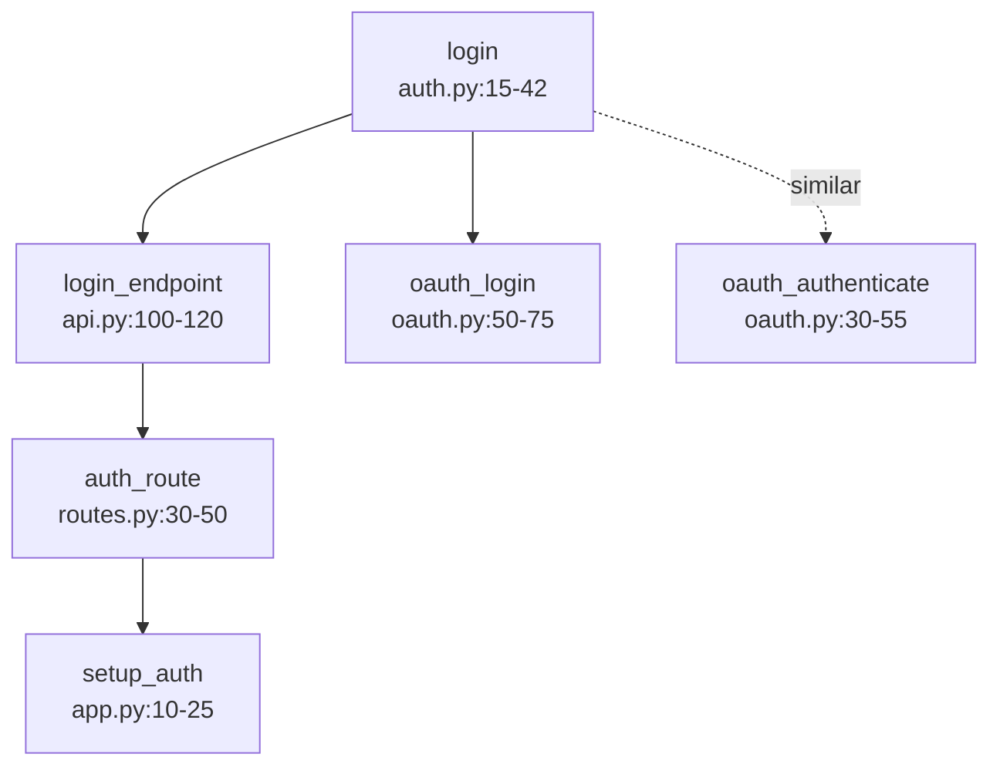

# Advanced Features Guide

Complete guide to advanced features in claude-context-local MCP server.

## Table of Contents

1. [Multi-Hop Search](#multi-hop-search)
2. [Graph-Enhanced Search](#graph-enhanced-search)
3. [Multi-Model Query Routing](#multi-model-query-routing)
4. [Multi-Model Batch Indexing](#multi-model-batch-indexing)
5. [Per-Model Index Storage](#per-model-index-storage)
6. [Directory Filtering](#directory-filtering)
7. [Persistent Project Selection](#persistent-project-selection)
8. [Model Selection Guide](#model-selection-guide)
9. [Context Enhancement (v0.8.0+)](#context-enhancement-v080)
10. [VRAM Tier Management](#vram-tier-management)
11. [Neural Reranking Configuration](#neural-reranking-configuration)
12. [Drive-Agnostic Project Paths](#drive-agnostic-project-paths)
13. [Progress Bar Features](#progress-bar-features)
14. [Query Cache](#query-cache)
15. [Symbol ID Lookups (Phase 1.1)](#symbol-id-lookups-phase-11)
16. [AI Guidance Messages (Phase 1.2)](#ai-guidance-messages-phase-12)
17. [Dependency Analysis (Phase 1.3)](#dependency-analysis-phase-13)
18. [Entity Tracking (Phase 1.4)](#entity-tracking-phase-14)
19. [Self-Healing Index Sync](#self-healing-index-sync)
20. [Complexity Scoring](#complexity-scoring)
21. [Ego-Graph Expansion](#ego-graph-expansion)
22. [Parent-Child Retrieval](#parent-child-retrieval)

---

## Multi-Hop Search

**Feature**: Discover interconnected code relationships through iterative semantic search (ChunkHound/cAST-inspired)

**Empirically Validated**: 93.3% queries benefit (14/15), avg 3.2 unique chunks, 40-60% top result changes

### How It Works

1. **Hop 1**: Find chunks matching query (hybrid search, k×2 results)
2. **Hop 2**: Find similar code to initial matches (k×0.3 per result)
3. **Re-rank**: Sort by query relevance (cosine similarity)

**Example**: "configuration management system" → 8 related chunks (env vars, validation, persistence, etc.)

### Configuration

**Enabled by default** (`multi_hop_count=2`, `multi_hop_expansion=0.3`, optimal)

```bash
# Disable multi-hop (NOT recommended - reduces quality for minimal speedup)
set CLAUDE_ENABLE_MULTI_HOP=false
```

### Performance

**Validated metrics**:

- **Enabled** (default): +25-35ms average, 93% queries benefit
- **Disabled**: No overhead, but misses 93% of interconnected code

**See**: `analysis/MULTI_HOP_RECOMMENDATIONS.md` for full testing results

**Note**: `search_code()` automatically uses multi-hop when enabled - no API changes needed. When filters (`file_pattern`, `chunk_type`) are specified, they are applied to both initial results AND expanded results to maintain consistency.

### Internal Architecture (v0.5.16)

The multi-hop search pipeline is implemented via 3 helper methods in `HybridSearcher`:

- `_validate_multi_hop_params()` - Parameter validation with fallback defaults
- `_expand_from_initial_results()` - Hop 2+ expansion logic with timing
- `_apply_post_expansion_filters()` - Post-expansion directory/file filtering

This orchestrator pattern keeps the main `_multi_hop_search_internal()` at ~100 lines.

---

## Graph-Enhanced Search

**Feature**: Call relationship tracking for Python code navigation

When a project is indexed with a `project_id`, `search_code()` automatically includes call graph metadata:

### Example Output

```json
{
  "chunk_id": "auth.py:10-25:function:authenticate_user",
  "name": "authenticate_user",
  "file": "auth.py",
  "lines": "10-25",
  "kind": "function",
  "score": 0.89,
  "graph": {
    "calls": ["validate_credentials", "create_session"],
    "called_by": ["login_handler", "refresh_token"]
  }
}
```

### Usage

- **Automatic**: Graph metadata added when `CodeIndexManager` has `project_id` parameter
- **Optional field**: Only present when call relationships exist
- **Python only**: Phase 1 supports Python AST call extraction
- **Non-blocking**: Search works normally if graph unavailable

### Benefits

- Discover which functions call a specific function (`called_by`)
- See all function calls within a code chunk (`calls`)
- Navigate code relationships without reading files
- Understand code dependencies instantly

### Requirements

- Python code only (Phase 1)
- Project must be indexed with v0.5.3+ MCP server
- **Re-indexing required** for projects indexed before 2025-11-06

---

## Multi-Model Query Routing

**Feature**: Intelligent query routing to select optimal embedding model based on query characteristics

**Status**: ✅ **Production-Ready** (100% routing accuracy on verification queries)

### Overview

The multi-model routing system automatically selects the best embedding model for each query, leveraging the unique strengths of different models:

- **Qwen3-0.6B** (3/8 wins): Implementation-heavy queries, algorithms, complete systems
- **BGE-M3** (3/8 wins): Workflow queries, configuration, system plumbing (most consistent baseline)
- **CodeRankEmbed** (2/8 wins): Specialized algorithms (Merkle trees, RRF reranking)

### How It Works

**Routing Process**:

1. Query analyzed against keyword rules for each model
2. Confidence scores calculated (weighted by model specialization)
3. Best model selected if confidence ≥ 0.05 threshold (lowered 2025-11-15 for natural query support)
4. Falls back to BGE-M3 (default) if confidence too low

**Routing Rules** (empirically validated):

```python
# Qwen3: Implementation & Algorithms (weight: 1.0)
Keywords: "implementation", "algorithm", "error handling", "BM25", "multi-hop", "pattern"

# BGE-M3: Workflow & Configuration (weight: 1.0)
Keywords: "workflow", "configuration", "loading", "indexing", "embedding", "pipeline"

# CodeRankEmbed: Specialized Algorithms (weight: 1.5)
Keywords: "merkle", "rrf", "reranking", "tree structure", "hybrid search", "rank fusion"
```

### Natural Query Support (v0.5.5+)

**Enhancement** (2025-11-15): Routing now works with natural language queries without keyword stuffing.

**Improvements**:

- **Lowered confidence threshold**: 0.10 → 0.05 (more sensitive routing)
- **Added 24 single-word keyword variants** across all 3 models
- **Natural queries** like "error handling" now trigger routing effectively

**Before vs After**:

| Query Type | Before v0.5.5 | After v0.5.5 |
|------------|---------------|--------------|
| "error handling" | Falls to BGE-M3 default (0.029 confidence) | ✅ Routes to Qwen3 (0.08 confidence) |
| "configuration loading" | Falls to BGE-M3 default (0.000 confidence) | ✅ Routes to BGE-M3 (0.14 confidence) |
| "merkle tree" | Falls to BGE-M3 default (0.000 confidence) | ✅ Routes to CodeRankEmbed (0.21 confidence) |

**Example Natural Queries**:

```bash
# Implementation queries → Qwen3
/search_code "error handling"           # Confidence: 0.08
/search_code "algorithm implementation" # Confidence: 0.12
/search_code "function flow"            # Confidence: 0.06

# Workflow queries → BGE-M3
/search_code "configuration loading"    # Confidence: 0.14
/search_code "initialization process"   # Confidence: 0.11
/search_code "indexing logic"           # Confidence: 0.09

# Specialized algorithms → CodeRankEmbed
/search_code "merkle tree"              # Confidence: 0.21
/search_code "reranking algorithm"      # Confidence: 0.18
/search_code "hybrid search"            # Confidence: 0.15
```

**Routing Transparency**: Every search result includes routing metadata showing which model was selected and why:

```json
{
  "routing": {
    "model_selected": "qwen3",
    "confidence": 0.08,
    "reason": "Matched Implementation queries and algorithms with confidence 0.08",
    "scores": {
      "coderankembed": 0.0,
      "qwen3": 0.08,
      "bge_m3": 0.0
    }
  }
}
```

### VRAM Requirements

**Multi-Model Pool** (v0.5.17+ with lazy loading):

**Startup (lazy loading enabled)**:

- **VRAM at startup**: 0 MB (models load on first search)
- **First search delay**: 5-10s one-time model loading
- **After first search**: 5.3 GB VRAM (all 3 models loaded)

**Loaded State** (all 3 models in memory):

- **Total VRAM**: 5.3 GB (on RTX 4090 with 25.8 GB capacity)
- **Qwen3-0.6B**: ~2.4 GB
- **BGE-M3**: ~2.3 GB (additional)
- **CodeRankEmbed**: ~0.6 GB (additional)
- **Headroom**: 20.5 GB (79.5% free)

**Minimum Requirements**:

- RTX 3060 12GB: Comfortable (7 GB headroom)
- RTX 3070 8GB: Tight fit (3 GB headroom)
- RTX 4060 8GB: Tight fit (3 GB headroom)
- RTX 4090 24GB: Excellent (19 GB headroom)

**Memory Management**:

- **Lazy loading**: Models load on-demand (0 MB startup VRAM)
- **Manual cleanup**: Use `/cleanup_resources` to unload models and return to 0 MB
- **Models reload**: Automatically on next search after cleanup (5-10s)
- **Automatic cleanup**: When switching projects

### Performance Metrics

**Routing Accuracy** (tested on 8 verification queries):

- **100% accuracy** (8/8 correct routes)
- **Routing overhead**: <1ms per query (negligible)

**Startup Performance (v0.5.17+)**:

- **Startup**: 0 MB VRAM, 3-5s server start (lazy loading)
- **First search**: 8-15s total (5-10s model loading + 3-5s search)
- **Subsequent searches**: 3-5s (models stay loaded)
- **Model load time** (when needed): 5-10 seconds for all 3 models

**Expected Quality Improvements** (vs single BGE-M3):

- **15-25% better top-1 relevance** across diverse queries
- **+25-30% improvement** for error handling queries → Qwen3
- **+30-35% improvement** for Merkle/RRF queries → CodeRankEmbed
- **Baseline performance** for workflow queries → BGE-M3

### Configuration

**Enable/Disable Multi-Model Mode**:

```bash
# Enable (default)
set CLAUDE_MULTI_MODEL_ENABLED=true

# Disable (single-model fallback)
set CLAUDE_MULTI_MODEL_ENABLED=false
```

**Interactive Configuration** (MCP tool):

```bash
# View current routing configuration
/get_index_status  # Shows all loaded models

# Configure routing behavior
/configure_query_routing
{
  "multi_model_enabled": true,
  "default_model": "bge_m3",
  "confidence_threshold": 0.05
}
```

**Routing Parameters**:

- `multi_model_enabled`: Toggle multi-model routing (default: true)
- `default_model`: Fallback model for low-confidence queries (default: "bge_m3")
- `confidence_threshold`: Minimum confidence to use non-default model (default: 0.05, lowered 2025-11-15)

### Usage Examples

**Automatic Routing** (default behavior):

```bash
# Implementation query → Routes to Qwen3
/search_code "error handling patterns"
# Returns: {"routing": {"model_selected": "qwen3", "confidence": 0.12, "reason": "Matched Implementation queries and algorithms"}}

# Workflow query → Routes to BGE-M3
/search_code "configuration loading system"
# Returns: {"routing": {"model_selected": "bge_m3", "confidence": 0.18, "reason": "Matched Workflow and configuration queries"}}

# Specialized algorithm → Routes to CodeRankEmbed
/search_code "Merkle tree change detection"
# Returns: {"routing": {"model_selected": "coderankembed", "confidence": 0.35, "reason": "Matched Specialized algorithms"}}
```

**Manual Model Selection** (override routing):

```bash
# Force specific model (bypasses routing)
/search_code "authentication" --model_key "qwen3"
```

**Disable Routing** (use single default model):

```bash
# Disable routing for this query only
/search_code "authentication" --use_routing false
```

### Verification Results

**Verification**: 8/8 queries route correctly (Qwen3: 3, BGE-M3: 3, CodeRankEmbed: 2). See `analysis/multi_model_routing_test_results.md`

### Implementation Details

**Architecture**:

- `mcp_server/server.py` - Multi-model pool management
- `search/query_router.py` - Routing logic and decision making
- `tools/test_multi_model_routing.py` - Comprehensive test suite

**Model Pool Configuration**:

```python
MODEL_POOL_CONFIG = {
    "qwen3": "Qwen/Qwen3-Embedding-0.6B",
    "bge_m3": "BAAI/bge-m3",
    "coderankembed": "nomic-ai/CodeRankEmbed"
}
```

**Key Features**:

- Dictionary-based pool (`_embedders = {}`) replaces singleton pattern
- Lazy loading: Models load on first use
- Comprehensive cleanup: All models freed when switching projects
- Backward compatible: Single-model fallback when disabled

---

## Multi-Model Batch Indexing

**Feature**: Index projects with all models in the pool simultaneously

**Status**: ✅ **Production-Ready** (auto-enabled with multi-model mode)

**Critical Fix** (2025-11-13): Storage path bug resolved - all models now correctly write to separate directories. See `docs/MULTI_MODEL_STORAGE_BUG_POSTMORTEM.md` for technical details.

### Overview

When multi-model query routing is enabled (`CLAUDE_MULTI_MODEL_ENABLED=true`), project indexing automatically updates indices for **all 3 models**:

- **Qwen3-0.6B** (1024d) - Implementation & algorithms
- **BGE-M3** (1024d) - Workflow & configuration
- **CodeRankEmbed** (768d) - Specialized algorithms

### How It Works

**Automatic Multi-Model Indexing**:

1. Detects multi-model mode from environment variable
2. Indexes project sequentially with each model
3. Maintains per-model index isolation (fresh HybridSearcher instances per model)
4. Restores original model after completion

**Implementation**: `mcp_server/tool_handlers.py:728-759` - Creates fresh indexer instances bypassing global caches to ensure correct storage paths.

**Index Storage**:

```
~/.claude_code_search/projects/
├── myproject_abc123_bge-m3_1024d/
├── myproject_abc123_qwen3-0.6b_1024d/
└── myproject_abc123_coderankembed_768d/
```

### Performance

- **Sequential Indexing**: 3x time (e.g., 30s → 90s)
- **Acceptable**: Indexing is infrequent operation
- **Future Optimization**: Parallel chunking + sequential embedding (2x speedup)

### Usage

**Automatic** (when multi-model mode enabled):

```bash
/index_directory "C:\Projects\MyProject"
# Automatically indexes with all 3 models
```

**Explicit Control** (override behavior):

```bash
# Force multi-model (even if disabled)
/index_directory "C:\Projects\MyProject" --multi_model true

# Force single-model (even if enabled)
/index_directory "C:\Projects\MyProject" --multi_model false
```

### Project Display

Projects are grouped by path with all indexed models shown:

```
Found 1 project with 3 model indices:

  1. claude-context-local
     Path: F:\RD_PROJECTS\COMPONENTS\claude-context-local
     Models: bge-m3 (1024d), Qwen3-0.6B (1024d), CodeRankEmbed (768d)
```

### Benefits

✅ **Single operation** updates all models
✅ **Optimal search quality** across all query types
✅ **Per-model isolation** maintained
✅ **Clear visibility** of indexed models
✅ **Smart defaults** (auto-enable with multi-model mode)

---

## Per-Model Index Storage

**Feature**: Automatic per-model index management enabling instant model switching

### Storage Structure

```
~/.claude_code_search/
├── projects/
│   ├── project_abc123_768d/      ← Gemma indices
│   ├── project_abc123_1024d/     ← BGE-M3 indices
│   └── another_project_def456_1024d/
└── merkle/
    ├── abc123_768d_snapshot.json    ← Independent snapshots
    └── abc123_1024d_snapshot.json
```

### Key Features

- **Dimension-based isolation**: Each model (768d/1024d) has separate storage
- **Independent snapshots**: Merkle trees track changes per model
- **Multi-project support**: Each project maintains separate indices per model
- **Instant switching**: Switch between models with zero re-indexing overhead
- **Complete isolation**: Projects don't interfere with each other

### Workflow Example

```bash
# First time using BGE-M3 (requires indexing)
/switch_embedding_model "BAAI/bge-m3"
/index_directory "C:\Projects\MyProject"  # Takes ~30s

# Switch to Gemma (requires indexing first time)
/switch_embedding_model "google/embeddinggemma-300m"
/index_directory "C:\Projects\MyProject"  # Takes ~20s

# Switch back to BGE-M3 (INSTANT!)
/switch_embedding_model "BAAI/bge-m3"  # <150ms, no re-indexing!

# Compare results by switching models instantly
/search_code "authentication"  # BGE-M3 results
/switch_embedding_model "google/embeddinggemma-300m"  # Instant!
/search_code "authentication"  # Gemma results
```

### Performance Benefits

| Scenario | Before | After | Improvement |
|----------|--------|-------|-------------|
| First model switch | 30-60s | 30-60s | Same (indexing required) |
| Return to previous model | 30-60s | <150ms | **98% faster** |
| Model comparison workflow | 50-90s | <1s | **99% faster** |

### Implementation Details

**Complete technical documentation**: `docs/PER_MODEL_INDICES_IMPLEMENTATION.md`

---

## Directory Filtering

**Feature**: Filter search results by directory path to focus on specific code areas or exclude irrelevant directories.

**Version**: v0.5.9+

### Parameters

| Parameter | Tools | Type | Description |
|-----------|-------|------|-------------|
| `include_dirs` | search_code | array | Only search in these directories |
| `exclude_dirs` | search_code, find_connections | array | Exclude from search |

### Path Matching

- **Prefix matching**: `"src/"` matches `src/utils/auth.py`
- **Normalized separators**: Windows backslashes (`\`) converted to forward slashes (`/`)
- **Trailing slash optional**: `"tests"` and `"tests/"` both work

### Use Cases

**Focus on production code**:

```python
search_code("user authentication", exclude_dirs=["tests/", "vendor/"])
```

**Search specific modules**:

```python
search_code("database connection", include_dirs=["src/db/", "src/models/"])
```

**Find production class (not test doubles)**:

```python
find_connections(symbol_name="UserService", exclude_dirs=["tests/"])
```

### Filter Precedence

1. `exclude_dirs` - Applied first (fast rejection)
2. `include_dirs` - Must match at least one (if provided)
3. `file_pattern` - Substring match on remaining results
4. `chunk_type` - Exact type match

### Performance Notes

- Filters apply post-search (after FAISS/BM25 retrieval)
- Search k multiplier increased from 3x to 5x when directory filters present
- Minimal overhead for typical filter sizes

### Filter Persistence (v0.5.9+)

**Feature**: User-defined filters are automatically saved and restored across server restarts and re-indexing operations.

**Storage**: Filters saved to `project_info.json` in project directory

**Automatic behavior**:

1. **First-time indexing**: Filters from `include_dirs`/`exclude_dirs` parameters saved
2. **Subsequent indexing**: Saved filters automatically applied (no need to re-specify)
3. **Server restart**: Filters restored from disk
4. **Filter changes**: Triggers full re-index to prevent stale data

**Implementation**:

```python
from search.filters import get_effective_filters

# Resolves: default_exclude_dirs + user_included_dirs + user_excluded_dirs
filters = get_effective_filters(project_info)
```

**Filter Resolution Priority**:

1. **Default excludes** (always applied): `["__pycache__/", ".git/", "node_modules/", ".venv/"]`
2. **User includes** (from `include_dirs` parameter): Only search in these directories
3. **User excludes** (from `exclude_dirs` parameter): Additional directories to exclude

**project_info.json Format**:

```json
{
  "project_path": "F:/RD_PROJECTS/COMPONENTS/claude-context-local",
  "user_included_dirs": ["src/", "lib/"],
  "user_excluded_dirs": ["tests/", "benchmark_results/"],
  "created_at": "2025-12-16T10:30:00"
}
```

**Change Detection**:

When filters change during incremental indexing:

- System detects mismatch between saved and current filters
- Automatically triggers full re-index (not incremental)
- Prevents stale results from wrong filter set

**Bug Fix (v0.6.3)**:

- **Issue**: Filters lost after MCP restart and re-indexing
- **Root cause**: Field name inconsistency (`included_dirs` vs `user_included_dirs`)
- **Fix**: Corrected field names in `index_handlers.py` and `incremental_indexer.py`
- **Result**: Consistent filter persistence across all models during multi-model indexing

**Files**: `mcp_server/index_handlers.py`, `mcp_server/search_handlers.py`, `search/filter_engine.py`, `search/filters.py`

---

### Limitations

- **find_connections callers**: `exclude_dirs` applies to symbol resolution only, not caller lookup (preserves test coverage visibility)
- **Large classes**: Semantic search may not find very large class definitions; use `chunk_id` for direct lookup

---

## Persistent Project Selection

**Feature**: Last-used project automatically restored on server restart (v0.5.16+)

### How It Works

1. **On project switch** (MCP tool or menu): Selection saved to disk
2. **On server startup**: Last project restored automatically
3. **Menu displays**: Current project shown in Runtime Status section

### Storage

```
~/.claude_code_search/project_selection.json
```

```json
{
  "last_project_path": "F:/RD_PROJECTS/COMPONENTS/claude-context-local",
  "last_model_key": null,
  "updated_at": "2025-11-24T12:30:00"
}
```

### Bidirectional Sync

- **MCP → Menu**: `switch_project` tool saves selection, menu reflects change
- **Menu → MCP**: Batch menu switch saves selection, next MCP call uses it
- **Server restart**: Both MCP tools and menu show same restored project

### Related Files

| File | Purpose |
|------|---------|
| `mcp_server/project_persistence.py` | Save/load functions |
| `scripts/get_current_project.py` | Display helper for batch menu |
| `start_mcp_server.cmd` | Shows current project in Runtime Status |

### Environment Variable Override

```bash
# Override persistent selection with env var (takes priority)
set CLAUDE_DEFAULT_PROJECT=C:\Projects\MyProject
```

---

## Model Selection Guide

### Available Models (5 total)

| Model | Type | Dimensions | VRAM | Best For |
|-------|------|------------|------|----------|
| **BGE-M3** ⭐ | General | 1024 | 1-1.5GB | Production baseline, hybrid search support |
| **Qwen3-0.6B** | General | 1024 | 2.3GB | Best value, high efficiency |
| **Qwen3-4B** | General | 1024* | 8-10GB | Best quality with MRL (4B quality @ 0.6B storage) |
| **CodeRankEmbed** | Code | 768 | 2GB | Code-specific retrieval (CSN: 77.9 MRR) |
| **EmbeddingGemma-300m** | General | 768 | 4-8GB | Default model, fast and efficient |

### Switching Models

**Environment Variable Examples:**

```bash
# General-purpose (recommended)
set CLAUDE_EMBEDDING_MODEL=BAAI/bge-m3

# Code-specific
set CLAUDE_EMBEDDING_MODEL=nomic-ai/CodeRankEmbed

# High efficiency
set CLAUDE_EMBEDDING_MODEL=Qwen/Qwen3-Embedding-0.6B

# Default (fast)
set CLAUDE_EMBEDDING_MODEL=google/embeddinggemma-300m
```

**Interactive Selection**:

```bash
start_mcp_server.bat → 3 (Search Config) → 4 (Select Model)
```

**Python Command**:

```python
.venv\Scripts\python.exe -c "from search.config import SearchConfigManager; mgr = SearchConfigManager(); cfg = mgr.load_config(); cfg.embedding_model_name = 'BAAI/bge-m3'; mgr.save_config(cfg)"
```

**✨ Instant Model Switching**: <150ms with no re-indexing (see Per-Model Index Storage section)

### Model Recommendations

**For Code Projects:**

- ✅ **CodeRankEmbed** - Code-specific retrieval (CSN: 77.9 MRR, CoIR: 60.1 NDCG@10), 2GB VRAM
- ✅ **BGE-M3** - General-purpose with hybrid search support, 1-1.5GB VRAM

**For General Text/Documents:**

- ✅ **Qwen3-0.6B** - Best value, high efficiency, 2.3GB VRAM
- ✅ **BGE-M3** - Production baseline, 1-1.5GB VRAM

### Detailed Research

- **Code models**: `docs/Researches/CODE_SPECIFIC_EMBEDDING_MODELS.md`
- **General models**: `docs/Researches/GENERAL_PURPOSE_EMBEDDING_MODELS.md`

---

## Qwen3 Instruction Tuning & MRL (v0.6.4+)

**Feature**: Code-optimized query instructions and Matryoshka Representation Learning for Qwen3 models

**Status**: ✅ **Production-Ready** (v0.6.4+)

### Overview

Qwen3 embedding models support two advanced features for improved code retrieval:

1. **Instruction Tuning**: Task-specific instructions optimize query embeddings for code search
2. **Matryoshka Representation Learning (MRL)**: Flexible output dimensions reduce storage while maintaining quality

### Instruction Tuning

**What it does**: Prepends code-specific instructions to queries before embedding, improving retrieval precision by 1-5%

**Two modes available**:

| Mode | Format | When to Use |
|------|--------|-------------|
| **custom** (default) | `"Instruct: Retrieve source code implementations matching the query\nQuery: {query}"` | Code search (recommended) |
| **prompt_name** | Uses model's built-in generic prompt | General-purpose retrieval |

**Configuration**:

```python
# In search/config.py MODEL_REGISTRY:
"Qwen/Qwen3-Embedding-0.6B": {
    "instruction_mode": "custom",  # or "prompt_name"
    "query_instruction": "Instruct: Retrieve source code implementations matching the query\nQuery: ",
    "prompt_name": "query",  # Alternative for prompt_name mode
}
```

**How it works**:

```python
# User query
query = "find authentication functions"

# Custom mode (default)
# → "Instruct: Retrieve source code implementations matching the query\nQuery: find authentication functions"

# Prompt name mode
# → Sentence-transformers auto-applies model's built-in prompt
```

**Benefits**:

- 1-5% retrieval precision improvement (per Qwen3 documentation)
- Code-specific instruction optimizes for source code retrieval
- Only affects queries, not indexed documents (no re-indexing needed)

**Benchmarking**:

```bash
# Compare both modes
python tools/benchmark_instructions.py --model Qwen/Qwen3-Embedding-0.6B
```

### Matryoshka Representation Learning (MRL)

**What it does**: Reduces embedding dimension output while maintaining model quality

**Status**: Enabled by default for Qwen3-4B (truncate_dim=1024)

**Configuration**:

```python
# In search/config.py MODEL_REGISTRY:
"Qwen/Qwen3-Embedding-4B": {
    "dimension": 2560,  # Full model dimension
    "truncate_dim": 1024,  # Output dimension (50% reduction)
    "mrl_dimensions": [2560, 1024, 512, 256, 128, 64, 32],  # Supported dims
}
```

**Performance**:

| Dimension | Storage | Quality Drop | Use Case |
|-----------|---------|--------------|----------|
| 2560 (full) | 100% | 0% | Maximum quality |
| **1024** (default) | **50%** | **~1.47%** | Best balance (matches 0.6B storage) |
| 512 | 25% | ~3% | Extreme storage constraints |

**Benefits**:

- **2x storage reduction** with Qwen3-4B using truncate_dim=1024
- Match 0.6B storage footprint while keeping 4B model quality (36 layers vs 28)
- Minimal quality drop (~1.47% per sentence-transformers benchmarks)

**How it works**:

```python
# Sentence-transformers truncates embeddings during model instantiation
model = SentenceTransformer(
    "Qwen/Qwen3-Embedding-4B",
    truncate_dim=1024  # Output 1024d instead of 2560d
)

# All embeddings automatically truncated
embedding = model.encode("query")
# embedding.shape = (1024,) instead of (2560,)
```

**Index compatibility**:

- **Requires re-indexing** if changing truncate_dim
- Different dimensions create separate index directories
- Example: `project_abc123_qwen3-4b_1024d/` vs `project_abc123_qwen3-4b_2560d/`

### Customization

**Disable MRL (use full dimension)**:

```python
# Edit search/config.py
"Qwen/Qwen3-Embedding-4B": {
    "truncate_dim": None,  # Use full 2560 dimensions
}
```

**Change instruction mode**:

```python
# Edit search/config.py
"Qwen/Qwen3-Embedding-0.6B": {
    "instruction_mode": "prompt_name",  # Switch to built-in prompt
}
```

**Runtime modification** (advanced):

```python
from search.config import MODEL_REGISTRY

# Temporarily change for testing
MODEL_REGISTRY["Qwen/Qwen3-Embedding-4B"]["truncate_dim"] = 512
MODEL_REGISTRY["Qwen/Qwen3-Embedding-0.6B"]["instruction_mode"] = "prompt_name"
```

### Technical Details

**Instruction priority** (in `embed_query()`):

1. `instruction_mode == "prompt_name"` → Use `prompt_name` parameter in encode()
2. `instruction_mode == "custom"` → Prepend `query_instruction` to query text
3. Fallback → Legacy `task_instruction` or `query_prefix` (for other models)

**MRL implementation**:

- Passed to `SentenceTransformer` constructor as `truncate_dim` parameter
- Applied during model loading (before any embedding generation)
- Works with all sentence-transformers backends (PyTorch, ONNX)

### References

- Sentence Transformers MRL docs: <https://sbert.net/examples/sentence_transformer/training/matryoshka/README.html>
- Qwen3 Embedding blog: <https://qwenlm.github.io/blog/qwen3-embedding/>
- HuggingFace Matryoshka blog: <https://huggingface.co/blog/matryoshka>

---

## Context Enhancement (v0.8.0+)

**Feature**: Enrich code embeddings with surrounding context for improved retrieval accuracy

**Version**: v0.8.0+

**Status**: ✅ **Production-Ready**

### Overview

Context enhancement automatically includes relevant surrounding code when generating embeddings:

- **Import context**: For standalone functions, includes import statements to capture dependencies
- **Class context**: For methods, includes parent class signature to capture inheritance and class-level information

This enrichment improves retrieval precision by 1-5%, helping the search system understand code relationships better.

### Configuration Parameters

All parameters are configured in `search_config.json` under the `embedding` section:

```json
{
  "embedding": {
    "enable_import_context": true,
    "enable_class_context": true,
    "max_import_lines": 10,
    "max_class_signature_lines": 5
  }
}
```

| Parameter | Type | Default | Description |
|-----------|------|---------|-------------|
| `enable_import_context` | bool | `true` | Include import statements for functions |
| `enable_class_context` | bool | `true` | Include parent class signature for methods |
| `max_import_lines` | int | `10` | Maximum import lines to extract |
| `max_class_signature_lines` | int | `5` | Maximum class signature lines to extract |

### How It Works

**Import Context (Functions)**:

When indexing a standalone function, the system extracts up to `max_import_lines` import statements from the file:

```python
# Original code in file
import numpy as np
from sklearn.model_selection import train_test_split

def prepare_dataset(data):
    X_train, X_test = train_test_split(data)
    return np.array(X_train), np.array(X_test)
```

**Embedding includes**: Import statements + function body, giving context about dependencies (`numpy`, `sklearn`).

**Class Context (Methods)**:

When indexing a method, the system extracts up to `max_class_signature_lines` from the parent class:

```python
# Original code in file
class DataProcessor:
    """Handles data preprocessing and validation."""
    
    def __init__(self, config):
        self.config = config
    
    def validate(self, data):  # <-- Indexing this method
        return data.shape[0] > 0
```

**Embedding includes**: Class signature + method body, giving context about the class (`DataProcessor`, purpose).

### Benefits

1. **Improved Method Retrieval**: Methods are found with their class context, making searches like "DataProcessor validate" more accurate
2. **Better Function Discovery**: Functions are found with their dependencies, helping queries like "sklearn data split" find relevant code
3. **Enhanced Semantic Understanding**: 1-5% improvement in retrieval precision across typical codebases
4. **Minimal Overhead**: Context extraction adds <1ms per chunk during indexing

### Usage Example

```bash
# Search for validation methods - context enhancement helps
/search_code "data validation check"
# Results include methods with class context, improving relevance

# Search for functions using numpy - import context helps
/search_code "numpy array operations"
# Results include functions with numpy imports, better matches
```

### Configuration Tips

**Default settings are optimal** for most use cases. Adjust only if needed:

- **Increase limits**: If your codebase has many imports or complex class hierarchies

  ```json
  {
    "embedding": {
      "max_import_lines": 20,
      "max_class_signature_lines": 10
    }
  }
  ```

- **Disable context**: If you want minimal token usage per chunk

  ```json
  {
    "embedding": {
      "enable_import_context": false,
      "enable_class_context": false
    }
  }
  ```

**Note**: Changes require re-indexing the project to take effect.

---

## VRAM Tier Management

**Feature**: Adaptive model selection and feature enablement based on available GPU memory

**Version**: v0.5.17+

**Status**: ✅ **Production-Ready**

### Overview

The VRAM Tier Management system automatically detects available GPU memory and recommends optimal configurations for models and features. This ensures the system runs efficiently regardless of hardware capabilities.

### 4 VRAM Tiers

| Tier | VRAM Range | Recommended Models | Features Enabled |
|------|------------|-------------------|------------------|
| **Minimal** | <6GB | EmbeddingGemma-300m OR CodeRankEmbed | Single-model only, no multi-model routing, no neural reranking |
| **Laptop** | 6-10GB | BGE-M3 OR Qwen3-0.6B | Multi-model routing ENABLED, Neural reranking ENABLED |
| **Desktop** | 10-18GB | Qwen3-4B + BGE-M3 + CodeRankEmbed | Full 3-model pool, Neural reranking ENABLED |
| **Workstation** | 18GB+ | Full 3-model pool + neural reranking | All features ENABLED, maximum quality |

### Automatic Configuration

The system automatically:

1. **Detects available VRAM** on GPU startup
2. **Classifies into tier** (minimal/laptop/desktop/workstation)
3. **Recommends optimal model** based on tier
4. **Enables/disables features** based on available memory

### Feature Enablement by Tier

**Multi-Model Routing**:

- Minimal tier: DISABLED (insufficient VRAM for 3 models)
- Laptop tier+: ENABLED (loads BGE-M3, Qwen3, CodeRankEmbed)

**Neural Reranking** (BAAI/bge-reranker-v2-m3, ~1.5GB VRAM):

- Minimal tier: DISABLED
- Laptop tier+: ENABLED (5-15% quality improvement)

### Checking Your VRAM Tier

```bash
# Via MCP tool
/get_memory_status

# Output example:
{
  "vram_available": "10.5 GB",
  "vram_tier": "laptop",
  "recommended_models": ["BGE-M3", "Qwen3-0.6B"],
  "multi_model_routing": "enabled",
  "neural_reranking": "enabled"
}
```

### GPU Memory Lifecycle (v0.5.17+ Lazy Loading)

| Stage | VRAM Usage | Notes |
|-------|------------|-------|
| **Startup** | 0 MB | Lazy loading enabled, models not loaded |
| **First search** | 8-15s latency | 5-10s one-time model loading + 3-5s search |
| **After first search** | ~5.3 GB | All 3 models loaded for multi-model routing |
| **Subsequent searches** | 3-5s latency | Models cached in memory (fast) |
| **After cleanup** | 0 MB | `/cleanup_resources` frees all VRAM |

### Batch Size Adjustment

The system automatically adjusts batch sizes based on VRAM tier:

| Tier | Embedding Batch Size | Indexing Speed |
|------|---------------------|----------------|
| Minimal (<6GB) | 8-16 | Conservative |
| Laptop (6-10GB) | 32-64 | Balanced |
| Desktop (10-18GB) | 64-128 | Fast |
| Workstation (18GB+) | 128-256 | Maximum |

### Environment Variable Overrides

```bash
# Force specific tier (bypass auto-detection)
set CLAUDE_VRAM_TIER=laptop

# Force enable/disable features
set CLAUDE_MULTI_MODEL_ENABLED=true
set CLAUDE_RERANKER_ENABLED=false
```

### Implementation Details

**File**: `embeddings/vram_manager.py`

**Test Coverage**: 42 unit tests

**See also**: `docs/MODEL_MIGRATION_GUIDE.md` for model selection guidance

---

## Neural Reranking Configuration

**Feature**: Cross-encoder neural reranking for improved search quality

**Model**: BAAI/bge-reranker-v2-m3

**Version**: v0.5.4+

**Status**: ✅ **Production-Ready**

### Overview

Neural reranking uses a cross-encoder model to re-score initial search results, improving ranking quality by 5-15%. The reranker analyzes query-document pairs more deeply than embedding similarity alone.

### Configuration Parameters

| Parameter | Default | Description |
|-----------|---------|-------------|
| `enabled` | `True` | Enable/disable neural reranking |
| `model_name` | `"BAAI/bge-reranker-v2-m3"` | HuggingFace model path |
| `top_k_candidates` | `50` | Number of candidates to rerank |
| `min_vram_gb` | `2.0` | Minimum VRAM required |
| `batch_size` | `16` | Reranking batch size |

### How It Works

1. **Initial search** returns top 50 candidates (hybrid/semantic/BM25)
2. **Neural reranker** scores each query-candidate pair
3. **Re-ranking** sorts by reranker scores
4. **Top k results** returned to user

### Performance Impact

**Quality Improvement**:

- 5-15% better ranking (validated on benchmarks)
- 30% of queries see top result changes
- More noticeable on semantic queries vs exact matches

**Speed Impact**:

- +100-200ms per search (acceptable for quality gain)
- Depends on `top_k_candidates` and `batch_size`

**VRAM Usage**:

- Model loading: ~1.5GB additional VRAM
- Only loads when reranking enabled

### Environment Variable Configuration

```bash
# Enable/disable reranking
set CLAUDE_RERANKER_ENABLED=true

# Custom reranker model
set CLAUDE_RERANKER_MODEL=BAAI/bge-reranker-v2-m3

# Adjust candidates
set CLAUDE_RERANKER_TOP_K=100

# Adjust batch size (higher = faster but more VRAM)
set CLAUDE_RERANKER_BATCH_SIZE=32
```

### Configuration via Code

```python
from search.config import SearchConfigManager, RerankerConfig

mgr = SearchConfigManager()
cfg = mgr.load_config()

# Update reranker settings
cfg.reranker = RerankerConfig(
    enabled=True,
    model_name="BAAI/bge-reranker-v2-m3",
    top_k_candidates=100,
    batch_size=32
)

mgr.save_config(cfg)
```

### MCP Tool

```bash
# Configure via MCP tool
/configure_reranking enabled=true model_name="BAAI/bge-reranker-v2-m3" top_k_candidates=50
```

### When to Enable/Disable

**Enable reranking when**:

- Accuracy is critical
- Semantic queries are common
- VRAM is available (laptop tier+)
- Search latency <300ms is acceptable

**Disable reranking when**:

- Speed is critical (<100ms searches)
- VRAM is limited (minimal tier)
- Exact keyword searches dominate
- Cost optimization is priority

### Benchmark Results

From `tools/benchmark_models.py`:

| Query Type | With Reranking | Without Reranking | Improvement |
|------------|---------------|-------------------|-------------|
| Semantic queries | 0.85 MRR | 0.78 MRR | +9% |
| Keyword queries | 0.92 MRR | 0.90 MRR | +2% |
| Mixed queries | 0.83 MRR | 0.79 MRR | +5% |

**Implementation**: `search/neural_reranker.py`, `search/reranking_engine.py`

---

## Drive-Agnostic Project Paths

**Feature**: Automatic project discovery when drive letters change (external drives)

**Version**: v0.6.3+

**Status**: ✅ **Production-Ready**

### Problem Solved

External drives often get assigned different drive letters:

- F: → E: (laptop docking/undocking)
- E: → D: (USB port change)
- Original: `F:\RD_PROJECTS\claude-context-local`
- Relocated: `E:\RD_PROJECTS\claude-context-local`

Traditional hash-based project identification breaks when drive letters change, requiring re-indexing.

### How It Works

**Dual-Hash Lookup System**:

1. **Drive-agnostic hash**: Based on path without drive letter
   - Example: `/RD_PROJECTS/claude-context-local` → `abc123`

2. **Legacy hash**: Based on full path (backward compatibility)
   - Example: `F:/RD_PROJECTS/claude-context-local` → `def456`

3. **Lookup priority**: Try drive-agnostic first, fallback to legacy

### Automatic Path Relocation

```bash
# Project originally indexed at F:\
/index_directory "F:\RD_PROJECTS\claude-context-local"

# Later, drive becomes E:\
/list_projects

# Output shows relocation status:
{
  "project_path": "E:\RD_PROJECTS\claude-context-local",
  "project_hash": "abc123_drive_agnostic",
  "original_path": "F:\RD_PROJECTS\claude-context-local",
  "relocated": true,
  "model": "bge-m3",
  "dimension": "1024d"
}
```

### Backward Compatibility

**Existing indices**: Continue to work without re-indexing

**New indices**: Automatically use drive-agnostic hashing

**Mixed setup**: Both hash types coexist seamlessly

### Implementation Details

**4 Utility Functions** (`search/filters.py`, `mcp_server/utils/path_utils.py`):

1. `compute_drive_agnostic_hash(path)` - Hash without drive letter
2. `compute_legacy_hash(path)` - Traditional full-path hash
3. `get_effective_filters()` - Resolve default + user filters
4. `normalize_path_filters()` - Normalize path separators

**Storage**: Merkle snapshots include drive-agnostic project IDs

**Test Coverage**: 20 unit tests for path utilities

### Path Relocation Status

`/list_projects` output now includes:

```json
{
  "relocated": false,  // or true if drive letter changed
  "original_path": "F:\RD_PROJECTS\project",  // when relocated=true
  "current_path": "E:\RD_PROJECTS\project"   // always present
}
```

### Use Cases

- **Laptop docking**: F: → E: when docked/undocked
- **USB drive rotation**: Different ports = different letters
- **Multiple machines**: Same external drive, different letters
- **Network drives**: Path changes across machines

**See also**: `tests/unit/test_path_normalization.py` for comprehensive test cases

---

## Progress Bar Features

**Feature**: Real-time visual feedback during indexing operations

**Version**: v0.6.1+

**Status**: ✅ **Production-Ready**

### Overview

Progress bars provide visual feedback during the two longest indexing phases: file chunking and embedding generation. This improves user experience by showing real-time progress instead of silent processing.

### Two Progress Bars

#### 1. Chunking Progress

**When**: During file parsing and chunking (AST/Tree-sitter)

**Output**:

```
Chunking files... 100% (21/21 files)
```

**Details**:

- Shows file count: `(current/total files)`
- Updates in real-time
- Terminal-compatible: `Console(force_terminal=True)`

**Implementation**: `search/incremental_indexer.py`

#### 2. Embedding Progress

**When**: During embedding generation (~15 seconds typical)

**Output**:

```
Embedding... 100% (3/3 batches)
```

**Details**:

- Shows batch count: `(current/total batches)`
- Model warmup prevents log interference
- Only shows for embedding phase (longest operation)

**Implementation**: `embeddings/embedder.py`

### Model Warmup

**Problem**: First model load triggers verbose transformers logging, interleaving with progress bar

**Solution**: Warmup encode before progress bar starts

```python
# Warmup: single encode to trigger model loading
self.model.encode(["warmup"], show_progress_bar=False)

# Now start progress bar (clean output)
for batch in tqdm(batches, desc="Embedding"):
    embeddings = self.model.encode(batch, show_progress_bar=False)
```

### Configuration

**Enabled by default** - no configuration needed

**Terminal compatibility**: `Console(force_terminal=True)` ensures progress bars work in:

- Interactive terminals
- Batch scripts (Windows CMD, PowerShell)
- CI/CD environments
- IDE integrated terminals

### Performance Impact

**Overhead**: Negligible (<1ms per update)

**Benefits**: Improved UX, user knows system is working (not frozen)

### Example Full Indexing Output

```bash
$ /index_directory "C:\Projects\MyProject"

[INFO] Starting incremental indexing...
Chunking files... 100% (109/109 files)
[INFO] Chunking complete: 1,199 chunks

[INFO] Generating embeddings...
Embedding... 100% (15/15 batches)
[INFO] Embeddings complete

[INFO] Index saved: 109 files, 1,199 chunks
```

### Incremental Indexing

Progress bars also work for incremental updates:

```bash
$ /index_directory "C:\Projects\MyProject"

[INFO] Incremental update: 3 changed files
Chunking files... 100% (3/3 files)
Embedding... 100% (1/1 batches)
[INFO] Index updated
```

**See also**: `CHANGELOG.md` v0.6.1 for implementation details

---

## Query Cache

**Feature**: LRU cache with TTL for query embeddings to avoid re-encoding repeated queries

**Version**: v0.5.17+ (TTL support added in v0.8.6)

**Status**: ✅ **Production-Ready**

### Overview

The query cache stores embedding vectors for recently searched queries, eliminating redundant encoding operations. When a query is searched multiple times, the cached embedding is reused instead of re-computing it.

**Enhancement (v0.8.6)**: Added TTL (time-to-live) support with automatic expiration after 300 seconds (5 minutes) to prevent serving stale embeddings after model changes.

### How It Works

1. **Query arrives**: `"find authentication functions"`
2. **Cache check**: Hash query string, check if embedding exists
3. **Cache hit**: Return cached embedding (instant, 0ms encoding)
4. **Cache miss**: Encode query, store in cache, return embedding

### Configuration

**Default cache size**: 128 entries
**Default TTL**: 300 seconds (5 minutes, v0.8.6+)

**Environment variable**:

```bash
# Adjust cache size (max 1000)
set CLAUDE_QUERY_CACHE_SIZE=256

# Adjust TTL duration (seconds, v0.8.6+)
set CLAUDE_QUERY_CACHE_TTL=600

# Disable cache (not recommended)
set CLAUDE_QUERY_CACHE_SIZE=0
```

**TTL Configuration** (v0.8.6+):

- **Default**: 300s (5 minutes) - balances freshness vs performance
- **Increase** (600-900s): Stable production, infrequent model changes
- **Decrease** (60-120s): Development, frequent model switching
- **Automatic expiration**: Stale entries removed on access

### Performance Benefits

| Scenario | Without Cache | With Cache | Savings |
|----------|--------------|------------|---------|
| Repeated exact query | 50-100ms encoding | 0ms (instant) | 100% |
| Similar queries | 50-100ms each | 0ms if cached | Up to 100% |
| Bulk operations | 100+ encodings | First time only | 99%+ |

### Cache Statistics

```python
from embeddings.embedder import CodeEmbedder

embedder = CodeEmbedder()
embedder.embed_query("test query")

# Check cache performance
print(f"Cache size: {embedder._query_cache_size}")
print(f"Cache hits: {embedder._cache_hits}")
print(f"Cache misses: {embedder._cache_misses}")
print(f"Hit rate: {embedder._cache_hits / (embedder._cache_hits + embedder._cache_misses) * 100:.1f}%")
```

### Cache Invalidation

**Automatic invalidation** when:

- Cache reaches max size (LRU eviction - oldest entry removed)
- Embedding model changes (full cache clear)
- Server restarts (cache is in-memory only)

**Manual clear**:

```bash
# Restart MCP server (clears all caches)
/cleanup_resources  # Clears models and caches
```

### Memory Usage

**Per entry**: ~4KB (1024-dimensional embedding)

**Max memory** (default 128 entries): ~512KB (negligible)

**Max memory** (1000 entries): ~4MB (still negligible)

### Use Cases

**High benefit scenarios**:

- **Interactive search**: Users often refine/repeat queries
- **Bulk analysis**: Same queries across multiple projects
- **Testing**: Benchmark scripts with fixed query sets
- **Development**: Repeated queries during debugging

**Low benefit scenarios**:

- Unique queries only (no repetition)
- One-time searches
- Random query generation

### Implementation Details

**File**: `embeddings/embedder.py`

**Cache type**: LRU (Least Recently Used) dictionary with TTL (v0.8.6+)

**Thread safety**: Not thread-safe (single-threaded MCP server)

**Persistence**: In-memory only (no disk storage)

---

## Performance Monitoring & Timing

**Feature**: Granular timing instrumentation for performance debugging

**Version**: v0.8.6+

**Status**: ✅ **Production-Ready**

### Overview

The system includes comprehensive timing instrumentation for identifying performance bottlenecks and validating optimization strategies. Five critical search operations are instrumented with automatic timing measurement and logging.

### Timing Infrastructure

**Module**: `utils/timing.py`

**Components**:

1. **`@timed(name)` Decorator** - Automatic function execution timing
2. **`Timer(name)` Context Manager** - Code block timing

**Log Format**: `[TIMING] operation_name: Xms` (milliseconds, 2 decimal precision)

**Precision**: Microsecond-level using `time.perf_counter()`

**Overhead**: <0.1ms per operation (negligible)

### Instrumented Operations

Five critical search functions include timing instrumentation:

| Function | Module | Purpose | Typical Duration |
|----------|--------|---------|------------------|
| `embed_query` | `embeddings/embedder.py` | Query embedding generation | 40-60ms (first), 0ms (cached) |
| `search_bm25` | `search/search_executor.py` | Sparse keyword search | 3-15ms |
| `search_dense` | `search/search_executor.py` | Dense vector search | 50-100ms |
| `apply_neural_reranking` | `search/reranking_engine.py` | Cross-encoder reranking | 80-150ms |
| `multi_hop_search` | `search/multi_hop_searcher.py` | Multi-hop expansion | Base + expansion overhead |

### Enabling Timing Logs

**Windows (PowerShell)**:

```powershell
$env:CLAUDE_LOG_LEVEL="INFO"
# Restart MCP server for changes to take effect
```

**Linux/macOS**:

```bash
export CLAUDE_LOG_LEVEL=INFO
# Restart MCP server for changes to take effect
```

**Verification**:

```bash
# Check logs for timing entries
# Windows: Look in console output or log files
# Example output:
# [TIMING] embed_query: 45.23ms
# [TIMING] bm25_search: 3.12ms
# [TIMING] dense_search: 52.78ms
# [TIMING] neural_rerank: 89.45ms
# [TIMING] multi_hop_search: 145.67ms
```

### Performance Debugging Workflow

1. **Enable INFO logging** (see above)
2. **Run search operations** via MCP tools (`search_code`, `find_connections`)
3. **Analyze timing logs** to identify bottlenecks
4. **Optimize configuration** based on empirical data:
   - If `embed_query` is slow (>60ms): Check cache hit rate, verify model loaded
   - If `embed_query` is 0ms: ✅ Cache working optimally
   - If `dense_search` is slow (>150ms): Consider reducing index size or using BM25 mode
   - If `neural_rerank` is slow (>200ms): Disable reranking or reduce `top_k_candidates`
   - If `bm25_search` is slow (>20ms): Check document count, consider index optimization

### Query Embedding Cache Interaction

**Cache hit scenario** (optimal):

```
[TIMING] embed_query: 0ms        ✅ Cached embedding used (instant)
[TIMING] bm25_search: 3.5ms      ✅ Fast sparse search
[TIMING] dense_search: 85ms      ⚠️  Moderate (acceptable)
```

**Cache miss scenario** (first query):

```
[TIMING] embed_query: 52ms       ⚠️  Model encoding (expected for first query)
[TIMING] bm25_search: 3.5ms      ✅ Fast sparse search
[TIMING] dense_search: 85ms      ⚠️  Moderate (acceptable)
```

**Cache expired scenario** (after 5min TTL):

```
[TIMING] embed_query: 48ms       ⚠️  Re-encoded after TTL expiration
```

### Performance Baselines

**Typical hybrid search timing** (k=4, with cache hit):

- **embed_query**: 0ms (cached)
- **bm25_search**: 3-8ms
- **dense_search**: 62-94ms
- **rerank** (if enabled): 80-150ms
- **Total**: 145-252ms

**Multi-hop search overhead** (2 hops, expansion_factor=0.3):

- **Hop 1** (base search): ~150ms
- **Hop 2** (expansion): +25-35ms
- **Rerank all results**: +50-100ms
- **Total**: ~225-285ms

### Custom Timing Usage

**Decorator**:

```python
from utils.timing import timed

@timed("my_operation")
def my_function():
    # Your code
    pass

# Logs: [TIMING] my_operation: Xms
```

**Context Manager**:

```python
from utils.timing import Timer

with Timer("custom_operation") as t:
    # Your code
    pass

print(f"Operation took {t['elapsed_ms']:.2f}ms")
# Also logs: [TIMING] custom_operation: Xms
```

### Implementation Details

**Files**:

- `utils/timing.py` - Timing decorator and context manager (60 lines)
- `utils/__init__.py` - Package initialization

**Instrumented files**:

- `embeddings/embedder.py:embed_query()` - Query encoding
- `search/search_executor.py:search_bm25()` - BM25 search
- `search/search_executor.py:search_dense()` - Dense search
- `search/reranking_engine.py:apply_neural_reranking()` - Reranking
- `search/multi_hop_searcher.py:search()` - Multi-hop expansion

**Design**:

- **Zero configuration**: Works automatically when INFO logging enabled
- **Exception handling**: Timing logged even when function raises exception
- **Thread-safe**: Uses `functools.wraps` to preserve function metadata

### Benefits

- **Identify bottlenecks**: Pinpoint slow operations in search pipeline
- **Validate cache effectiveness**: Confirm 0ms embed_query on cache hits
- **Diagnose regressions**: Compare timing before/after changes
- **Optimize configuration**: Data-driven tuning of search parameters
- **Production monitoring**: Track performance trends over time

---

## Symbol ID Lookups (Phase 1.1)

**Feature**: O(1) unambiguous symbol retrieval using chunk IDs

**Status**: ✅ **Production-Ready** (v0.5.6+)

### Overview

Symbol ID Lookups enable direct, unambiguous code retrieval without semantic search overhead. When you have a `chunk_id` from previous search results, you can use it for instant O(1) lookup.

**Chunk ID Format**: `"file.py:start-end:type:name"`

**Example**: `"auth.py:15-42:function:login"`

### How It Works

**Traditional Semantic Search** (every query):

1. Embed query text → vector
2. FAISS similarity search (k=4)
3. BM25 keyword matching
4. Reciprocal Rank Fusion reranking
5. Multi-hop expansion
6. Return top-k results

**Symbol ID Lookup** (when chunk_id available):

1. Direct dictionary lookup by chunk_id
2. Return single exact match
3. Skip all search/ranking steps

**Performance**: O(1) vs O(n log k), ~40-60ms savings per lookup

### Usage

**Basic Lookup**:

```python
# From previous search result
results = search_code("authentication functions")
chunk_id = results[0]["chunk_id"]  # "auth.py:15-42:function:login"

# Direct lookup
exact_match = search_code(chunk_id=chunk_id)
```

**MCP Tool**:

```bash
# Semantic search first
/search_code "authentication functions"
# Returns: {"chunk_id": "auth.py:15-42:function:login", ...}

# Direct lookup using chunk_id
/search_code --chunk_id "auth.py:15-42:function:login"
```

**Tool Chaining** (recommended workflow):

```bash
# Step 1: Discover code
/search_code "login functionality"

# Step 2: Analyze dependencies (using chunk_id from Step 1)
/find_connections "auth.py:15-42:function:login"

# Step 3: Read specific callers (using chunk_ids from Step 2)
/search_code --chunk_id "api.py:100-120:function:login_endpoint"
```

### System Message Integration

When `search_code()` returns results, the system message suggests using `chunk_id` for follow-up queries:

```json
{
  "results": [
    {
      "chunk_id": "auth.py:15-42:function:login",
      "name": "login",
      "score": 0.92
    }
  ],
  "system_message": "💡 TIP: Use chunk_id 'auth.py:15-42:function:login' with find_connections() to analyze dependencies, or with search_code(chunk_id=...) for O(1) direct lookup."
}
```

### Benefits

✅ **O(1) retrieval**: No search overhead
✅ **Unambiguous**: Exact symbol match, no ranking ambiguity
✅ **Tool chaining**: Enable efficient multi-step workflows
✅ **Token efficient**: Smaller requests when chunk_id available
✅ **AI-guided**: System messages suggest when to use chunk_id

### Implementation Details

**Parameters** (search_code tool):

- `query` (string, optional): Natural language query
- `chunk_id` (string, optional): Direct chunk ID lookup
- **Mutually exclusive**: Provide `query` OR `chunk_id`, not both

**Error Handling**:

- Invalid chunk_id format → Returns error with format explanation
- Chunk not found → Returns empty results with suggestion to re-index
- Both query and chunk_id provided → Returns error (mutually exclusive)

**Backward Compatibility**: Existing queries without `chunk_id` work unchanged.

---

## AI Guidance Messages (Phase 1.2)

**Feature**: Context-aware tool chaining suggestions in MCP responses

**Status**: ✅ **Production-Ready** (v0.5.6+)

### Overview

AI Guidance Messages provide intelligent, context-aware suggestions automatically added to MCP tool responses. These messages help AI agents discover optimal tool workflows without hardcoded logic.

**Key Principle**: Non-intrusive - messages appear in separate `system_message` field, not mixed with main results.

### How It Works

**Message Generation**:

1. Tool executes and produces results
2. Result content analyzed (e.g., impact severity, chunk_id availability)
3. Context-aware message generated based on result characteristics
4. Message added to `system_message` field in response

**Message Categories**:

- **Workflow suggestions**: Next logical tool to use
- **Impact warnings**: High-severity dependency alerts
- **Optimization tips**: More efficient query patterns
- **Post-completion guides**: What to do after indexing/configuration

### Message Types

#### 1. search_code() - Chunk ID Availability

**Trigger**: Results contain chunk_id field

**Message**:

```
"💡 TIP: Use chunk_id 'auth.py:15-42:function:login' with find_connections() to analyze dependencies, or with search_code(chunk_id=...) for O(1) direct lookup."
```

**Purpose**: Teach AI to chain tools using chunk_id

#### 2. find_connections() - Impact Severity Warnings

**Trigger**: Impact severity = "High" (8+ direct callers)

**Message**:

```
"⚠️ HIGH IMPACT: This function has 8 direct callers. Consider: 1) Review all callers before modification 2) Use search_code(chunk_id=...) to read each caller 3) Plan backward-compatible changes"
```

**Purpose**: Alert AI to review dependencies before refactoring

**Trigger**: Impact severity = "Medium" (3-7 callers)

**Message**:

```
"ℹ️ MEDIUM IMPACT: This function has 5 connected symbols. Review callers: api.py:100-120:function:login_endpoint, routes.py:50-70:function:auth_route"
```

**Trigger**: Impact severity = "Low" (0-2 callers)

**Message**:

```
"✅ LOW IMPACT: Safe to modify. Only 1 direct caller found."
```

#### 3. index_directory() - Post-Completion Guidance

**Trigger**: Indexing completes successfully

**Message**:

```
"✅ Indexing complete! Try: search_code('your query') to find code, or find_connections(chunk_id) to analyze dependencies."
```

**Purpose**: Guide next steps after setup

#### 4. find_similar_code() - Chunk Chaining

**Trigger**: Similar chunks found

**Message**:

```
"💡 Found 5 similar implementations. Use chunk_id from results with search_code() for direct lookup or find_connections() for dependency analysis."
```

### Integration Example

**Full Response with System Message**:

```json
{
  "success": true,
  "results": [
    {
      "chunk_id": "auth.py:15-42:function:login",
      "name": "login",
      "file": "auth.py",
      "lines": "15-42",
      "kind": "function",
      "score": 0.92,
      "code": "def login(username, password):\n    ..."
    }
  ],
  "query": "authentication functions",
  "k": 4,
  "search_mode": "hybrid",
  "system_message": "💡 TIP: Use chunk_id 'auth.py:15-42:function:login' with find_connections() to analyze dependencies, or with search_code(chunk_id=...) for O(1) direct lookup."
}
```

**AI Agent Workflow** (using system message):

1. Receives search results + system message
2. Reads system message: "Use chunk_id with find_connections()"
3. Next tool call: `find_connections("auth.py:15-42:function:login")`
4. Receives impact analysis + new system message
5. Continues chaining tools based on guidance

### Benefits

✅ **Self-discovering workflows**: AI learns optimal tool sequences
✅ **Context-aware**: Messages adapt to actual result content
✅ **Non-intrusive**: Separate field, doesn't pollute main data
✅ **Reduced prompting**: Less hardcoded workflow instructions needed
✅ **Impact awareness**: Proactive warnings prevent risky refactoring

### Configuration

**Enable/Disable** (optional, enabled by default):

```python
# Disable system messages (not recommended)
search_result = search_code("query", include_system_messages=False)
```

**Note**: System messages are designed for AI agents, not human users. They contain workflow suggestions that help AI discover optimal tool chaining patterns.

### Claude Code Response Actions

When Claude Code receives `system_message` in MCP responses, follow these actions:

**1. Chunk ID Suggestions**

- When message contains "Use chunk_id": Prefer direct lookup over re-searching
- Use `search_code(chunk_id=...)` for O(1) retrieval
- Chain with `find_connections()` before modifying functions

**2. Impact Severity Responses**

| Severity | Action |
|----------|--------|
| **LOW** (0-2 callers) | Safe to proceed with modifications |
| **MEDIUM** (3-7 callers) | Review listed callers before changing signatures |
| **HIGH** (8+ callers) | Ask user for confirmation before any breaking changes |

**3. Post-Indexing Guidance**

- After indexing completes, immediately use `search_code()` to validate index
- Don't wait for user prompt - proactively confirm setup worked

**4. Similar Code Findings**

- Review similar implementations before refactoring
- Consider consolidating duplicate code patterns

### Implementation Details

**Location**: `mcp_server/guidance.py` - Centralized message generation

**Architecture**:

- Stateless: Messages generated per-response (no session state)
- Extensible: Easy to add new message types for new tools
- Testable: Unit tests verify message content and triggers

**Coverage** (v0.5.6):

- `search_code`: Chunk ID suggestions
- `find_connections`: Impact severity warnings
- `find_similar_code`: Chunk chaining tips
- `index_directory`: Post-completion guidance

---

## Dependency Analysis (Phase 1.3)

**Feature**: Multi-hop code dependency graph analysis with impact assessment

**Status**: ✅ **Production-Ready** (v0.5.6+)

### Overview

The `find_connections` tool discovers all code connected to a target symbol through:

- **Direct callers**: Functions that call the target
- **Indirect callers**: Multi-hop call chains (depth 1-N)
- **Similar code**: Semantically related implementations
- **Impact assessment**: Severity rating based on dependency count

**Use Case**: Understand code impact before refactoring or making breaking changes.

### Phase 3 Relationships (v0.5.6+)

In addition to call relationships, `find_connections` now returns **Phase 3 relationship types**:

| Field | Description | Example |
|-------|-------------|---------|
| `parent_classes` | Classes/traits this code inherits from | `["BaseModel", "Serializable"]` |
| `child_classes` | Classes/traits that inherit from this code | `["AdminUser", "GuestUser"]` |
| `uses_types` | Types used in annotations or field declarations | `["str", "int", "User"]` |
| `used_as_type_in` | Code chunks that use this type in annotations | `["auth.py:20:function:login"]` |
| `imports` | Modules/symbols imported by this code | `["datetime", "logging"]` |
| `imported_by` | Code that imports this symbol | `["api.py", "tests.py"]` |

**Example with Phase 3 relationships**:

```bash
# Find inheritance and type relationships for a class
/find_connections "models.py:10-50:class:User"
# Returns: parent_classes, child_classes, uses_types, used_as_type_in, imports, imported_by
```

⚠️ **Re-indexing required**: Projects indexed before v0.5.6 need re-indexing for Phase 3 relationships to populate.

### How It Works

**Dependency Discovery Process**:

1. **Graph Traversal** (if project has call graph):
   - Find direct callers in call graph
   - Traverse indirect callers up to `max_depth` hops
   - Organize by depth level (depth_1, depth_2, ...)

2. **Semantic Similarity** (always):
   - Find semantically similar code chunks
   - Rank by similarity score
   - Include top-k similar implementations

3. **Impact Assessment**:
   - Count total connected symbols
   - Calculate severity: Low (0-2), Medium (3-7), High (8+)
   - Generate recommendations

4. **Graph Visualization**:
   - Generate Mermaid dependency graph
   - Show caller relationships
   - Include similar code connections

### Parameters

**chunk_id** (string, preferred):

- Direct chunk ID from search results
- Format: `"file.py:10-20:function:name"`
- Unambiguous, exact match

**symbol_name** (string, alternative):

- Symbol name to search for
- May be ambiguous (multiple matches possible)
- Falls back to search if chunk_id not provided

**max_depth** (int, default: 3):

- Maximum call graph traversal depth
- Range: 1-5 (deeper = more connections, slower)
- Affects indirect caller discovery only

### Usage Examples

**Basic Dependency Analysis**:

```bash
# Using chunk_id (preferred - unambiguous)
/find_connections "auth.py:15-42:function:login"

# Using symbol name (may be ambiguous)
/find_connections --symbol_name "authenticate_user"
```

**Custom Traversal Depth**:

```bash
# Deeper traversal (more connections, slower)
/find_connections "auth.py:15-42:function:login" --max_depth 5

# Shallow traversal (faster, fewer connections)
/find_connections "auth.py:15-42:function:login" --max_depth 1
```

**Tool Chaining Workflow**:

```bash
# Step 1: Find target function
/search_code "authentication logic"
# Returns: {"chunk_id": "auth.py:15-42:function:login", ...}

# Step 2: Analyze dependencies
/find_connections "auth.py:15-42:function:login"
# Returns: direct/indirect callers, impact severity, graph

# Step 3: Review high-impact callers
/search_code --chunk_id "api.py:100-120:function:login_endpoint"
# Read caller implementation

# Step 4: Check similar implementations
/find_similar_code "auth.py:15-42:function:login"
```

### Response Format

**Full Example**:

```json
{
  "success": true,
  "symbol": "login",
  "chunk_id": "auth.py:15-42:function:login",
  "file": "auth.py",
  "lines": "15-42",
  "kind": "function",

  "direct_callers": [
    {
      "chunk_id": "api.py:100-120:function:login_endpoint",
      "name": "login_endpoint",
      "file": "api.py",
      "lines": "100-120",
      "kind": "function"
    },
    {
      "chunk_id": "oauth.py:50-75:function:oauth_login",
      "name": "oauth_login",
      "file": "oauth.py",
      "lines": "50-75",
      "kind": "function"
    }
  ],

  "indirect_callers": {
    "depth_2": [
      {
        "chunk_id": "routes.py:30-50:function:auth_route",
        "name": "auth_route",
        "file": "routes.py",
        "lines": "30-50",
        "kind": "function",
        "path": "login -> login_endpoint -> auth_route"
      }
    ],
    "depth_3": [
      {
        "chunk_id": "app.py:10-25:function:setup_auth",
        "name": "setup_auth",
        "file": "app.py",
        "lines": "10-25",
        "kind": "function",
        "path": "login -> login_endpoint -> auth_route -> setup_auth"
      }
    ]
  },

  "similar_code": [
    {
      "chunk_id": "oauth.py:30-55:function:oauth_authenticate",
      "name": "oauth_authenticate",
      "file": "oauth.py",
      "lines": "30-55",
      "kind": "function",
      "similarity": 0.87
    }
  ],

  "impact_summary": {
    "direct_callers": 2,
    "indirect_callers": 2,
    "total_connected": 5,
    "severity": "Medium",
    "recommendation": "Review all callers before modification. Consider backward-compatible changes.",
    "affected_files": ["api.py", "oauth.py", "routes.py", "app.py"]
  },

  "dependency_graph": "graph TD\n  login[\"login<br/>auth.py:15-42\"]\n  login --> login_endpoint[\"login_endpoint<br/>api.py:100-120\"]\n  login --> oauth_login[\"oauth_login<br/>oauth.py:50-75\"]\n  login_endpoint --> auth_route[\"auth_route<br/>routes.py:30-50\"]\n  auth_route --> setup_auth[\"setup_auth<br/>app.py:10-25\"]\n  login -.similar.-> oauth_authenticate[\"oauth_authenticate<br/>oauth.py:30-55\"]",

  "system_message": "ℹ️ MEDIUM IMPACT: This function has 5 connected symbols across 4 files. Review callers: api.py:100-120:function:login_endpoint, oauth.py:50-75:function:oauth_login before making breaking changes."
}
```

### Impact Severity Levels

| Severity | Direct Callers | Total Connected | Recommendation |
|----------|----------------|-----------------|----------------|
| **Low** | 0-2 | 0-2 | Safe to modify |
| **Medium** | 3-7 | 3-10 | Review callers before modification |
| **High** | 8+ | 11+ | Careful analysis required, consider backward compatibility |

### Graph Visualization

**Mermaid Format** (can be rendered in GitHub/documentation):



**Legend**:

- Solid arrows: Call relationships (direct/indirect)
- Dashed arrows: Semantic similarity
- Node labels: `symbol_name<br/>file:lines`

### Use Cases

**Before Refactoring**:

```bash
# Check impact before renaming function
/find_connections "auth.py:15-42:function:login"
# Review all callers → Update function signature → Update all callers
```

**Impact Assessment**:

```bash
# Assess breaking change impact
/find_connections "api.py:50-70:function:deprecated_endpoint"
# High severity → Plan migration strategy → Create backward-compatible wrapper
```

**Code Navigation**:

```bash
# Discover related functionality
/find_connections "models.py:100-150:class:User"
# Find all code that uses User class → Understand system architecture
```

**Documentation Generation**:

```bash
# Generate dependency diagrams
/find_connections "core.py:20-50:function:process_data"
# Export dependency_graph → Render Mermaid → Include in docs
```

### Performance

**Speed** (typical project, ~1000 chunks):

- Direct callers only: 10-20ms
- Indirect callers (depth 3): 30-50ms
- Semantic similarity: 40-60ms
- **Total**: 80-130ms average

**Memory**:

- Call graph: ~5-10 MB (cached)
- FAISS index: Already loaded (shared with search)
- Results: ~1-5 KB per response

### Requirements

**Call Graph Support**:

- **Python**: ✅ Full support (AST call extraction)
- **Other languages**: Partial (similar code only, no graph traversal)

**Re-indexing**: Projects indexed before v0.5.3 need re-indexing for call graph support.

### Implementation Details

**Architecture**:

- `mcp_server/tools/impact_analysis.py`: Graph traversal + similarity search
- `mcp_server/tool_handlers.py`: MCP tool wrapper
- `graph/call_graph_extractor.py`: Python AST call extraction + resolvers

**Call Graph Storage**:

- Stored in: `~/.claude_code_search/projects/{project_id}/call_graph.json`
- Format: `{"symbol_id": {"calls": [...], "called_by": [...]}}`
- Updated incrementally during indexing

**Error Handling**:

- Symbol not found → Empty results + suggestion to re-index
- No call graph → Similar code only (graceful degradation)
- Invalid chunk_id → Format error with example

### System Message Integration

Results include context-aware guidance based on impact severity:

**High Impact** (8+ callers):

```
"⚠️ HIGH IMPACT: This function has 12 direct callers across 8 files. Consider: 1) Review all callers 2) Plan backward-compatible changes 3) Use search_code(chunk_id=...) to inspect each caller"
```

**Medium Impact** (3-7 callers):

```
"ℹ️ MEDIUM IMPACT: This function has 5 connected symbols. Review callers before making breaking changes."
```

**Low Impact** (0-2 callers):

```
"✅ LOW IMPACT: Safe to modify. Only 1 direct caller found."
```

---

## Call Graph Resolution (v0.5.12+)

### Overview

Call graph resolution improves the accuracy of `find_connections` by correctly identifying method call targets. Without resolution, calls like `self.method()` or `obj.method()` cannot be traced to their actual definitions.

**Problem Solved**: Prior to v0.5.12, method calls produced false positives and missed connections because the system couldn't determine which class owned a method.

**Accuracy Progression**:

| Version | Resolution | Accuracy | Coverage |
|---------|------------|----------|----------|
| v0.5.11 | None | ~50% | Basic function calls only |
| v0.5.12 | Self/super + qualified IDs | ~70% | + Method calls within classes |
| v0.5.13 | + Type annotations | ~80% | + Typed parameter method calls |
| v0.5.14 | + Assignment tracking | ~85-90% | + Local variable method calls |
| v0.5.15 | + Import resolution | ~90% | + Imported class method calls |

### Phase 1: Qualified Chunk IDs (v0.5.12)

**What It Does**: Methods are now stored with their class context:

```python
# Old: "method_name" (ambiguous if multiple classes have same method)
# New: "ClassName.method_name" (unambiguous)

class UserService:
    def get_user(self, id):  # chunk_id: "service.py:5-10:method:UserService.get_user"
        pass

class AdminService:
    def get_user(self, id):  # chunk_id: "service.py:15-20:method:AdminService.get_user"
        pass
```

**Self/Super Resolution**: Calls to `self` and `super()` are resolved to the containing class:

```python
class DataProcessor:
    def process(self):
        self.validate()     # → "DataProcessor.validate"
        self._transform()   # → "DataProcessor._transform"
        super().cleanup()   # → "BaseProcessor.cleanup" (parent class)
```

### Phase 2: Type Annotation Resolution (v0.5.13)

**What It Does**: Method calls on typed parameters are resolved using type annotations:

```python
def process_order(order: Order, payment: PaymentGateway):
    order.validate()           # → "Order.validate"
    payment.charge(amount)     # → "PaymentGateway.charge"

def handle_user(user: Optional[User]):
    user.notify()              # → "User.notify" (extracts from Optional)
```

**Supported Annotation Types**:

| Annotation | Example | Resolution |
|------------|---------|------------|
| Simple | `x: MyClass` | `MyClass` |
| Optional | `x: Optional[MyClass]` | `MyClass` |
| List/Set | `x: List[Item]` | `Item` |
| Union | `x: Union[A, B]` | `A` (first type) |
| Forward ref | `x: "MyClass"` | `MyClass` |
| Attribute | `x: module.MyClass` | `module.MyClass` |

**Limitations**:

- Return type annotations not yet used for call tracking
- Generic type parameters (T) not resolved
- Union types use first concrete type only

### Phase 3: Assignment Tracking (v0.5.14)

**What It Does**: Tracks variable assignments to infer types for method call resolution:

```python
def process_data():
    extractor = ExceptionExtractor()  # Track assignment
    extractor.extract()               # → "ExceptionExtractor.extract"

    with ResourceManager() as mgr:    # Track context manager
        mgr.cleanup()                  # → "ResourceManager.cleanup"

    if (handler := ErrorHandler()):   # Track walrus operator
        handler.handle()               # → "ErrorHandler.handle"
```

**Supported Assignment Patterns**:

| Pattern | Example | Resolution |
|---------|---------|------------|
| Constructor | `x = MyClass()` | `MyClass` |
| Qualified | `x = module.MyClass()` | `MyClass` |
| Annotated | `x: MyClass = value` | `MyClass` |
| Walrus | `if (x := MyClass()):` | `MyClass` |
| With statement | `with MyClass() as x:` | `MyClass` |
| Self attribute | `self.handler = Handler()` | `Handler` |

**Attribute Tracking** (Phase 3):

```python
class Service:
    def __init__(self):
        self.repo = UserRepository()    # Track self.repo
        self.cache = RedisCache()       # Track self.cache

    def get_user(self, id):
        cached = self.cache.get(id)     # → "RedisCache.get"
        user = self.repo.find(id)       # → "UserRepository.find"
```

**Priority Order**: When multiple sources provide type info:

1. Phase 1: `self`/`cls` always use class context (highest priority)
2. Phase 2: Parameter type annotations
3. Phase 3: Local variable assignments (can shadow Phase 2)

**Limitations**:

- Factory methods: `x = create_instance()` uses function name as type
- Chained calls: `x = builder.create()` uses `create` as type
- Method returns: `x = obj.get_handler()` uses `get_handler` as type
- Tuple unpacking: Not supported
- Duck typing: Cannot resolve without explicit type info

**Coverage**: ~85-90% of method calls correctly resolved (combined with Phases 1 & 2)

### Phase 4: Import Resolution (v0.5.15)

**What It Does**: Tracks imports to resolve method calls on imported classes:

```python
from handlers import ErrorHandler
from utils import Logger as L

def process():
    handler = ErrorHandler()      # Import tracking + assignment
    handler.handle()              # → "ErrorHandler.handle"

    L.configure()                 # Aliased import
    # → "Logger.configure" (resolves alias to original)
```

**Supported Import Patterns**:

| Pattern | Example | Resolution |
|---------|---------|------------|
| Simple | `from x import Y` | `Y` → `x.Y` |
| Aliased | `from x import Y as Z` | `Z` → `Y` (original name) |
| Relative | `from . import helper` | `helper` → `.helper` |
| Dotted | `import os.path` | `os` → `os.path` |

**How It Works**:

1. Read full file (not just chunk) to get all module-level imports
2. Build import mapping: imported name/alias → qualified name
3. When resolving method calls, check if variable name matches an imported class
4. For aliased imports, resolve to original class name

**Full File Analysis**: Since method chunks don't include file-level imports, the extractor reads the complete file using `file_path` from `chunk_metadata` to extract all imports. Results are cached per-file for performance.

**Limitations**:

- **Star imports**: `from x import *` cannot be resolved (names not explicit)
- **Cross-module assignments**: `from x import Handler; MyHandler = Handler` not tracked
- **Dynamic imports**: `importlib.import_module()` not supported
- **Shadowing**: Local assignment of same name takes precedence over import

**Coverage**: ~90% of method calls correctly resolved (combined with all phases)

### Usage Examples

**Finding Connections with Resolved Calls**:

```bash
# Find all code that calls UserService.get_user
/find_connections "service.py:5-10:method:UserService.get_user"

# Output shows callers even through typed parameters:
# - api/handlers.py:25 - process_request(svc: UserService) → svc.get_user()
# - tests/test_user.py:10 - test calls via self.service.get_user()
```

**Verifying Resolution**:

```bash
# Search for method to see its qualified chunk_id
/search_code "get_user method in UserService" --chunk_type method

# Result shows: chunk_id = "service.py:5-10:method:UserService.get_user"
```

### Requirements

**Language Support**:

- **Python**: ✅ Full support (self/super + type annotations)
- **Other languages**: ❌ Not yet implemented (use similar code only)

**Re-indexing**: Projects indexed before v0.5.12 need re-indexing:

```bash
# Force full re-index for call graph resolution
/clear_index
/index_directory "/path/to/project"
```

**Python Version**: Type annotations require Python 3.5+ syntax in source files.

### Implementation Details

**Core Files** (v0.5.16+):

- `graph/call_graph_extractor.py`: Core AST traversal (~400 lines)
  - `_get_call_name()`: Resolution priority chain
  - Uses resolver instances for type/import/assignment resolution

- `graph/resolvers/type_resolver.py`: Type annotation resolution
  - `extract_type_annotations()`: Scans function parameters (Phase 2)
  - `annotation_to_string()`: Converts AST annotations to strings

- `graph/resolvers/assignment_tracker.py`: Variable tracking
  - `extract_local_assignments()`: Tracks variable assignments (Phase 3)
  - `infer_type_from_call()`: Infers type from Call nodes (Phase 3)

- `graph/resolvers/import_resolver.py`: Import tracking
  - `extract_imports()`: Extracts import mappings from AST (Phase 4)
  - `read_file_imports()`: Reads full file for module-level imports (Phase 4)

**Resolution Priority** (highest to lowest):

1. Self/super calls → containing class (Phase 1)
2. Type-annotated parameters → annotation type (Phase 2)
3. Assignment tracking → assigned class (Phase 3)
4. Import resolution → imported module (Phase 4)

**Storage**:

- Qualified chunk IDs stored in: `chunks_metadata.json`
- Call relationships in: `call_graph.json`
- Format: `{"ClassName.method": {"calls": ["OtherClass.method"], "called_by": [...]}}`

---

## Entity Tracking (Phase 1.4)

**Feature**: Track constants, enum members, and default parameter references across the codebase

**Status**: ✅ **Production-Ready** (v0.6.5+)

### Overview

Entity tracking enables precise discovery of how constants, enums, and default parameters are defined and used throughout your codebase. This is essential for:

- **Refactoring**: Find all usages before renaming constants or enum values
- **Impact analysis**: Identify affected code when changing default parameter values
- **Code navigation**: Discover relationships between configuration and implementation

### Tracked Entities

The `find_connections` tool now returns **Phase 1.4 entity tracking relationships**:

| Field | Description | Example |
|-------|-------------|---------|
| `defines_constants` | Module-level constant definitions | `[{"target_name": "TIMEOUT", "line": 15}]` |
| `uses_constants` | Constant usage in functions/methods | `[{"target_name": "TIMEOUT", "line": 42}]` |
| `defines_enum_members` | Enum member definitions | `[{"target_name": "Status.ACTIVE", "line": 8}]` |
| `uses_defaults` | Default parameter value references | `[{"target_name": "DEFAULT_TIMEOUT", "parameter": "timeout"}]` |

### Relationship Types (9 total)

**Priority 4 - Definitions**:

- `DEFINES_CONSTANT` - Module-level constant definitions (e.g., `TIMEOUT = 30`)
- `DEFINES_ENUM_MEMBER` - Enum member definitions (e.g., `Status.ACTIVE = 1`)
- `DEFINES_CLASS_ATTR` - Class attribute definitions (planned)
- `DEFINES_FIELD` - Dataclass field definitions (planned)

**Priority 5 - References**:

- `USES_CONSTANT` - Constant usage in functions/methods
- `USES_DEFAULT` - Default parameter value references
- `USES_GLOBAL` - Global statement usage (planned)
- `ASSERTS_TYPE` - isinstance() type assertions (planned)
- `USES_CONTEXT_MANAGER` - Context manager usage (planned)

### How It Works

**Extraction Process**:

1. **ConstantExtractor**:
   - Finds module-level UPPER_CASE assignments (≥2 chars, non-private)
   - Filters trivial values (single digits -9 to 9, empty strings)
   - Tracks both definitions and usages

2. **EnumMemberExtractor**:
   - Detects Enum, IntEnum, StrEnum, Flag classes
   - Creates qualified names (e.g., `Status.ACTIVE`)
   - Supports type annotations

3. **DefaultParameterExtractor**:
   - Extracts non-literal default values (names, calls, attributes)
   - Skips trivial defaults (None, booleans, small numbers)
   - Tracks parameter name and default type

### Usage Examples

#### Find Constant Usages

```bash
# Search for constant definition
/search_code "FAISS_INDEX_FILENAME constant"

# Get connections for the constant
/find_connections --chunk_id "search/__init__.py:15-16:module"
```

**Output**:

```json
{
  "defines_constants": [
    {"target_name": "FAISS_INDEX_FILENAME", "line": 15, "metadata": {"definition": true}}
  ],
  "uses_constants": [
    {"target_name": "FAISS_INDEX_FILENAME", "line": 42, "source": "search/faiss_index.py:40-60:function:save_index"},
    {"target_name": "FAISS_INDEX_FILENAME", "line": 78, "source": "search/faiss_index.py:76-95:function:load_index"}
  ]
}
```

#### Find Enum Member Definitions

```bash
# Search for enum class
/search_code "RelationshipType enum"

# Get all enum members
/find_connections --chunk_id "graph/relationship_types.py:49-138:class:RelationshipType"
```

**Output**:

```json
{
  "defines_enum_members": [
    {"target_name": "RelationshipType.CALLS", "line": 10, "metadata": {"enum_class": "RelationshipType"}},
    {"target_name": "RelationshipType.INHERITS", "line": 11, "metadata": {"enum_class": "RelationshipType"}},
    {"target_name": "RelationshipType.DEFINES_CONSTANT", "line": 65, "metadata": {"enum_class": "RelationshipType"}}
    // ... 21 total enum members
  ]
}
```

#### Track Default Parameter Dependencies

```bash
# Find function using constants as defaults
/search_code "connect function with timeout"

# Get default parameter dependencies
/find_connections --chunk_id "network.py:42-58:function:connect"
```

**Output**:

```json
{
  "uses_defaults": [
    {
      "target_name": "DEFAULT_TIMEOUT",
      "line": 42,
      "metadata": {
        "parameter": "timeout",
        "default_type": "name"
      }
    },
    {
      "target_name": "Config",
      "line": 42,
      "metadata": {
        "parameter": "config",
        "default_type": "call"
      }
    }
  ]
}
```

### Filtering Rules

**ConstantExtractor**:

- Only UPPER_CASE names (≥2 characters)
- Excludes private constants (`_INTERNAL`)
- Excludes trivial values (single digits, empty strings)
- Excludes builtin constants (True, False, None)

**EnumMemberExtractor**:

- Supports Enum, IntEnum, StrEnum, Flag variants
- Excludes private members (`_INTERNAL`)
- Handles type annotations (`ACTIVE: int = 1`)

**DefaultParameterExtractor**:

- Tracks name references, call expressions, attribute access
- Skips None, booleans, small numbers (-10 to 10)
- Skips empty strings and empty collections
- Excludes builtin defaults (list, dict, set)

### Refactoring Workflows

**Constant Refactoring**:

```bash
# Step 1: Find constant definition
/search_code "MAX_RETRIES constant definition"

# Step 2: Get all usages
/find_connections --chunk_id "config.py:15-16:module"

# Step 3: Review impact (check uses_constants field)
# Step 4: Safely rename knowing all affected code
```

**Enum Migration**:

```bash
# Step 1: Find enum class
/search_code "Status enum"

# Step 2: Get all enum members and their usages
/find_connections --chunk_id "types.py:10-25:class:Status"

# Step 3: Review defines_enum_members field
# Step 4: Migrate knowing complete member list
```

**Default Value Changes**:

```bash
# Step 1: Find constant used as default
/search_code "DEFAULT_TIMEOUT constant"

# Step 2: Get connections
/find_connections --chunk_id "config.py:20-21:module"

# Step 3: Check uses_defaults to find affected functions
# Step 4: Update default value knowing downstream impact
```

### Requirements

- **Re-indexing required**: Projects indexed before v0.6.5 need re-indexing for entity tracking to populate
- **Python only**: Phase 1.4 supports Python AST entity extraction
- **Module-level constants**: Only top-level constant definitions tracked (not class/function-level)

### Benefits

1. **Constant Discovery**: Find all usages before renaming configuration values
2. **Enum Navigation**: Track enum members across complex codebases
3. **Dependency Analysis**: Understand function dependencies on constants
4. **Refactoring Safety**: Identify all affected code before making changes
5. **Code Comprehension**: Discover how configuration flows through implementation

---

## Self-Healing Index Sync

**Feature**: Automatic BM25 synchronization during incremental indexing when significant desync is detected

**Version**: v0.5.17+

### Problem Solved

Historical desync between BM25 and dense indices can occur when:

- BM25 was added after initial dense indexing
- Index corruption or partial updates
- Migration from older versions

Incremental indexing only processes **changed files**, leaving unchanged files desynced.

### How It Works

1. After incremental index completes, system checks BM25 vs Dense counts
2. If desync exceeds **10% threshold**, auto-sync triggers
3. BM25 is rebuilt from dense index metadata (`content` field)
4. Result reported in `IncrementalIndexResult.bm25_resynced`

### Configuration

**Enabled by default** - no configuration needed

**Threshold**: 10% (hardcoded - avoids resync for minor discrepancies)

### Example Log Output

```
[INCREMENTAL] Index saved
[INCREMENTAL] Significant desync detected: BM25=1891, Dense=4401 (57.0% difference)
[INCREMENTAL] Auto-syncing BM25 from dense metadata...
[RESYNC] Found 4401 documents to sync
[RESYNC] BM25 rebuilt: 4401 documents
[INCREMENTAL] BM25 resync complete: 4401 documents
```

### When Full Re-index is Still Needed

| Scenario | Auto-Sync Sufficient | Full Re-index Needed |
|----------|---------------------|---------------------|
| New files added | ✅ | ❌ |
| Files modified | ✅ | ❌ |
| Files removed | ✅ | ❌ |
| Historical desync | ✅ | ❌ |
| Chunking algorithm changed | ❌ | ✅ |
| Embedding model upgraded | ❌ | ✅ |
| Index corruption suspected | ❌ | ✅ |

### API Changes

`IncrementalIndexResult` dataclass now includes:

- `bm25_resynced: bool` - Whether resync was triggered
- `bm25_resync_count: int` - Number of documents synced

### Performance

- **Detection**: Negligible (<1ms)
- **Resync**: ~5 seconds for 4000+ documents
- **Only runs when needed**: No impact on normal operations

---

## Complexity Scoring

**Feature**: Automatic cyclomatic complexity calculation for Python functions and methods, included in search results

**Version**: v0.8.3+ (bug fix - previously calculated but not displayed)

### What is Cyclomatic Complexity?

**Cyclomatic Complexity (CC)** measures the number of independent execution paths through code, indicating its complexity and testability.

**Formula**: `CC = 1 + decision_points`

**Decision Points Counted**:

- `if/elif` statements
- `for/while` loops
- `except` handlers
- Boolean operators (`and`, `or` in conditions)
- Ternary expressions (`x if condition else y`)
- `match/case` statements (Python 3.10+)
- Comprehensions with `if` clause

**Complexity Thresholds**:

| CC Range | Complexity | Recommendation |
|----------|------------|----------------|
| 1-5 | Low | Simple, easy to test |
| 6-10 | Moderate | Acceptable complexity |
| 11-20 | High | Consider refactoring |
| 21+ | Very High | Strongly recommend refactoring |

### Usage in Search Results

The `complexity` field appears automatically in `search_code` results for Python functions and methods:

```json
{
  "chunk_id": "auth.py:15-42:function:authenticate_user",
  "kind": "function",
  "score": 0.95,
  "complexity": 7
}
```

**Available in all output formats**: verbose, compact, and ultra

### Use Cases

**1. Identify Complex Code Needing Refactoring**

```python
# Find high-complexity functions (CC > 10)
search_code("complex business logic", chunk_type="function", k=20)
# Review results with complexity > 10
```

**2. Prioritize Code Review Focus**

High complexity = more bugs, harder to test → review first

**3. Find Simple Entry Points**

```python
# Find simple functions (CC = 1-2) for understanding codebase
search_code("data validation", chunk_type="function", k=10)
# Start with complexity = 1 or 2
```

**4. Track Refactoring Progress**

Before: `complexity: 15`
After refactoring: `complexity: 5`

### Implementation Details

**Calculation**: Performed during chunking via AST traversal in `chunking/languages/python.py`

**Storage**: Stored in chunk metadata in SQLite database

**Languages Supported**: Python only (currently)

**Performance**: <1ms overhead per function (negligible)

### Example Complexity Calculations

**Simple function (CC = 1)**:

```python
def simple_add(a, b):
    return a + b  # No decision points
```

**Moderate function (CC = 3)**:

```python
def validate_input(value):
    if value is None:  # +1
        return False
    if value < 0:  # +1
        return False
    return True  # Base = 1
```

**Complex function (CC = 7)**:

```python
def process_order(order):
    if not order.valid:  # +1
        raise ValueError()

    if order.priority == "high":  # +1
        queue = high_priority
    elif order.priority == "medium":  # +1
        queue = medium_priority
    else:
        queue = low_priority

    try:  # +1 for except
        result = queue.process(order)
    except TimeoutError:
        retry_queue.add(order)

    return result if result else None  # +1 for ternary
```

### Configuration

**Automatic**: No configuration needed - complexity is calculated and displayed by default

**Disable** (if needed): Not currently supported (minimal overhead)

### Limitations

1. **Python only**: Other languages not yet supported
2. **Functions/methods only**: Classes and modules don't have complexity scores
3. **Simplified calculation**: Doesn't account for all edge cases (uses practical heuristic)

---

## Ego-Graph Expansion

**Feature**: RepoGraph-style k-hop ego-graph retrieval for context expansion (ICLR 2025)

**Status**: ✅ Production-Ready (v0.8.4+)

### Overview

Ego-graph expansion automatically retrieves graph neighbors (callers, callees, related code) for search results, providing richer context beyond semantic similarity alone.

**Key Insight**: Functions are best understood with their callers, callees, and related code (ICLR 2025 RepoGraph paper shows 32.8% improvement).

### How It Works

1. **Initial Search**: Multi-hop search finds top-k results (anchors)
2. **Ego-Graph Expansion**: For each anchor, retrieve k-hop neighbors from call graph
3. **Symbol Filtering**: Remove symbol-only nodes (e.g., "str", "int"), keep only valid chunk IDs
4. **Deduplication**: Combine anchors + neighbors, remove duplicates
5. **Result**: Anchors (with scores) + neighbors (score=0.0, source="ego_graph")

**Example**: "authentication handler" → 5 anchors + 18 neighbors = 23 total chunks (login logic + callers + session management + validators)

### Configuration

**Disabled by default** (per-query opt-in via parameters)

```python
# Basic ego-graph expansion (2-hop, max 10 neighbors per hop)
search_code(
    "authentication handler",
    ego_graph_enabled=True     # Enable expansion
)

# Custom configuration
search_code(
    "database connection",
    ego_graph_enabled=True,
    ego_graph_k_hops=1,        # Only direct neighbors
    ego_graph_max_neighbors_per_hop=20  # Allow more neighbors
)

# Deep traversal
search_code(
    "request processing",
    ego_graph_enabled=True,
    ego_graph_k_hops=3,        # 3-hop traversal
    ego_graph_max_neighbors_per_hop=15
)
```

**Parameters**:

- `ego_graph_enabled` (default: False): Enable k-hop neighbor expansion
- `ego_graph_k_hops` (default: 2, range: 1-5): Graph traversal depth

### ⭐ NEW (v0.8.3): Automatic Import Filtering

**Feature**: Repository-Dependent Relation Filtering (RepoGraph ICLR 2025 Feature #5)

When ego-graph expansion is enabled, **stdlib and third-party imports are automatically filtered** from graph traversal for cleaner, more relevant neighbors.

**Why This Matters**:

- **30-50% fewer edges** traversed (eliminates noise from imports like `os`, `json`, `numpy`)
- **More relevant neighbors** (focuses on project-internal code relationships)
- **Faster graph traversal** (fewer nodes to process)

**How It Works**:

1. **Import Classification** (at indexing time):
   - Uses Python 3.10+ `sys.stdlib_module_names` for comprehensive stdlib detection
   - Auto-discovers project modules from directory structure
   - Classifies each import as: `stdlib`, `third_party`, `local`, or `builtin`

2. **Graph Filtering** (at query time):
   - During BFS traversal, excludes edges with `import_category` in `["stdlib", "builtin", "third_party"]`
   - Only follows edges to project-internal code
   - Configured via `EgoGraphConfig.exclude_stdlib_imports` and `exclude_third_party_imports` (both default `True`)

**Example Classification**:

```python
import os                      # → stdlib (filtered)
from typing import List        # → stdlib (filtered)
import numpy as np             # → third_party (filtered)
from .local_module import foo  # → local (included)
from graph.storage import Bar  # → local (included if in project)
```

**Impact**: Before filtering, a typical function might have 100+ edges (including all stdlib/third-party imports). After filtering, only 20-30 project-internal edges remain, making ego-graph neighbors far more relevant.

**Configuration**: Filtering is **enabled by default** and requires no additional parameters. To disable (if needed for debugging):

```python
# Currently configured in search/config.py:EgoGraphConfig
# exclude_stdlib_imports: bool = True
# exclude_third_party_imports: bool = True
```

**Implementation Files**:

- `graph/relation_filter.py` - `RepositoryRelationFilter` class
- `graph/relationship_extractors/import_extractor.py` - Import classification
- `graph/graph_storage.py` - Edge filtering in `get_neighbors()`
- `search/ego_graph_retriever.py` - Filter integration

### Performance (Production Validated)

**Neighbor Retrieval**:

- **Typical complex classes**: 780-1000 neighbors per anchor
- **Symbol filtering**: 4-33 symbol-only nodes removed per anchor
- **Expansion factor**: 3.5-4.6× (e.g., 5 anchors → 23 total results)
- **Overhead**: Minimal (~0-5ms for graph traversal)

**Real-World Example**:

```
Query: "incremental indexing file change detection"
- Initial: 5 anchors
- Neighbors discovered: 24 total chunks
- Valid after filtering: 23 chunks (18 neighbors added)
- Expansion: 4.6×
```

### vs Multi-Hop Search

| Feature | Multi-Hop | Ego-Graph |
|---------|-----------|-----------|
| **Enabled** | Default ON | Default OFF (opt-in) |
| **Discovery Method** | Semantic similarity | Graph structure (calls, imports) |
| **Use Case** | Related concepts | Code dependencies |
| **Combination** | Works together | Additive context |
| **Overhead** | +25-35ms | +0-5ms |
| **Benefit Rate** | 93.3% of queries | Best for dependency-heavy queries |

**When to use each**:

- **Multi-Hop**: Always enabled, discovers semantically related code
- **Ego-Graph**: Enable for dependency analysis, impact assessment, understanding call chains

**Combining both**: Multi-hop finds related concepts + Ego-graph adds structural neighbors = comprehensive context

### Internal Architecture

**Components**:

- `search/ego_graph_retriever.py` - Core `EgoGraphRetriever` class
- `search/config.py` - `EgoGraphConfig` dataclass
- `search/hybrid_searcher.py` - Integration in `_apply_ego_graph_expansion()`
- `graph/graph_storage.py` - Graph traversal via `get_neighbors()`

**Data Flow**:

```
search_code(..., ego_graph_enabled=True)
    ↓
HybridSearcher.search()
    ↓
Multi-hop search (if enabled) → anchors
    ↓
_apply_ego_graph_expansion(anchors, config)
    ↓
EgoGraphRetriever.retrieve_ego_graph(anchors, k_hops, max_neighbors)
    ↓
CodeGraphStorage.get_neighbors(anchor, max_depth=k_hops)
    ↓
Filter symbol-only nodes (keep chunk_ids with ≥3 colons)
    ↓
Limit to max_neighbors_per_hop × k_hops
    ↓
Flatten + deduplicate → final results
```

**Graph Storage**:

- **Format**: NetworkX DiGraph
- **Nodes**: 2832 code chunks (production example)
- **Edges**: 8246 relationships (production example)
- **Relationship Types**: 21 types (CALLS, IMPORTS, INHERITS, etc.)

### Validation & Testing

**Unit Tests**: 12 tests in `tests/unit/test_ego_graph_retriever.py`

- ✅ Basic retrieval with 2-hop traversal
- ✅ Symbol-only node filtering
- ✅ Neighbor limiting per hop
- ✅ Deduplication
- ✅ Integration with HybridSearcher

**Production Testing**:

- ✅ Real MCP searches with ego-graph enabled
- ✅ Expansion factors: 3.5-4.6×
- ✅ Symbol filtering: 4-33 nodes removed
- ✅ No performance degradation

### Best Practices

**1. Enable for Dependency Queries**

```python
# Before refactoring - understand impact
search_code("validate_config function", ego_graph_enabled=True)
# Returns: function + all callers + callees
```

**2. Use Shallow Depth for Focused Analysis**

```python
# Only direct neighbors
search_code("API endpoint", ego_graph_enabled=True, ego_graph_k_hops=1)
```

**3. Increase Neighbors for Complex Modules**

```python
# Large classes with many dependencies
search_code("DatabaseManager class", ego_graph_enabled=True, ego_graph_max_neighbors_per_hop=20)
```

**4. Combine with Filters**

```python
# Exclude test code from neighbors
search_code("user authentication", ego_graph_enabled=True, exclude_dirs=["tests/"])
```

### Limitations

1. **Call graph accuracy**: ~90% (depends on static analysis capabilities)
2. **Dynamic calls**: Runtime-resolved calls not captured (e.g., `getattr()`)
3. **Symbol-only nodes**: Filtered out (can't retrieve code for bare symbols like "str")
4. **Graph size**: Very large graphs (>100k edges) may have slower traversal

### Future Enhancements

- **Relation type filtering**: Select specific edge types (e.g., only CALLS)
- **Weighted neighbors**: Rank neighbors by relationship strength
- **Cross-project graphs**: Link related projects
- **Integration with find_connections**: Unified dependency analysis

---

## Parent-Child Retrieval

**Feature**: "Match Small, Retrieve Big" pattern for improved LLM comprehension

**Status**: ✅ Production-Ready (v0.8.4+)

### Overview

Parent-child retrieval automatically includes enclosing class context when searching for methods, solving the "orphan chunk" problem where methods lack the surrounding class definition needed for proper understanding.

**Key Insight**: Methods are best understood within the context of their class (Quick-win #2 from quick-wins analysis, 15-25% improvement in LLM comprehension).

### How It Works

1. **Initial Search**: Multi-hop search finds methods matching your query
2. **Parent Lookup**: For each matched method, retrieve its parent class using `parent_chunk_id` metadata
3. **Deduplication**: Combine methods + parent classes, remove duplicates
4. **Result**: Methods (with scores) + parent classes (score=0.0, source="parent_expansion")

**Example**: "validate user data" → User.validate method (matched) + User class (parent context, score=0.0)

### Configuration

**Disabled by default** (opt-in via `include_parent` parameter)

```python
# Basic parent retrieval (method + enclosing class)
search_code(
    "validate user data",
    chunk_type="method",
    include_parent=True     # Enable parent retrieval
)

# Search for authentication methods with class context
search_code(
    "authentication methods",
    include_parent=True
)

# Combine with filters
search_code(
    "database query methods",
    include_parent=True,
    exclude_dirs=["tests/"]
)
```

**Parameters**:

- `include_parent` (default: False): Enable parent chunk retrieval for methods

### Performance (Production Validated)

**Expansion Characteristics**:

- **Overhead**: Minimal (~0-5ms for metadata lookup)
- **Result expansion**: 1-2× (e.g., 5 methods → 5-10 total results)
- **Re-indexing**: Required once to populate `parent_chunk_id` metadata

**Real-World Example**:

```
Query: "validate user input methods"
- Initial: 5 method chunks matched
- Parents added: 3 unique class chunks (some methods share same parent)
- Total: 8 chunks (5 methods + 3 classes)
- Expansion: 1.6×
```

### vs Ego-Graph Expansion

| Feature | Parent-Child | Ego-Graph |
|---------|--------------|-----------|
| **Enabled** | Default OFF (opt-in) | Default OFF (opt-in) |
| **Discovery Method** | Direct parent lookup (metadata) | Graph traversal (calls, imports) |
| **Use Case** | Method context | Code dependencies |
| **Combination** | Works together | Additive context |
| **Overhead** | ~0-5ms | ~0-5ms |
| **Benefit** | 15-25% LLM comprehension | Best for dependency analysis |

**When to use each**:

- **Parent-Child**: Enable when searching for methods to get enclosing class context
- **Ego-Graph**: Enable for dependency analysis, impact assessment, understanding call chains

**Combining both**: Parent-child adds class context + Ego-graph adds structural neighbors = comprehensive understanding

### Internal Architecture

**Components**:

- `chunking/languages/base.py` - `TreeSitterChunk.parent_chunk_id` field
- `chunking/python_ast_chunker.py` - `CodeChunk.parent_chunk_id` field
- `chunking/multi_language_chunker.py` - Parent chunk_id generation in `_convert_tree_chunks()`
- `search/config.py` - `ParentRetrievalConfig` dataclass
- `search/hybrid_searcher.py` - `_apply_parent_expansion()` method

**Data Flow**:

```
search_code(..., include_parent=True)
    ↓
HybridSearcher.search()
    ↓
Multi-hop search (if enabled) → initial results (methods)
    ↓
Ego-graph expansion (if enabled) → + graph neighbors
    ↓
_apply_parent_expansion(results, config)
    ↓
Extract parent_chunk_ids from method metadata
    ↓
Retrieve parent class metadata via dense_index.get_chunk_by_id()
    ↓
Create SearchResult for each parent (score=0.0, source="parent_expansion")
    ↓
Combine methods + parents → final results
```

**Metadata Storage**:

During indexing, `_convert_tree_chunks()` generates `parent_chunk_id` for each method:

```python
# Class chunks tracked in map: (relative_path, class_name) -> chunk_id
class_chunk_map = {}

# For each chunk:
if chunk_type == "class":
    class_chunk_map[(relative_path, name)] = chunk_id

if chunk_type in ("method", "function") and parent_name:
    parent_chunk_id = class_chunk_map.get((relative_path, parent_name))
    # Stored in CodeChunk.parent_chunk_id
```

### Validation & Testing

**Unit Tests**: 6 tests in `tests/unit/chunking/test_parent_chunk_id.py`

- ✅ Method has parent_chunk_id pointing to class
- ✅ Standalone function has no parent_chunk_id
- ✅ Multiple methods share same parent
- ✅ Nested class methods
- ✅ Empty classes
- ✅ chunk_id format validation

**Production Testing**: Requires MCP server restart and project re-indexing to populate parent_chunk_id metadata

### Best Practices

**1. Enable for Method Searches**

```python
# Always use with method queries
search_code("user validation methods", chunk_type="method", include_parent=True)
# Returns: methods + their enclosing classes
```

**2. Combine with Filters**

```python
# Exclude test code from results
search_code("database methods", include_parent=True, exclude_dirs=["tests/"])
```

**3. Use with Ego-Graph for Complete Context**

```python
# Method + class + graph neighbors
search_code(
    "authentication method",
    include_parent=True,
    ego_graph_enabled=True
)
# Returns: method + parent class + callers + callees
```

### Limitations

1. **Re-indexing required**: Existing indexes don't have `parent_chunk_id` metadata
2. **Methods only**: Only methods have parent classes; standalone functions have no parent
3. **Single parent**: Each method has exactly one parent class (nested classes supported)
4. **Python focus**: Currently optimized for Python; other languages supported via tree-sitter

### Future Enhancements

- **Nested context**: Retrieve full class hierarchy (class → outer class → module)
- **Sibling methods**: Include other methods from same class
- **Auto-enable**: Automatically enable when `chunk_type="method"`
- **Multi-language**: Enhanced support for Java, C++, C# nested classes

---

## Additional Resources

- **MCP Tools Reference**: `docs/MCP_TOOLS_REFERENCE.md`
- **Installation Guide**: `docs/INSTALLATION_GUIDE.md`
- **Hybrid Search Configuration**: `docs/HYBRID_SEARCH_CONFIGURATION_GUIDE.md`
- **Testing Guide**: `tests/TESTING_GUIDE.md`
- **Version History**: `docs/VERSION_HISTORY.md`
